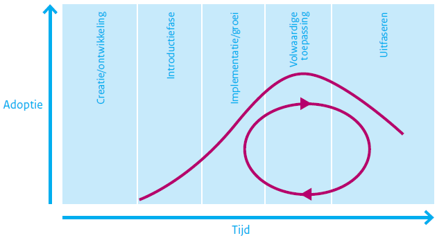

# Fundament, het BOMOS Model

## Woord van Dank

Al in 2006 werd er aan voorlopers van BOMOS gewerkt, maar het duurde tot 2009 voordat de eerste publicatie van BOMOS het levenslicht zag, met de kenmerkende activiteitenplaat. Dus hoe je ook telt, BOMOS bestaat inmiddels meer dan 10 jaar.

Er zijn inmiddels al vele werkgroepen en betrokkenen geweest die in de loop der jaren aan BOMOS hebben bijgedragen. Prachtig natuurlijk, en daar was het in de basis natuurlijk ook om te doen: Inspiratie voor in de standaardisatie praktijk, en dat leidt ongetwijfeld tot nieuwe ervaringen behoeftes die ook zijn weerslag kunnen hebben met BOMOS.

**De kern**
Geheel in lijn met de beroemde strip, waarin het bestaan van teveel standaarden wordt opgelost door het introduceren van nog een standaard, met als resultaat dat er n+1 standaarden zijn. In die lijn dachten we het ook met BOMOS aan te vliegen…

Eind 2018 organiseerde Logius een sessie rond het gebruik van BOMOS; een inspirerende sessie met zo’n 40 deelnemers, die zo’n 30 verschillende organisaties representeerde die allen BOMOS (in meer of mindere mate) gebruikte. Als wens kwam naar voren om een nieuwe versie te maken….maar ja, wie gaat dat dan doen? Wij staken de hand op, en zijn aan de slag gegaan, met als doel niet om veel aan BOMOS te veranderen, maar om 1 integraal nieuwe versie te maken, die al het andere vervangt, en daarnaast een toets op actualiteit heeft gehad; immers de standaardisatie wereld heeft niet stilgestaan.

De tijd zal het leren of wij wel succesvol het eerdere werk hebben vervangen met deze versie, of dat wij ook gewoon in de valkuil zijn getrapt.

Erwin Folmer & Erwin Kaats & Edwin Wisse
Februari 2022

## De 13 BOMOS statements

1. “Een standaard die niet beheerd wordt is geen standaard!”
2. “Het is nooit te vroeg om de mogelijkheden voor het beheer van de standaard te onderzoeken.”
3. “Een standaard ontwikkelen en beheren is geen tijdelijk project, waardoor projectfinanciering geen geschikte financieringsbron is.”
4. “Een standaard ontwikkelen en beheren is een situationeel proces, en kan daardoor voor elke standaard anders ingevuld zijn.”
5. “Een standaard is nooit af!”
6. “De openheid van de standaard wordt volledig bepaald door de inrichting van ontwikkel en beheerproces.”
7. “Een duurzame standaard wil zeggen open en beheerd”
8. “Het lelijke van standaarden is dat er al zoveel zijn; hergebruik is cruciaal (geinspireerd door Professor Tanenbaum:"The nice thing about standards is that you have so many to choose from" ”
9. “Het beheren van standaarden kent veel overeenkomsten met andere "artifacten" (stelselafspraken, data, api's, ...) waardoor BOMOS ook bruikbaar is in andere contexten.”
10. “Een standaard is niet goed of slecht, open of gesloten, etc. er zijn altijd meer dan 50 tinten grijs, en dus ook altijd verbeterpunten.”
11. “Zonder standaarden waren er geen pyramides (standaarden zijn al zo oud als de mensheid)”
12. “Standaarden, toegepast in architectuur, vormen de basis van interoperabiliteit.”
13. “De essentie van een standaardisatie-proces is samenwerken; daarmee is standaardisatie een cultuurverschijnsel.”

## Inleiding

### Aanleiding

Het beheer en ontwikkelen van standaarden is geen sinecure. Toch gebeurt het vaak dat standaarden worden ontwikkeld zonder stil te staan bij verdere ontwikkeling en beheer van de standaard. Dit komt doordat standaardisatie vaak als tijdelijk project tot stand komt. Er wordt projectfinanciering ingezet voor de ontwikkeling van een standaard of een bijbehorende voorziening, maar een structurele inzet ontbreekt. Dat gaat niet goed samen met een continue ontwikkeling en beheer van standaarden.

### Doel

Het doel van deze publicatie is organisaties te helpen bij het opzetten van het beheer van standaarden en de verbetering daarvan. Vragen waar deze publicatie een antwoord op probeert te geven zijn:

* Hoe kunnen we de standaard organisatorisch goed (door)ontwikkelen en beheren?
* Hoe kunnen we ontwikkeling en beheer zo inrichten, dat er sprake is van een open standaard?
* Hoe kunnen we de adoptie van onze standaard bij gebruikers verbeteren?

Deze concrete vragen waren ruim 10 jaar geleden aanleiding tot het opstellen van het Beheer- en OntwikkelModel voor Open Standaarden (BOMOS), met handreikingen (best practices) voor een open invulling voor het beheer. Sindsdien wordt BOMOS in de praktijk gebruikt, en is er bij de gebruikers behoefte ontstaan om meer kennis en ervaringen te delen rond het beheer van standaarden.  

### Doelgroep

Met dit hulpmiddel (BOMOS) worden standaardisatiecommunities en hun opdrachtgevers ondersteund en geïnspireerd bij het structureel vormgeven van het beheer en verdere ontwikkelingen van standaarden.

### Aanpak & Historie

In 2006 heeft de Werkgroep CMO (Community Model Open Standaarden), een werkgroep van Bureau Open Standaarden (later omgedoopt tot Forum Standaardisatie) van GBO.Overheid (later omgedoopt tot Logius), al aan dit onderwerp gewerkt. De uitkomst, een notitie, is door Forum Standaardisatie beschikbaar gesteld en vormde het startpunt voor de ontwikkeling van BOMOS versie 1.

Als aanpak voor de ontwikkeling van BOMOS is gekozen voor een gestructureerde discussie met een kleine groep van experts uit de semantische standaardisatieorganisaties waarin kennis gedeeld werd over de relevante onderwerpen. Dit heeft geleid tot versie 1 van BOMOS in 2009.

Na de eerste uitgave heeft in 2010 opnieuw een serie bijeenkomsten plaatsgevonden. Daar waren ook gebruikers van de eerste versie vertegenwoordigd. Aan de hand van de ervaringen en nieuwe inzichten is BOMOS verder uitgebouwd en uitgebreid: BOMOS versie 2.

Door middel van deze aanpak is kennis van organisaties die zich bezighouden met ontwikkeling en beheer van standaarden verankerd; zoals Logius, Geonovum, Kennisnet, CROW, Informatiehuis Water, Stichting Elektronische Transacties Uitzendbranche (SETU), het Nederlands Normalisatie-instituut (NEN), VNG Realisatie, onderzoeksorganisatie TNO, Universiteit Twente en vele anderen.

In 2012 is onder aanvoering van Forum Standaardisatie gewerkt aan een uitbreiding met als titel Bomos2i. Waarbij de “i” staat voor “implementatie”; Een handreiking hoe BOMOS in de standaardisatie praktijk gebruikt kan worden. Een andere variant op BOMOS is uitgebracht door TNO genaamd BOMOD. Ook hier gaat het over beheer en ontwikkelprocessen, maar nu is het onderwerp het publiceren van datasets in plaats van standaarden. Ook is in die periode BOMOS (her)uitgebracht in verschillende huisstijlen. Al met al is het er niet per definitie overzichtelijker op geworden voor een gebruiker.

Rond 2017 heeft Logius het beheer van BOMOS opgepakt. Er is een uitbreiding op BOMOS 2i gepubliceerd door de toevoeging van een normenkader. Hierop is de BOMOS-meting gebouwd. Dit instument stelt een beheerder in staat om het beheer van de standaard daadwerkelijk te toetsen.

In 2022 is BOMOS versie 3 gepubliceerd waarmee de BOMOS gebruiker een nieuw integraal startpunt heeft om met BOMOS aan de slag te gaan.

### Structuur BOMOS

BOMOS bestaat uit meerdere onderdelen. De kern van BOMOS is het "Fundament". Dat bestaat uit een basis beschrijving van het BOMOS model, en een verdere verdieping op basis van literatuur of praktijkervaringen.  De kern van het BOMOS model is het activiteitenmodel: activiteiten en rollen die relevant zijn bij het beheer- en ontwikkelproces van standaarden.  Dit model samen met de best practices zijn het stabiele BOMOS fundament, oftewel BOMOS.

Naast dit fundament zijn er uitbreidingen voor BOMOS gemaakt, die het toepassen van BOMOS in concrete situaties, soms met een wat andere context, kunnen helpen. We noemen dit de BOMOS aanvullende modules, ook wel een Body of Knowledge genoemd, welke dynamisch zullen zijn in de tijd.  

Als we het hebben over BOMOS, dan bedoelen we daarmee het fundament. De aanvullende modules zijn wel duidelijk met BOMOS verbonden, maar hebben een eigen governance wat kan resulteren in een eigen naam, eigen doelgroep, eigen beheer, etc. In het beheerproces van BOMOS wordt ook beschreven welke eisen er gesteld worden voordat iets opgenomen wordt als BOMOS aanvullende module.

### Leeswijzer

Bent u vanuit een beleidsmakende of besturende rol alleen op hoofdniveau geïnteresseerd, dan biedt het fundament voldoende achtergrond en context. Bent u zelf actief in standaardisatiecommunities dan kunt u naadloos doorgaan met het lezen van de verdieping met best practices, waarin meer achtergrond en praktische tips rond standaardisatie zijn opgenomen.

Wilt u BOMOS gaan toepassen dan is het ook raadzaam om de aanvullende modules te gaan bekijken. Hier kunt u voorbeelden en tools vinden die kunnen helpen bij implementaties van open Standaarden. Ook vindt u hier varianten op BOMOS. Deze implementatieprofielen maken BOMOS toepasbaar op meer dan (semantische) standaarden alleen.

BOMOS - Het Fundament

- Deel 1 - Het BOMOS Activiteiten Model
- Deel 2 - De Verdieping; BOMOS Best Practices

BOMOS - Aanvullende Modules (Geen onderdeel van deze publicatie; wel op website)

## Context & Definities

### Context: standaarden voor interoperabiliteit

De belangrijkste redenen voor organisaties om interoperabiliteit na te streven zijn effectiviteit en efficiëncy. Standaardisatie zorgt voor een betere samenwerking in de gehele keten van bijvoobeeld partners, toeleveranciers en klanten. Een gebrek aan interoperabiliteit is niet alleen kostbaar, maar kan ook leiden tot langere doorlooptijden, zoals verschillende onderzoeken laten zien. Zo worden de kosten van gebrek aan interoperabiliteit in de automobielindustrie in de Verenigde Staten geschat op 1 miljard dollar, en een twee maanden langere ontwerptijd dan strikt noodzakelijk (Zie: Brunnermeier, S.B. & S.A. Martin (2002). Interoperability costs in the US automotive supply chain. Supply Chain Management 7(2), pp. 71-82.). Ook de overheid heeft belang bij het nastreven van interoperabiliteit, maar heeft nog een extra reden ondermeer vanuit maatschappelijk oogpunt. Denk aan de consequenties bij een ramp wanneer de verschillende hulpdienstorganisaties niet interoperabel met elkaar zouden zijn. Daarnaast doen zich bij thema’s als het elektronisch patiëntendossier en de problematiek rond risicojongeren ook interoperabiliteitsvraagstukken voor.

Standaarden zijn een belangrijk middel voor het bereiken van interoperabiliteit, en daarnaast ook belangrijk voor leveranciersonafhankelijkheid. Standaarden zijn er in verschillende soorten en maten. Er zijn zeer veel indelingen in type standaarden, maar binnen de overheid wordt het European Interoperability Framework als leidraad gehanteerd.
Hierin wordt onderscheid gemaakt tussen technische en semantische interoperabiliteit, waarmee ook een onderscheid te maken is tussen technische en semantische standaarden.
De technische (infrastructureel) georiënteerde standaarden kunnen veelal één-op-één overgenomen worden van internationale consortia.
Standaarden van semantische aard vereisen vaak een regionaal profiel zodat rekening kan worden gehouden met  specifieke implemenatieeisen.
Zo zijn er Nederlandse gebruikersgroepen (communities) actief voor het ontwikkelen van een nationale profielen op internationale standarden.
In de context van Nederlandse wetgeving en/of Nederlandse specifieke bedrijfs(overheids)-processen is het namelijk noodzakelijk om internationale standaarden toe te spitsen op de Nederlandse situatie.

Kenmerken van semantische standaarden (regelmatig wordt ook de term bedrijfstransactie standaarden (Business Transaction Standards) als synoniem voor semantische standaarden gebruikt, wat een goede indruk geeft maar in principe vocabulaires (waardelijstjes) of dossiers (bv. patiëntendossier) als standaard uitsluit omdat dit geen transacties betreffen.):

* Het zijn vaak een specifieke invulling van een internationale standaard.
* Ze zijn vaak voor een specifiek inhoudelijk probleem:
  * Bijv. ‘verticaal’: informatie-uitwisseling voor een bepaalde sector: Geo-domein, Onderwijs, Zorg, etc.
  * Bijv. ‘horizontaal’ informatie-uitwisseling voor een bepaalde functie: Inkoop, Facturatie, etc.
* Ze worden vaak ontwikkeld en beheerd in het domein (de sector), en niet door formele standaardisatieorganisaties.
* De kern van de standaard is de semantiek (de betekenis), niet de techniek.

Daarnaast zijn er technische standaarden die veelal in een internationale context binnen formele standaardisatieorganisaties worden ontwikkeld zoals W3C, UN/CEFACT, ETSI, ISO, CEN en IETF. Een semantische standaard staat nooit op zichzelf en heeft vaak meerdere relaties met andere internationale standaarden, waaronder ook technische standaarden. Vaak zien we ook een gelaagdheid binnen de semantische standaard: De internationale semantische standaard die de basissemantiek standaardiseert voor een bepaald probleemdomein en ruimte biedt om in een specifieke context (zoals een land) nog extra afspraken te standaardiseren. Deze extra afspraken bovenop de internationale standaarden worden soms een toepassingsprofiel genoemd, maar regelmatig ook gewoon aangeduid met de term semantische standaard. Binnen het toepassingsprofiel of semantische standaard worden vaak vocabulaires (codelijsten e.d.) buiten de standaard vastgesteld omdat deze een eigen dynamiek kennen en daarmee andere beheerprocedures van toepassing kunnen zijn. Hiermee hebben we drie niveaus van semantische standaarden; de internationale, de specifieke context (bijv. nationaal), en de vocabulaires. Een belangrijke taak is afstemming blijven houden met de ontwikkel- en beheerorganisaties van deze internationale standaarden. De semantische standaarden, waar dit document op van toepassing is, kan van toepassing zijn in de overheidscontext (G2G, G2B en/of G2C-context), maar in de praktijk zal dit document evengoed van toepassing zijn buiten de overheidscontext.

Het ontwikkelen en het beheer van standaarden is anders dan het ontwikkelen en beheren van andere producten zoals voorzieningen en software. Een voorziening is een samenstel van informatie, systeem,organisatie en koppelvlak ten behoeve van dienstverlening. Zowel intern binnen de voorziening, als op het koppelvlak van de voorziening met de buitenwereld kunnen verschillende type standaarden gebruikt worden waaronder ook semantische standaarden. Deze gebruiksrelatie tussen een standaard en voorziening geldt evengoed tussen een standaard en software.

Voorbeeld: NL-LOM en Edurep. De standaard NL-LOM beschrijft op welke manier metadata moet worden vastgelegd bij educatief materiaal. Een voorziening dat gebruik maakt van NL-LOM is Edurep, een zoekmachine die op basis van metadata educatief materiaal vindbaar maakt. (NL-LOM: [https://www.forumstandaardisatie.nl/standaard/nl-lom](https://www.forumstandaardisatie.nl/standaard/nl-lom); Edurep: [https://www.kennisnet.nl/edurep/](https://www.kennisnet.nl/edurep/))

Standaarden hebben daarmee andere gebruikers, en andere uitdagingen zoals afstemming met communities en internationale standaarden. Dat betekent niet dat de semantische standaardisatiediscipline niet kan leren van andere disciplines, zoals de software-wereld. Modellen uit die disciplines kunnen bruikbaar zijn. Met name het BiSL-raamwerk voor functioneel beheer is in enige mate bruikbaar, en deze is dan ook meegenomen in de totstandkoming van BOMOS (Voor meer informatie over BiSL: Best Practice - BiSL – Een framework voor Functioneel Beheer en Informatiemanagement , Remko van der Pols, Ralph Donatz, Frank van Outvorst, Van Haren Publishing, 2005.).

BOMOS is initieel ontwikkeld voor Semantische Standaarden; deze focus is nog regelmatig terug te vinden in onder meer de best practices. Echter op basis van gebruikservaringen hebben we inmiddels ook geleerd dat wanneer BOMOS met beleid wordt toegepast het ook bruikbaar is in de context van andere standaarden (zoals technische of organisatorische), voorzieningen, of andere concepten zoals het beheer van data, of software. Dit soort gebruikservaringen, die eventueel leiden tot aangepaste BOMOS versies voor gebruik in een specifieke context, kunnen gepubliceerd worden als aanvullende BOMOS module.

### Definities

**Beheer en Ontwikkelen van standaarden (kortweg: beheer)**  
Alle activiteiten gericht op het structureel werken aan, beschikbaar stellen, en houden van een (set van) standaard(en) die steeds past bij de actuele behoefte van de belanghebbenden.

Een onderscheid is te maken tussen ontwikkeling en beheer. Het beheer van standaarden heeft betrekking op het beschikbaar stellen en aanpassen van bestaande standaarden op basis van nieuwe wensen en eisen zonder dat er sprake is van functionele uitbreidingen. Dit bevat dus ondermeer het verspreiden van de standaard bijvoorbeeld op een website, het bieden van ondersteuning, het verzamelen van wensen en eisen en het uitbrengen van nieuwe versies.

Het ontwikkelen van standaarden heeft betrekking op de ontwikkeling van een standaard als oplossing voor een nieuw functioneel terrein. Dit kan betekenen dat op basis van de ontwikkeling de bestaande standaard wordt uitgebreid of dat er een nieuwe standaard ontstaat.

Beheer en ontwikkeling, in de brede zin, voor een standaard bevat ook onderwerpen als adoptie en certificering.

**Community**  
Elke specifieke gemeenschap of groep in het elektronische (overheids-)veld die zich bezighoudt met de ontwikkeling en/of het beheer van een specifieke (set van) standaard(en), vanuit een expliciete gezamenlijke behoefte. Omdat dergelijke behoeften vaak zowel in het private als in het publieke domein worden gevoeld, kan een community een publiek-private samenwerkingsvorm zijn.

**Open standaard**  
Er zijn vele meningen over de definitie van een open standaard, vooral vanwege belangen van verschillende organisaties is het nooit gelukt om dit goed te definieren. In BOMOS hanteren we een definitie die in de start periode van het European Interoperability Framework werd gehanteerd en ook door de Nederlandse overheid werd overgenomen. Later zijn aanpassingen, en met name afzwakkingen geintroduceerd, maar de oorspronkelijke definitie is relatief het meest open.
Onder een ‘open standaard’ verstaan we een standaard die voldoet aan de volgende eisen:

1. De standaard is goedgekeurd en zal worden gehandhaafd door een not-for-profit organisatie, en de lopende ontwikkeling gebeurt op basis van een open besluitvormingsprocedure die toegankelijk is voor alle belanghebbende partijen (consensus of meerderheidsbeschikking);

2. De standaard is gepubliceerd en over het specificatiedocument van de standaard kan vrijelijk worden beschikt of het is te verkrijgen tegen een nominale bijdrage. Het moet voor een ieder mogelijk zijn om het te kopiëren, beschikbaar te stellen en te gebruiken om niet of tegen een nominale prijs;

3. Het intellectuele eigendom - m.b.t. mogelijk aanwezige patenten - van (delen van) de standaard is onherroepelijk ter beschikking gesteld op een royalty-free basis;

4. Er zijn geen beperkingen omtrent het hergebruik van de standaard.

**Semantische interoperabiliteit**  
Betekent dat samenwerkende partijen aan gegevens, die uitgewisseld worden, dezelfde betekenis toekennen.

**Semantische standaarden**  
Zijn afspraken over de betekenis van gegevens.

**Werkgroep**  
Een groep binnen de community met een afgebakende deelactiviteit met een eenduidig gedefinieerd eindresultaat als doel.

Voor meer informatie over interoperabiliteit en standaarden:

Open Standaard:  
[https://www.forumstandaardisatie.nl/thema/open-standaarden](https://www.forumstandaardisatie.nl/thema/open-standaarden)

[https://en.wikipedia.org/wiki/Open_standard](https://en.wikipedia.org/wiki/Open_standard)

[https://open-stand.org/](https://open-stand.org/)

European Interoperability Framework:  
[https://ec.europa.eu/isa2/eif_en](https://ec.europa.eu/isa2/eif_en)

BSI Guide to Standardization:  
[https://www.bsigroup.com/en-GB/standards/Information-about-standards/how-are-standards-made/The-BSI-Guide-to-Standardization/](https://www.bsigroup.com/en-GB/standards/Information-about-standards/how-are-standards-made/The-BSI-Guide-to-Standardization/)

Standardisation Handbook:  
https://en.wikipedia.org/wiki/Open_standard

Handreiking Standardisatie voor onderzoekers:
[https://op.europa.eu/en/publication-detail/-/publication/db289e47-140b-11eb-b57e-01aa75ed71a1/]

Verplichte open standaarden in Nederland:  
[https://www.forumstandaardisatie.nl/open-standaarden/lijst/verplicht](https://www.forumstandaardisatie.nl/open-standaarden/lijst/verplicht)

Nederlandse Overheids Referentie Architectuur (NORA):  
[https://www.digitaleoverheid.nl/dossiers/nederlandse-overheid-referentie-architectuur-nora/](https://www.digitaleoverheid.nl/dossiers/nederlandse-overheid-referentie-architectuur-nora/)

## BOMOS gebruiken

Hoe kan BOMOS ingezet worden? Er zijn verschillende mogelijkheden:

1. Als hulpmiddel voor verdere ontwikkeling van beheerorganisaties
2. Als achtergrondinformatie ter inspiratie
3. Als toets van het huidige beheerproces

### BOMOS als hulpmiddel voor verdere ontwikkeling van de beheerorganisaties

De belangrijkste toepassing van BOMOS is als hulpmiddel voor de verdere ontwikkeling van beheerorganisaties. Veel beheerorganisaties komen voort uit een initieel project of programma. Soms is dit gekoppeld aan een bepaalde voorziening. Het beheer van de standaard kan dan een afhankelijkheid hebben met het operationele beheer van die voorziening. Om de standaard breder te kunnen inzetten zijn dan nadere afwegingen nodig. BOMOS helpt daarbij.

Een andere toepassing is de inrichting van een geheel nieuwe beheerorganisatie. Als organisaties er voor kiezen om in een sector een standaard af te spreken dan ontkomt men er niet aan om naast inhoudelijke ook financiële en beheersmatige afspraken te maken. BOMOS vormt dan een leidraad waarmee die afspraken gemaakt kunnen worden.

Er zijn een aantal mogelijkheden:

1. Is er al een standaard?  
   Soms is er nog geen standaard, maar moet deze nog ontwikkeld worden. In het hoofdstuk operationeel beheer wordt ingegaan op het verzamelen van de juiste wensen voor en eisen aan de standaard. Vervolgens kan de brug worden geslagen naar het beheerproces.

2. Inrichting van het beheerproces  
   Dit begint met het bepalen van de scope van het beheerproces: waarvoor moet het beheerproces worden ingericht? Voor het beheer van één standaard of van meerdere standaarden? Aan de hand daarvan kan met BOMOS een keuze worden gemaakt op het gebied van de beheeractiviteiten (strategisch, tactisch, operationeel) en ondersteunende activiteiten. Niet alleen kan met BOMOS bewust gekozen worden voor het wel of niet inrichten van bepaalde beheeractiviteiten, maar ook zijn er hints en tips voor de inrichting zelf.

3. Is er al een beheerorganisatie ingericht?  
   Vaak is er al een vorm van beheer ingericht. Dan kan BOMOS worden gebruikt om te controleren of alle activiteiten nog voldoen, of dat er naast operationele ook strategische en tactische activiteiten opgepakt kunnen worden. Daarnaast kan BOMOS dienen om de openheid van het proces te verbeteren.

4. Aanpak van specifieke problemen  
   Vaak zijn er specifieke problemen. BOMOS kan ook voor maatwerk worden ingezet om op basis van best practices en referentiemodellen verbeteringen door te voeren in zaken als:  
   * Kwaliteit: hoe kan de kwaliteit van een standaard gemeten en verbeterd worden?
   * Adoptie: hoe kan de adoptie van een standaard worden versneld? Welke middelen kunnen daarvoor worden ingezet?
   * Financiën: hoe kan het financiële model van een beheerorganisatie worden verbeterd, bijvoorbeeld bij teruglopende financiering of veranderde wensen?
   * Validatie en certificering: hoe kan worden getoetst dat implementaties van een standaard voldoen aan de gestelde specificaties? Welke mogelijkheden zijn er?

### BOMOS als achtergrondinformatie ter inspiratie

BOMOS kan goed gebruikt worden als achtergrondinformatie voor bijvoorbeeld opdrachtgevers van standaarden. Het BOMOS Model is hiervoor ontwikkeld en legt een basis. Kennis over het beheer van standaarden is essentieel voor een ieder betrokken bij standaardisatie.

In het verdiepende deel  worden oplossingen geschetst waarbij de praktijk centraal staat: waar mogelijk is met behulp van voorbeelden aangegeven wat de acceptatie van de oplossing in de praktijk is, welke standaardisatieorganisaties daar ervaring mee hebben, en welke adviezen daarbij horen. Oftewel: waardevolle achtergrondinformatie over praktijksituaties.

Samen zijn deze twee delen het BOMOS Fundament, en inspirerende achtergrondinformatie.
Een ander voorbeeld is het gebruik van BOMOS als middel voor bestuurders en beleidsmakers om aan te geven wat openheid van standaarden nu concreet inhoudt.

### BOMOS als toets van het huidige beheerproces

Diverse organisaties gebruiken BOMOS als onderlegger of zelfs als richtlijn voor het beheer van hun (open) standaard. Andere organisaties gebruiken BOMOS als globale checklist en als inhoudelijke verantwoording voor bepaalde keuzes. Echter BOMOS is niet normatief. Dat kan ook niet want de inrichting van het beheer van standaarden is in hoge mate situatieafhankelijk.

Toch is wel conformiteit met BOMOS mogelijk. **De beheerorganisatie werkt conform BOMOS als er een beheerdocument is gepubliceerd waarin de invulling van alle onderdelen uit het BOMOS Model zijn beschreven.**

Voor specifieke situaties zijn wel in meer details eisen/toetsen te definieren per BOMOS activiteit, maar deze behoren niet tot het fundament van BOMOS vanwege dat ze niet voor alle BOMOS gebruikers relevant hoeven te zijn.  

Overigens als de beheerorganisatie conform BOMOS werkt, dan wil dat niet automatisch zeggen dat de standaard daarmee ook voldoet aan de criteria voor de pas-toe of leg-uit lijst van standaarden van de overheid. Echter het is wel te prefereren dat aangemelde standaarden conform BOMOS werken, en daarnaast speciale aandacht schenken aan de hoofdstukken rond de ontwikkel-beheer organisatie, openheid, het operationele proces, en de financiële structuur.

Taalkundig betekent het woord "Standaard", vaak in de trend van vastgesteld of met elkaar afgesproken. In die context concluderen we dat BOMOS een standaard is. Een standaard voor (het ontwikkelen en beheren van) standaarden.

## Het BOMOS Model: Onderwerpen voor ontwikkeling en beheer

In figuur 1 is het hoofdmodel van BOMOS weergegeven: een gelaagde structuur van onderwerpen die nodig zijn voor het ontwikkelen en beheren van een open standaard.

De structuur bestaat uit een aantal elementen:

* Drie hoofdlagen: strategie, tactiek en operationeel.
* Twee ondersteunende lagen: implementatie ondersteuning en communicatie.
* Per laag meerdere activiteiten die uitgevoerd kunnen worden.

### Benodigde invulling per situatie

De invulling van de ontwikkel- en beheeronderwerpen zijn situationeel afhankelijk; dit wil zeggen dat verschillende situaties kunnen leiden tot een andere invulling voor een optimaal resultaat. Voor alle onderwerpen geldt dat deze in een ‘minimum’ en ‘maximum’ scenario kunnen worden uitgevoerd of wellicht niet relevant zijn voor een bepaalde organisatie. Het is dus zeker niet zo dat elk onderwerp moet worden geimplementeerd. In tegendeel, teveel nadruk op formalisatie kan averechts werken.

In het model worden slechts de onderwerpen beschreven die met activiteiten ingevuld kunnen worden, en waarvan sommige noodzakelijk kunnen zijn. Het is aan de inrichter van een organisatie voor beheer en ontwikkeling van standaarden om op basis van het hier gegeven model de relevante onderdelen te selecteren en in te richten. Daar waar relevant worden eventuele voor- en nadelen van een specifieke invulling van een onderwerp of activiteit gegeven.

Kernonderwerpen zijn door de situationele afhankelijkheid ook onmogelijk aan te geven, maar het moge duidelijk zijn dat ‘governance’ altijd georganiseerd moet zijn om besluitvorming te kunnen laten plaatsvinden.

Afhankelijk van de situatie is het dan te bepalen welke onderwerpen prioriteit dienen te krijgen. In het figuur zijn de drie traditionele lagen herkenbaar: strategie, tactiek en operationeel. Deze worden geflankeerd door twee ondersteunende processen: communicatie en implementatieondersteuning.

Het model kan de suggestie wekken dat de onderwerpen geïsoleerd zijn, omdat er geen onderlinge relaties zijn aangegeven. Het tegendeel is waar: veel onderwerpen zijn gerelateerd – zowel binnen een hoofdgroep als tussen de hoofdgroepen.

Afstemming tussen onderwerpen is dan ook essentieel. Het model zegt niets over de organisatievorm of indeling daarvan in een beheerorganisatie. In de praktijk kunnen meerdere activiteiten belegd zijn bij een enkel organisatieonderdeel of kunnen meerdere organisatieonderdelen zich bezighouden met een enkele activiteit. De best practice organisatiestructuur gaat hier verder op in.

### De onderwerpen uit het model

Onder de genoemde activiteiten verstaan we het volgende:

**Strategie**: Richtinggevende activiteiten gerelateerd aan de strategische (lange) termijn:

* Governance: beleid uitzetten over de eigen bestuurlijke organisatie (zoals de rechtsvorm); het huishoudelijke reglement (de charter), maar ook allianties vormen met andere organisaties. Het regelen van besluitvorming is cruciaal (zie kader).
* Visie: het beschrijven van een ontwikkelrichting. Dit is de stip op de horizon en geldt als focus voor de lange termijn.
* Financiën: een financieel model voor de lange termijn hebben die opbrengsten garandeert in overeenstemming met de behoefte.

**Taktiek**, Activiteiten die op middellang termijn voor stabiliteit zorgen:

* Adoptie & erkenning: Activiteiten die te maken hebben met de certificiering, verplichtstelling of promotie van de standaard.
* Architectuur: Opbouw van de standaard en de aangrenzende processen en technieken.
* Community: Beheer en ondersteuning van gremia en stakeholders.
* Kwaliteitsbeleid benchmarking: ontwikkeling van beleid dat toeziet op de kwaliteit van implementaties van de standaard.
* Rechtenbeleid: Vaststellen van rechten van intellectueel eigendom.

**Operationeel**, de uitvoerende activiteiten die leiden tot nieuwe versies van standaarden, waaronder:

* Initiatie: identificatie van nieuwe ideeën (voor bijvoorbeeld een nieuwe specificatie en nieuwe werkgroep) en alle activiteiten die horen bij het succesvol optuigen daarvan (bijv. belangenanalyse, business case, agendering).
* Wensen en eisen: opstellen van de wensen en eisen aan de te ontwikkelen en te beheren specificatie, ook wel bekend onder de naam Maintenance Requests (MRs).
* Ontwikkeling: op conceptueel niveau de inhoudelijke uitwerking van oplossingen voor de ideeën, wensen en eisen opgesteld in voorafgaande fasen. Deze oplossingen zijn zoveel mogelijk los van technologieën bedoeld voor nadere uitwerking in een (nieuwe versie van) de specificatie.
* Uitvoeren: de daadwerkelijk aanpassingen op basis van de conceptuele oplossingen doorvoeren in de specificatie en eventuele technische invulling.
* Documentatie: verzorgen van passende neerslag van de resultaten van het primaire beheerproces. Niet alleen de beschikbaarheid van de specificaties, maar bijvoorbeeld ook de mogelijkheid bieden tot een historisch overzicht van verzoeken tot wijzigingen (maintenance requests) en de actuele status daarvan.

**Implementatie-ondersteuning**, ondersteunende activiteiten gericht op het bevorderen van implementaties van de standaard, waaronder:
* Opleiding: Het bieden van opleidingsmogelijkheden aan verschillende gebruikersgroepen variërend van een informatie bijeenkomst tot aan een (online) cursus.
* Helpdesk: Het bieden van ondersteuning aan verschillende gebruikersgroepen, bijvoorbeeld telefonisch of per e-mail volgens een service level agreement (bijv. beantwoording van vragen binnen 24 uur). Een frequently asked questionslijst opstellen en bijhouden kan ook een helpdeskactiviteit zijn.
* Module-ontwikkeling: (Stimuleren van) de ontwikkeling van breed te verspreiden softwaremodules die de standaard implementeren. Dit kan door het stimuleren van de markt om software te ontwikkelen, of, als de markt niet beweegt, zelf software te ontwikkelen en te verspreiden om de markt in beweging te krijgen.
* Validatie & Certificatie: Het bieden van mogelijkheden om de correctheid van de implementaties te testen (validatie). Daaraan kan een officieel traject verbonden worden wat leidt tot certificatie van een organisatie of product. Ook verplicht stellen van het doorlopen van validatie en certificatietrajecten behoort tot de mogelijkheden. Module-ontwikkeling en Certificatie zijn riskante activiteiten, waarmee er actief ingegrepen wordt in de markt. De uitvoering daarvan dient zorgvuldig te gebeuren en zoveel mogelijk buiten de eigen organisatie.

**Communicatie**, ondersteunende activiteiten gericht op het creëren van draagvlak voor de standaard, waaronder:
* Promotie: Het uitdragen van nut/noodzaak/voordelen van de standaard.
* Publicatie: Het vindbaar/kenbaar maken van de standaard en de actuele stand van zaken, bij voorkeur op Internet.
* Klachtenafhandeling: Het garanderen van het serieus nemen van klachten door deze volgens een zorgvuldige procedure te behandelen. Klachten kunnen ook beschouwd worden als verbetersuggesties.

### Activiteiten en Rollen
Rollen betrokken bij ontwikkeling en beheer van standaarden (Dit onderdeel is gebaseerd op het werk gedaan in NEN 7522:2021).

**Eigenaar**: eindverantwoordelijk voor het ontwikkelen en beheren van een standaard. De eigenaar bepaalt de scope en het doel van een standaard, en bepaalt de principes en de uitgangspunten die worden gehanteerd bij ontwikkeling en beheer.

**Financier**: verantwoordelijk voor het financieren van het ontwikkelen en beheren van standaarden.

**Autorisator**: keurt een standaard goed. Toelichting: een autorisator kan een persoon, organisatie of groep van personen en organisaties zijn. Het is aan de eigenaar om de autorisator te benoemen. Een autorisator bevat vaak een vertegenwoordiging van stakeholders, die als persoon of organisatie ook de ook de rol gebruiker hebben.

**Functioneel beheerder**: verantwoordelijk voor het proces van ontwikkelen en beheren van standaarden, binnen de kaders van de gemaakte afspraken en afgesproken governance. Toelichting: de functioneel beheerder is verantwoordelijk het proces van ontwikkelen en beheer van de inhoud van standaarden. Hiervoor werkt hij nauw samen met experts, gebruikers, de technische beheerder en de distributeur. De functioneel beheerder heeft vaak een regie voerende rol. Resultaten van het proces worden voorgelegd aan de autorisator.

**Technisch beheerder**: verantwoordelijk voor het technisch beheren van standaarden. De technisch beheerder zorgt voor de inrichting en beheer van een technische omgeving die noodzakelijk is om de artefacten die onderdeel zijn van de standaard te onderhouden. Toelichting: De technisch beheerder is verantwoordelijk voor de technische omgeving waarin de artefacten, die in beheer zijn, worden onderhouden. Zo’n technische omgeving zal bestaan uit het geheel aan ICT-middelen (tools, hardware, netwerken, e.d.) die noodzakelijk zijn om het functioneel beheer uit te kunnen voeren op de standaard. Onder de verantwoordelijkheid van de technische beheerder valt o.a. het kunnen toepassen van versiebeheer op de technische omgeving en het beschikbaar stellen en houden van de technische omgeving, in overleg met de functioneel beheerder.

**Distributeur**: verantwoordelijk voor het distribueren van standaarden.

**Expert**: brengt specifieke noodzakelijke expertise in ten behoeve van het ontwikkelen of beheren van een standaard. Toelichting: verschillende type experts kunnen, afhankelijk van de standaard, noodzakelijk zijn. Veel voorkomende experts zijn domein-inhoudelijk of bijvoorbeeld expert op het gebied van ontologie, architectuur, vertrouwen, informatiebeveiliging, cryptografie of privacy. Vaak voorkomend is ook een vertegenwoordiging ervaringsdeskundige stakeholders die als persoon of organisatie ook de rol gebruiker hebben.

**Gebruiker**: gebruikt de standaarden direct of indirect. Voorbeelden van deze gebruikers zijn leveranciers van componenten (vaak applicaties), of gebruikers van deze applicaties (indirect).

Van bovenstaande rollen kunnen de financier-rol, de expert-rol, de gebruikers-rol en de eindgebruikers-rol meervoudig worden ingevuld: meer dan één persoon of organisatie kan de rol van financier, expert, gebruiker of eindgebruiker vervullen. Meervoudigheid betekent hier ook dat de stakeholders die deze rollen invullen een ander belang of expertise gebied kunnen vertegenwoordigen en dit dus ook inbrengen.
De overige rollen zijn enkelvoudig: er kan maar één persoon of organisatie in die rol zijn. Enkelvoudig kan wel betekenen dat de rol ingevuld wordt met een instantie, bijvoorbeeld een raad of een overleg, waarin meerdere personen of organisaties zijn vertegenwoordigd.

Onderstaande tabel geeft voor de BOMOS hoofdactiviteiten weer welke rol primair verantwoordelijk is, en welke rollen veelal ook betrokken zullen zijn.

Activiteit | Primair verantwoordelijke rol | Overige betrokken rollen
-----------|-------------------------------|--------------------------
Strategie | Houder, financier| Autorisator, functioneel beheerder, experts
Taktiek | Autorisator | Functioneel beheerder, experts
Operationeel | Functioneel beheerder | Technisch beheerder, experts
Implementatie ondersteuning | Functioneel beheerder | Technisch beheerder, experts
Communicatie | Distributeur | Functioneel beheerder, technisch beheerder, experts

### Hoe BOMOS als hulpmiddel te gebruiken voor beheerorganisatie
Hiervoor hebben we beschreven in welke situaties BOMOS te gebruiken is, nu maken we de stap HOE BOMOS vervolgens ingezet kan worden. Dit is niet eenvoudig eenduidig te definieren omdat de context van de gebruiker hierin bepalend is. De context kan bepaald worden aan de hand van het in kaart brengen van situatiekenmerken. Een belangrijke situationele kenmerk is de plaats van de standaard in de standaardenlevenscyclus.

De levensfase waarin een standaard zich bevindt is immers van invloed op de inrichting van het beheer. Een standaard die zich nog in de ontwikkelingsfase bevindt stelt andere eisen aan beheer dan een standaard die grootschalig is geadopteerd en geïmplementeerd. Het is dan ook als vuistregel verstandig om bij iedere overgang een controle (op basis van het BOMOS Model) uit te voeren om te bepalen of uw beheerinrichting nog voldoet. Hieronder volgt een beschrijving van de fasen van de standaardenlevenscyclus, zodat u kunt toetsen in welke fase uw standaard zich bevindt.

**1. Creatie / ontwikkeling**

Deze fase markeert het moment waarop een gemeenschap van belanghebbenden en geïnteresseerden de behoefte aan een standaard vaststelt en start met het opstellen van de standaard.
Dit hoeft niet altijd te betekenen dat een standaard geheel ontbreekt.
Ook in het geval dat een standaard met (kleine) afwijkende specificaties al bestaat kan een gemeenschap tot de conclusie komen dat de behoefte aan een nieuwe standaard de inspanning rechtvaardigt.
In deze fase is nog geen sprake van ingericht beheer maar hebben de meeste activiteiten vooral een projectmatig karakter. In deze fase is het bijvoorbeeld belangrijk na te denken over de besluitvormingsprocessen. Bij een modulair opgezette standaard kunnen onderdelen van de standaard al gereed zijn, terwijl andere onderdelen nog in de ontwikkelfase verkeren. Creatie heeft dan betrekking op de nieuw ontwikkelde modules.

In deze eerste fase waarin een standaard zich bevindt is vooral afstemming van besluitvorming belangrijk. Er moet een goede business case zijn die het management, de geïnteresseerde gebruikers en ontwikkelaars kan overtuigen van het nut van de standaard. Ook moet er een duidelijk adoptiebeleid zijn. In grotere organisaties is het ook belangrijk dat de processen rondom de adoptie zijn verankerd in het proceslandschap. Dit is immers een goede manier om de adoptie ook via formele wegen af te dwingen.

**2. Introductiefase van de standaard**

In deze fase wordt gekozen voor een specifieke standaard om in een behoefte te voorzien. Tijdens deze fase zullen veel wijzigingen aan de orde zijn. De inrichting van beheer wordt belangrijk. De keuze kan bewust en expliciet worden gemaakt in besluitvorming om een standaard algemeen geldend te verklaren of door organische groei waarbij de adoptie geleidelijk plaatsvindt. Een voorbeeld van bewuste keuze is besluitvorming door de overheid om een standaard verplicht te stellen. Ook sectorafspraken of een besluit van het Forum Standaardisatie om een standaard op de ‘Pas toe of leg uit’-lijst te plaatsen, vallen hieronder.

Van organische adoptie is sprake als diverse (individuele) partijen besluiten een standaard te gaan toepassen. Tijdens deze fase zullen veel wijzigingen aan de orde zijn. De inrichting voor beheer wordt belangrijk, net als de adoptie van de standaard bij de ‘early adopters’ van belang. Uw activiteiten zullen hierop gericht moeten zijn.

**3. Implementatie / groei van de standaard**

In deze fase kiezen gebruikers bewust voor de implementatie van de standaard. In het beheer wordt ook rekening gehouden met het feit dat niet alle gebruikers beschikken over een volwaardig kennisniveau van de standaard. Beheer betekent in deze fase ook de ondersteuning en het informeren van de gebruikers. Marketingtermen als ‘early majority’ zijn in deze fase van toepassing. Uw activiteiten zijn gericht op meer professionele adoptie en professionalisatie van de open beheerprocessen, zodat bij opschaling van het gebruik alle partijen aangehaakt blijven en de processen transparant verlopen. Registraties van gebruikers/ afnemers/ experts etc. worden steeds belangrijker.

In de introductiefase is het nog steeds belangrijk om een goed adoptieplan te hebben. Ook het uitdragen van het nut en de noodzaak van de standaard is relevant. Nieuw in deze fase is het monitoren van de adoptie en het publiceren van de standaard. Waar er tijdens de creatiefase misschien nog geen (concept)versie beschikbaar is, moet dit tijdens de introductie wel het geval zijn.

**4. Volwaardige toepassing / volwassenheid van de standaard**

In deze fase is de standaard algemeen geaccepteerd en geïmplementeerd. Het beheer is in deze fase volledig ingericht om de stabiliteit en kwaliteit van de standaard te waarborgen.

In de volwassen fase worden nog meer normen belangrijk, terwijl er geen normen minder van belang worden. Kwaliteitsmanagement en het volgen van de BOMOS-activiteiten zijn belangrijk, net als de relatie met andere (internationale) standaarden. Natuurlijk kan dit ook van belang zijn in eerdere fases, maar in de regel is dit voor een volwassen standaard altijd het geval.

**5. Uitfaseren / overgang naar een andere (versie van de) standaard**

Tijdens het uitfaseren van een standaard is het van belang dat de samenhang met verschillende producten goed wordt bewaakt. Het kan namelijk zo zijn dat de standaard een cruciale plaats inneemt in het architectuurlandschap van derden. Daarbij is ook het bewaken van de organisatiestructuur van belang aangezien het verwijderen van standaard kan zorgen voor verschuivende verantwoordelijkheden. Verder is het afbouwen van financieringen een aandachtspunt, net als het beheersen van verwachtingen.

## De BOMOS best practices in vogelvlucht - Introductie in deel 2.

Met alleen een beheer- en ontwikkelmodel voor standaarden leggen we een fundament, maar daarmee kunnen niet al standaardisatievraagstukken worden opgelost. Op meerdere vlakken dienen keuzes gemaakt te worden met betrekking tot de inrichting van het beheerproces van standaarden.
Daarbij zijn verschillende vraagstukken te herkennen, zoals:

Bijvoorbeeld over:

* Adoptie: hoe stimuleer je dat?
* Open: Ik hoor over ‘openheid’, maar wat betekent dat?
* Business case: Wat levert het uiteindelijk op?
* Financiering: Wat kost het nou? En wat zijn goede inkomstenbronnen?  
* De kwaliteit van de standaard leidt tot problemen of ontevredenheid.
* Leveranciers die gecertificeerd willen worden zodat ze zich kunnen profileren.

Deze onderwerpen worden in detail in Deel 2 - De Verdieping besproken:

**De organisatiestructuur (hoofdstuk 1)**

De activiteiten uit het activiteitenmodel worden uitgevoerd in een organisatiestructuur, welke vaak bestaat uit een uitvoeringsorganisatie die opdrachten ontvangt vanuit het bestuur. De uitvoeringsorganisatie werkt met werkgroepen om de opdrachten in te vullen. Naast de werkgroepen kunnen nog aparte leveranciers en/of adviesorganen worden opgericht. De beheer- en ontwikkelactiviteiten kunnen belegd worden bij een eigen organisatie, maar voor specifieke taken kan ook een beroep worden gedaan op andere organisaties zoals formele standaardisatieorganisaties, kennisinstellingen, of brancheorganisaties. Voor de eigen beheerorganisatie zijn er verschillende rechtsvormen mogelijk, waarbij de stichting de meest voorkomende is.

**Financieel: de kosten en de opbrengsten (hoofdstuk 2)**

Weinig cijfers zijn bekend over opbrengsten en kosten van standaardisatie. Maar toch weten we dat standaarden economisch een toegevoegde waarde hebben. Voordelen liggen onder andere op het gebied van netwerkeffecten, voorkomen van vendor lock-ins en het verlagen van transactiekosten.

Los van alle grote voordelen is het soms lastig om een sluitende begroting voor de standaard op te stellen. Een standaard brengt ontwikkelkosten met zich mee, terwijl de opbrengsten voor de standaard lastig zijn te realiseren, helemaal opbrengsten die niet strijdig zijn met openheid. Voor de opbrengsten wordt een groeimodel geschetst. Tijdelijk financiering geschikt voor het opstarten, is geen geschikte financiering voor continu beheer. Zonder structurele financiering lijkt de meest voor de hand liggende vorm te werken met lidmaatschapsgelden of betaalde dienstverlening aan te bieden. De consequenties voor openheid zijn dan beperkt.

De business case van standaarden is een belangrijk onderwerp, We schetsen hier, op basis van ervaringen met een standaard voor de juweliersbranche, een aanpak in drie stappen om een eenvoudige business case op te stellen. Dit leidt niet tot harde cijfers, maar geeft wel een beeld van hoe de kosten en baten verdeeld zijn over de verschillende stakeholders.

**De open invulling van een standaard (hoofdstuk 3)**

We willen allemaal open standaarden, maar anders dan een definitie hebben we weinig handvatten voor wat een open standaard werkelijk betekent. Aan de hand van 10 criteria, waaronder de voor de hand liggende Open Intellectuele Eigendomsrechten als criteria ook minder voor de hand liggende criteria zoals Open Change (wie bepaalt wanneer er een nieuwe versie komt?) en One World (1 standaard voor 1 wereldwijd probleem). De 10 criteria worden meetbaar gemaakt, waarmee een standaard zijn eigen openheid kan bepalen en verbetertrajecten kan inzetten.

 **Samenhang met andere standaarden (hoofdstuk 4)**

Semantische standaarden zijn uitermate complex door de relaties met andere standaarden. Om interoperabiliteit te behalen is allereerst een combinatie nodig van technische, syntax en semantische standaarden. Semantische standaarden zijn te herkennen in zogenaamde horizontale en verticale (domein) standaarden. Daarnaast is er een onderscheid tussen de internationale standaarden, en de nationale invullingen daarop. Dit type standaarden wordt ook wel afspraken of toepassingsprofielen genoemd.

Deze standaarden maken ook weer gebruik van vocabulaires (codelijstjes). Alle varianten van standaarden moeten beheerd worden. Met alleen een internationale standaard zijn we er dus niet; dat zal vaak het interoperabiliteitsprobleem niet oplossen. De semantische standaarden worden veelal buiten de formele standaardisatieorganisaties (zoals NEN en ISO) ontwikkeld maar hebben wel vaak een relatie met formele standaarden die lastig is vanwege een potentieel gebrek aan openheid van deze standaarden. Op nationaal niveau hebben we vaak te maken met nationale invullingen van internationale standaarden, dat brengt een complexe relatie met zich mee waarvoor een strategie noodzakelijk is. Brengen we de aanpassingen ook internationaal in bij de standaard, of passen we de internationale standaard gewoon aan? Daarvoor zijn strategieën opgesteld.

In de wereld van semantische standaarden zijn de Semantic Web / Linked Data concepten een belangrijke ontwikkeling geweest voor de omgang en het vastleggen van semantiek bij de data. Deze ontwikkelingen zijn gebaseerd op een reeks van veelal W3C standaarden.

**Adoptie: het stimuleren van het gebruik van een standaard (hoofdstuk 5)**

De waarde van een standaard wordt voor een belangrijk deel gevormd door het aantal gebruikers. Immers: hoe meer gebruikers, hoe makkelijker het is om in een bepaalde sector of groep organisaties via de standaard gegevens uit te wisselen. Veel standaardisatieorganisaties willen daarom de adoptie van hun standaard (-en) versnellen. Hiervoor zijn verschillende soorten middelen te gebruiken: communicatief (voorlichting, promotie, etc.), financieel (implementatiesubsidies, financiering van voorbeeldprojecten, bieden van implementatietools, etc.) en juridisch (afdwingen, bijvoorbeeld via ‘pas toe of leg uit’). Het is van belang om het juiste middel te kiezen. Dit is afhankelijk van de zogenaamde adoptiekans in het netwerk van organisaties (collectieve business case) en voor individuele organisaties (business case voor individuele organisaties).

**Kwaliteit van standaarden (hoofdstuk 6)**

Door de jaren heen zal kwaliteit van standaarden een steeds belangrijker issue worden. We vergeten nog wel eens dat niet standaarden het doel zijn, maar juist interoperabiliteit. Een standaard met een slechte kwaliteit zal niet leiden tot interoperabiliteit en vaak duurt het even voordat we er achter komen dat interoperabiliteit in de praktijk deels of niet behaald wordt. Uit onderzoek is gebleken dat de meeste beheerorganisaties vinden dat de kwaliteit van de standaard verbeterd kan worden en dat dit zal leiden tot een verbetering in interoperabiliteit. Daarmee wordt het belangrijk om de kwaliteit van standaarden te verbeteren.

Op basis van bestaande modellen, onder meer uit de software engineering, wordt een eerste versie van een kwaliteitsmodel voorgesteld waarin kwaliteitsconcepten zoals effectiviteit, betrouwbaarheid en bruikbaarheid verder worden uitgewerkt. Door toepassing van dit kwaliteitsinstrument kan de kwaliteit van standaarden worden verbeterd.

 **Het operationele proces voor de ontwikkeling en het beheer van een standaard (hoofdstuk 7)**

Het verzamelen van wensen en eisen voor de standaard is een belangrijke stap in het operationele proces en kan op verschillende manieren gebeuren variërend van workshops tot online op het web. Deze wensen en eisen doorlopen dan een proces voordat ze opgenomen kunnen worden in de standaard. Versiemanagement is een belangrijk issue, aangezien teveel versies de doodsteek voor de adoptie van een standaard kunnen zijn. Het operationele proces van standaardisatie wordt veelal als langdurig en niet efficiënt bestempeld. Methodes die gebruik maken van Web 2.0 toepassingen, of het concept van de pressure cooker, maken het mogelijk om sneller en goedkoper standaarden te ontwikkelen.

**Conformance, certificering, validatie (hoofdstuk 8)**

Vaak als een standaard grofweg 2 jaar bestaat ontstaat er behoefte aan certificatie. Leveranciers willen graag hun implementatie van de standaard commercieel uitbuiten, en certificatie kan hen daarbij helpen. Vanuit de beheerorganisatie zou certificatie aangeboden kunnen worden met verschillende doelstellingen (bevorderen van interoperabiliteit, of adoptie, of financiën) welke andere uitwerkingen tot gevolg kunnen hebben en ook niet altijd te combineren zijn.

Certificering is complex en eigenlijk is het advies om te starten met validatie en een overzicht te creëren van leveranciers die de standaard gebruiken. Ook met validatie kan conformance aan een standaard gecontroleerd worden maar op een laagdrempelige manier.

**Ondersteuning bieden aan implementaties (hoofdstuk 9)**
De ondersteuning bieden aan implementaties is het gevolg van strategische en met name tactische keuzes rond onder meer adoptie en kwaliteit; andere best practices onderwerpen.
Vandaar een wat kortere beschrijving mogelijke invullingen.

**Bekendheidcreeren (hoofdstuk 10)**
Voorgaande geldt ook voor de communicatie activiteiten, echter deze mogen zeker niet onderschat worden. Uiteindelijk draait het erom dat de standaard in de praktijk gebruikt wordt, dat betekent dat de standaard een hoge mate van bekendheid moet hebben in het werkveld. Deze bekendheid ontstaat niet vanzelf.

## Tot slot

Een belangrijk onderbelicht onderwerp in de kennis over standaarden is de inrichting van het ontwikkel- en beheerproces. Met BOMOS wordt getracht een handreiking te geven voor de inrichting van een ontwikkel- en beheerproces binnen een organisatie. Daarbij wordt extra nadruk gelegd op hoe de ontwikkeling en beheer op een open manier kan geschieden.

Het document schetst ook dat het ontwikkelen en beheren van standaarden complexe materie is, met vele verschillende taken die al dan niet ingevuld zijn, en op verschillende manieren ingevuld kunnen zijn afhankelijk van de context van de standaard.

Ook laat het document zien dat openheid vele facetten heeft, meer dan men zich zou realiseren op basis van de definitie van een open standaard. De 10 punten van Krechmer worden deels in de praktijk vergeten, waardoor er veel verborgen geslotenheid is. Op basis van deze punten kan getracht worden het ontwikkelen en beheren op een zeer open manier in te vullen. Daarbij zijn de genoemde punten, gecombineerd met de concrete tips vooral geschikt om het denkproces hierover te initiëren.

Het doel is en blijft een duurzame standaard die een bijdrage levert in interoperabiliteit. Duurzaam kan alleen als het ontwikkel- en beheerproces op een kwalitatief hoogstaand niveau is ingericht. Dit document levert een bijdrage om de ontwikkeling en beheer van standaarden op een hoger plan te krijgen en daarmee duurzame standaarden te realiseren. Uiteraard is een duurzame standaard een open standaard die duurzaam beheerd wordt!

Ter afsluiting van deel 1, drie concrete tips:

1. Beschrijf de invulling van het takenpakket op basis van het BOMOS activiteitenmodel. (BOMOS Compliant)
2. Creëer continuïteit van ontwikkeling en beheer van een standaard door:
   1. Het zorgdragen voor een stabiel/structureel financieringsmodel.
   2. Het beleggen van kerntaken bij een structurele not for profit organisatie.
3. Zie openheid als een middel om de kwaliteit te verhogen, en adoptie te vereenvoudigen: gebruik de 10 punten van Krechmer voor het zoeken naar verbeteringen in openheid.

Net zoals een standaard is BOMOS nooit af; op basis van nieuwe ervaringen kunnen nieuwe inzichten ontstaan. Ook zijn er andere meningen mogelijk over de materie. Daarnaast kan dit document vragen oproepen als u ermee aan de slag gaat. We hopen dat er een actieve BOMOS community ontstaat die hierin een rol kan spelen, en verdere aanvullende BOMOS Modules beschikbaar stelt.
