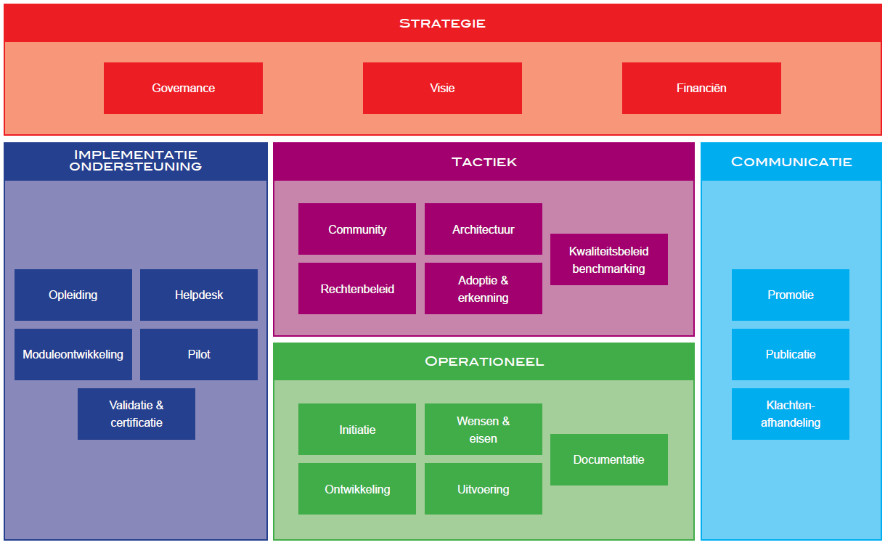

# Invulling van BOMOS voor het beheer van afsprakenstelsels

## Wat zijn afsprakenstelsels?

Afsprakenstelsels, of kortweg ‘stelsels’, zijn nauwe samenwerkingsvormen van verschillende partijen uit het bedrijfsleven, de overheid en de wetenschap, die producten of diensten leveren, op basis van vastgelegde eisen.  
Door afsprakenstelsels is het voor de deelnemende partijen duidelijk wat de spelregels zijn in de omgang met elkaar en het leveren van een product of dienst. Voor de gebruikers van de diensten biedt het keuzevrijheid met een kwaliteitsgarantie. Voorbeeld: je mag kiezen welke partij je helpt bij het insturen van jaarrapportages naar de Nederlandse Bank via SBR, alle erkende partijen doen wat ze moeten doen.
In het Engels wordt een afsprakenstelsel Trust Framework genoemd.

## Inhoud van een afsprakenstelsel

De kern van een afsprakenstelsel zijn de spelregels, waar je de leveranciers en andere betrokken partijen zich aan moet houden om mee te mogen doen en om een product of dienst te mogen leveren.
Deze spelregels bieden enerzijds de garantie voor de gebruiker dat je veilig en betrouwbaar het product of die dienst kan af nemen en anderzijds zijn dit onderlinge afspraken die de samenwerking succesvol maken. Elinor Ostrom beschrijft in het boek Governing the Commons de voorwaarden voor succesvolle samenwerking rond schaarse gemeenschappelijke voorzieningen zoals het beheer van waterputten. Deze principes zijn te herkennen in de samenwerking van succesvolle afsprakenstelsels. Deze zijn (vrij vertaald):
-	Er zijn duidelijke grenzen op gebied van homogene functionaliteit/middelen en een homogene gebruikersgroep.
-	Overeenstemming en balans in baten en lasten voor alle betrokkenen.
-	Iedereen kan bijdragen aan verbeteringen.
-	Controle (door transparantie) op alle betrokkenen.
-	Graduele sancties op overtreden afspraken zijn aanwezig en worden uitgevoerd.
-	Verschillen van inzicht kunnen snel en effectief opgelost worden.
-	Stelsel (deelnemers) heeft mandaat om zichzelf te organiseren.
-	Gebruik stelsels van stelsels om de individuele stelsels eenvoudig te houden.

Deze principes staan aan de basis van de afspraken en regels over de onderstaande aspecten die terugkomen als onderdelen binnen een afsprakenstelsel:
-	Informatie over rechten en plichten van deelnemende partijen: zoals definities, aansprakelijkheid, organen, besturing en taakverdeling.
-	Financiën: het beheren van een afsprakenstelsel en het organiseren van besturing kost geld: wat zijn de afspraken over wie wat betaalt?
-	Operatie: wie lost incidenten op? Wordt er gewerkt onder een label of merk? Denk aan communicatie, merkbeheer en afspraken over de operationele processen.
-	Normenkaders: aan welke eisen moeten de diensten/producten van leveranciers voldoen?
-	Architectuur en techniek: denk hierbij aan technische standaarden, use-cases en interface beschrijvingen.

### Voorbeeld van een afsprakenstelsel: Medmij

*Figuur 1: scope afsprakenstelsel Medmij*

Het afsprakenstelsel Medmij maakt het mogelijk dat de eindgebruiker de gezondheidsinformatie in de persoonlijke gezondsheidsomgeving veilig en betrouwbaar kan delen met zorgaanbieders zoals een apotheek of ziekenhuis. Hierbij kiezen de eindgebruikers een partij die de gezondheidsomgeving levert en ziekenhuizen een partij die ze op het Medmij netwerk aansluit. Het afsprakenstelsel zorgt voor de voorwaarden van veilig en betrouwbare uitwisseling en ook de technische voorzieningen om dit te operationaliseren. De scope van het afsprakenstelsel is het vlak waar de dienstverlener van de eindgebruiker samen gaat werken met de dienstverlener van de zorgaanbieder. Er zijn meerdere dienstverleners aan beide kanten en dankzij het stelsel blijft de complexiteit beperkt en werken de diensten en producten goed met elkaar samen.  
Deze opzet wordt  ook wel het “four corner” model genoemd; eindgebruikers zijn in dit geval via een eigen broker verbonden met andere deelnemers in het stelsel. Merk op: er zijn ook andere configuraties binnen een afsprakenstelsel mogelijk, zoals met een centrale voorziening (3-corner) of een extra afslag voor bijvoorbeeld transactie gedreven verantwoordingsinformatie (5-corner).

## Hoe is BOMOS als best practice inzetbaar voor het beheer van afsprakenstelsels?
Afsprakenstelsels zonder standaarden bestaan niet.... Standaarden staan aan de basis van het mogelijk maken van interoperabiliteit en samenwerking. Het lijkt dus op een bundeling van standaarden met daarbij een belangrijke toevoeging: bij een stelsel zijn er ook afspraken gemaakt over het operationaliseren van samenwerking om een product of dienst aan te bieden.
Voor een groot deel komt het beheer van een afsprakenstelsel en van een standaard goed overeen en maakt BOMOS prima toepasbaar voor deze bredere scope. De BOMOS activiteiten zijn binnen stelsels ook goed herkenbaar en toe te passen met hier en daar een uitzondering of afwijking. Net zoals bij het beheer van een standaard zijn er bij stelsels activiteiten gericht op het organiseren van de besturing, de doorontwikkeling, het beheren van centrale voorzieningen, het helpen bij aansluiten en promotie van gebruik.

Samen met de ICTU is aan de hand van deze methode ook een instrument gemaakt aan de hand van de BOMOS assessment maar dan toegespitst op afsprakenstelsels. Deze is op te vragen via Logius: [https://logius.nl/contact].

Inmiddels is er praktijkervaring opgedaan met het uitvoeren van deze specifieke BOMOS assessment voor stelsels. Na deze analyses is ook duidelijk naar voren gekomen hoe waardevol het om een raamwerk te hebben  die de structuur, definities, activiteiten en tips en trucs aanreiken. BOMOS zorgt hierbij voor een gezamenlijke “taal” en helpt om elkaars rollen en de beleving daarbij beter te begrijpen en dat maakt constructieve discussies mogelijk.

De uitkomst van een assessment helpt om in een korte termijn te komen tot een doelstelling om het beheer te professionaliseren, en wordt in beeld gebracht welke stappen daarvoor gezet moeten worden. Doe je een assessment samen met de stakeholders dan biedt dit gelijk het draagvlak om die veranderingen in gang te zetten.
Het BOMOS fundament is goed toepasbaar voor het inrichten van beheer van nieuwe afsprakenstelsels. BOMOS helpt dan om een programma of opdrachtgever een beeld te schetsen welke activiteiten ingeregeld moeten gaan worden en waarom. Dit beeld helpt bij het prioriteren en inplannen van het inregelen van beheeractiviteiten en het maken van de inschatting van de hiervoor benodigde middelen.

## BOMOS toegepast op afsprakenstelsels

## Strategie

### Governance

Het hebben van een gestructureerde afstemming tussen de verschillende betrokken partijen (‘de stakeholders’) binnen een stelsel is essentieel. Deze afstemming verloopt via de governance van een stelsel. Hiervoor is een beschrijving nodig van de organisatiestructuur, gremia voor besluitvorming en rollen.
De organisatiestructuur maakt duidelijk welke gremia bestaan in het kader van de besluitvorming en welk type beslissingen in welk gremium wordt genomen. Ook maakt de structuur duidelijk hoe taken, relaties en communicatie tussen de groepen geborgd is. Daarbij is een onderscheid tussen een sturend orgaan en uitvoering essentieel.
Afspraken hoe er besluiten worden genomen, hoe men lid kan worden van besluitvormende gremia en over de scope van sturing kunnen onderdeel maken van het afsprakenstelsel zelf maar kunnen ook daarbuiten liggen in de vorm van een instellingsbesluit of convenant.
De rol van toezichthouder is een extra rol ten opzichte van de rollen binnen standaarden: wat is er georganiseerd om te toetsen of de afspraken daadwerkelijk worden nagekomen en wat zijn de procedures en middelen om in te grijpen indien dit niet het geval is. Het is van belang deze taak onafhankelijk te beleggen om te voorkomen dat de slager zijn eigen vlees keurt. Daarnaast is deze rol belast met de taak om in geval van niet naleving passende maatregelen te nemen.

### Visie

Het doel van wat een afsprakenstelsel beoogt moet helder en duidelijk zijn. In de kern is de missie van een stelsel het “willen oplossen” van een probleem wat te complex en te groot is om zelfstandig te doen en waarbij de hulp van andere organisaties nodig is. Deze organisaties bundelen de krachten om deze oplossing te realiseren en om hierover afspraken over te maken. Dit uit zich in een positieve businesscase. Deze missie en visie komt terug in de communicatie uitingen van een stelsel en verbindt de partijen die actief binnen een stelsel actief zijn.

### Financiën
Voor de partijen die een actieve rol willen vervullen binnen een stelsel moet het financieel aantrekkelijk zijn en daar moet een positieve businesscase tegen over staan om een stelsel toekomst te geven. Dat geldt voor private, publiek-private en publieke stelsels. Deze businesscase is ook nodig om te verantwoorden dat een beheerorganisatie moet worden ingericht en voor een langere periode kan worden gefinancierd. De financiering voor de beheerorganisatie kan worden bekostigd door de stakeholders, leden van een stelsel of centraal vanuit de eigenaar.
Roadmapping (extra activiteit)
Het maken en hebben van een meerjarige roadmap bevat de strategische keuzes en hoe daar in stappen naar toe wordt gewerkt. Het helpt bij de adoptie omdat de stakeholders weten wanneer bepaalde functionaliteit wordt opgeleverd en daarmee aantrekkelijk wordt om gebruik te gaan maken van de stelselproducten of een rol te vervullen binnen het stelsel. Het maken en hebben van een gezamenlijk doel in de vorm van een roadmap zorgt ook voor draagvlak. Het bevat de concrete stappen om de visie te realiseren.

## Tactiek

### Community

Het begrip community is binnen afsprakenstelsel wat minder ingeburgerd maar er zijn wel organisatievormen die op tactisch niveau acteren maar meer in de vorm van een expertgroep of werkgroep. Deze groepen zijn betrokken bij inhoudelijke veranderingen in een afsprakenstelsel en het opstellen van advies over o.a. innovaties en architectuur. De governance van een stelsel geeft opdracht voor het inrichten van een expert– of werkgroep met een daarbij duidelijke opdracht.
De samenstelling binnen een werkgroep is afhankelijk van de opdracht. Er zijn werkgroepen die alleen bestaan uit een afvaardiging vanuit de leveranciers maar ook uit een samenstelling met gebruikers en andere stakeholders.

### Adoptie en Erkenning

Om in het overheidsdomein actief te zijn helpt het om een formele status te hebben van het stelsel, lees een verplichting of een advies om van de stelselproducten gebruik te maken. En een andere belangrijke factor is het ontwikkelen van een kritische massa rondom het gebruik. Het is vaak een kip – ei probleem waarbij partijen wachten wie de eerste stappen zet zelf mee gaan doen als bijvoorbeeld grote uitvoeringsorganisaties de overstap maken. Om dit goed te organiseren is een strategie noodzakelijk met daarbij de steun vanuit de stakeholders.  Hierdoor groeit ook de kans dat leveranciers een positieve businesscase kunnen maken en nieuwe deelnemers instappen. De governance is verantwoordelijk voor adoptie.

### Architectuur

Er zijn verschillende manieren of viewpoints (zie Archimate) om naar de architectuur te kijken: vanuit strategie, business, de applicaties en onderliggende componenten. Deze variatie aan zienswijze heeft vaak te maken met de verschillende rollen die partijen hebben binnen een stelsel. Idealiter zijn die allemaal beschreven, maar de praktijk kan dat per stelsel verschillen hoe dat is uitgewerkt. Het hebben van deze modellen helpt om makkelijker met elkaar te communiceren en de impact en kansen van veranderingen goed in te schatten. Het verlaagt ook de drempel voor nieuwe partijen die deel uit willen maken van een stelsel.
Binnen een stelsel speelt interoperabiliteit een belangrijke rol en dat zie je terugkomen in de aandacht voor de architectuur van de technische koppelvlakken tussen de verschillende partijen.  Onder architectuur vallen ook de keuzes welke (technische) standaarden binnen een stelsel gebruikt moeten worden door de deelnemers.
Het hebben en samen bepalen van architectuurprincipes voor een stelsel (zie NORA) is een waardevol kader om wijzigingsvoorstellen te toetsen.

### Stelselrisico analyse (extra activiteit)
Het afsprakenstelsel vormt de basis om veilig en betrouwbare gegevensuitwisseling mogelijk te maken tussen verschillende partijen. Daarvoor is het ook van belang om als governance een goed beeld te hebben hoe het gesteld is met dreigingen en risico’s op het stelsel zelf. Wat kan er misgaan, wat kan ik doen om dit te voorkomen en in het geval dat de dreiging realiteit wordt: wat zijn dan de stappen en wie betrek ik hierbij?

## Operationeel

### Wensen & Eisen
Net zoals standaarden ontwikkelt een afsprakenstelsel zich ook door om te voldoen aan de wensen en eisen van gebruikers. Een andere belangrijke kracht voor wijzigingen die structureel bijdragen aan de businesscase, wet- en regelgeving en maatregelen om aan (toekomstige) dreigingen rond veiligheid en betrouwbaarheid te voldoen.  Om dit in goed banen te leiden bevat een afsprakenstelsel regels hoe wijzigingen geïnitieerd worden, beschrijving van de besluitvorming en hoe die wijzigingen in het afsprakenstelsel terecht komen en uiteindelijk geïmplementeerd worden door de betrokken partijen. Een belangrijk aspect bij het doorvoeren en implementeren van wijzigingen in een stelsel is het borgen van continuïteit: idealiter voorkom je scenario’s waarbij wijzigingen via een big bang scenario worden uitgerold maar kan dit in een eigen tempo. Dit is te organiseren door een vorm van backward compatibility te faciliteren.
Documentatie
Het afsprakenstelsel is vrij beschikbaar en toegankelijk. Hiermee voorkom je dat de buitenwereld met wantrouwen kijkt naar wat er binnen een afsprakenstelsel gebeurt omdat het dan meer lijkt op een kartel. Idealiter zijn de stukken die gebruikt zijn ook publiek toegankelijk. Transparantie helpt bij het realiseren van draagvlak.  

### Operationeel handboek (extra activiteit)
Een afsprakenstelsel bevat voor een belangrijk deel afspraken hoe met elkaar wordt samengewerkt. Dit gaat over onderwerpen hoe je zoals bij wensen & eisen over het wijzigproces maar ook hoe je kan toetreden, hoe verstoringen en incidenten worden gemeld en verholpen, over de service windows van de betrokken partijen en over de rapportage-eisen richting elkaar en de governance.

## Implementatieondersteuning
De mate hoe een afsprakenstelsel hier invulling aan geeft is afhankelijk van de taakverdeling tussen de deelnemers binnen een stelsel en de stelselbeheerorganisatie. Het is daarbij logisch dat de partij die een contract afsluit met een leverancier daar ook aanklopt voor ondersteuning bij de implementatie (aansluiten) en het gebruik. Binnen het stelsel zelf heeft de beheerorganisatie een taak om een rol te spelen bij vraagstukken rond de interpretatie van de stelsel specificaties en bijvoorbeeld bij het aansluiten op het netwerk.

### Validatie& certificatie
Er zijn stelsels die validatie-tooling beschikbaar stellen waarmee deelnemers hun implementatie mee kunnen testen. Het is van groot belang dat de leveranciers betrokken zijn met de realisatie en toetsing van dergelijke tooling om te voorkomen dat pas in een laat stadium (tijdens de realisatie) onvolkomenheden en onduidelijkheden in specificaties boven tafel komen.
Rond inspectie en certificatie: dit is normaliter een taak van de partij die de rol van toezichthouder vervult. De toezichthouder kijkt of het afgesproken normenkader goed is geïmplementeerd bij de leverancier. Er zijn afspraken wanneer de leverancier zelf actief de toezichthouder informeert om een toetsing uit te voeren. Denk hierbij aan wijzigingen op processen die raakvlak hebben met het normenkader.

## Communicatie

### Promotie
De voordelen van de product of dienst van een afsprakenstelsel moeten bij zoveel mogelijk publiek bekend worden gemaakt. Het hebben van een gemeenschappelijk merk of label helpt daarbij en zorgt voor de herkenbaarheid van de dienst. Het afsprakenstelsel bevat regels hoe generieke uitingen worden opgesteld, merkbeheer, wat de beheerorganisatie doet en wat de speelruimte van de leveranciers is. De leveranciers zijn verantwoordelijk voor hun eigen marketing en acties om de eigen markt te vergroten maar zijn daarbij gebonden aan het afsprakenstelsel.  De beheerorganisatie heeft een rol om de voordelen van het stelsel uit te dragen maar niet van de individuele diensten of producten van de leveranciers die onder dit stelsel vallen.

### Publicatie

Hieronder valt het hebben van een site die informatie bevat over het afsprakenstelsel, inzet van sociale media en het delen van informatie met specifieke gebruikersgroepen.

### Klachtenafhandeling
De gebruikers kunnen de behoefte hebben om naast het indienen van de klacht bij de eigen leverancier ook bij een onafhankelijke partij die klacht te melden. Een klachtencommissie kan het geval dat beide partijen er niet uitkomen een bindende uitspraak
