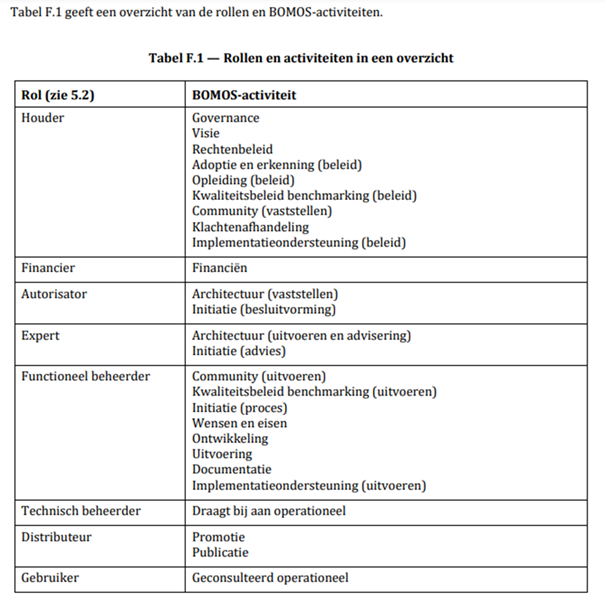
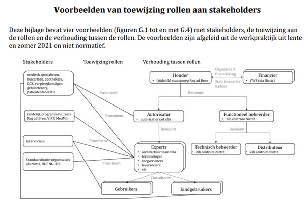
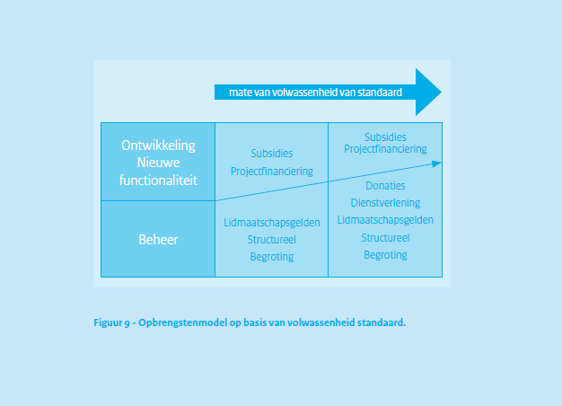

# De ontwikkel- en beheerorganisatie (Activiteit Governance)
Het beleid uitzetten over de eigen bestuurlijke organisatie (zoals de rechtsvorm); het huishoudelijke reglement (de charter), maar ook allianties vormen met andere organisaties. Het regelen van besluitvorming is cruciaal.

## Organisatiestructuur
In het BOMOS activiteitenmodel  zijn de verschillende activiteiten opgesomd die kunnen plaatsvinden in een standaardisatiegemeenschap. Figuur 2 schetst een globale organisatiestructuur hiervoor. Een belangrijk uitgangspunt is de scheiding tussen inhoudelijke activiteiten in de uitvoeringsorganisatie en de besluitvorming door het bestuur.

  
Figuur 2 - Organisatiestructuur

Het bestuur geeft opdracht aan een (not-for-profit) uitvoeringsorganisatie die verantwoordelijk is voor een groot deel van de beheertaken. Het bestuur verenigt de behoeften in dezen van zijn achterban en heeft het mandaat namens dezen te besluiten over zaken die de betreffende standaarden betreffen. Bestuur en uitvoeringsorganisatie werken bij voorkeur met wederzijdse eenhoofdige aanspreekpunten. Het bestuur is voornamelijk belast met de taak 'besluitvorming'. In de praktijk komt het bestuur een paar keer per jaar bij elkaar, wat geen belemmering mag zijn voor de gewenste besluitvorming. Het bestuur moet de uitvoeringsorganisatie voldoende mandaat geven. In de praktijk zien we dat sommige besluiten ook schriftelijk (e-mail) aan bestuursleden voorgelegd kunnen worden voor goedkeuring, of dat de verantwoordelijkheid van bepaalde activiteiten (bijv. communicatie) bij een enkel bestuurslid worden belegd. Dit maakt het eenvoudiger om bilateraal overleg tussen de uitvoeringsorganisatie en het verantwoordelijke bestuurslid te voeren en ook besluiten tussentijds te nemen (en kan als alternatief dienen voor de wederzijdse eenhoofdige aanspreekpunten).

De kern is dat duidelijk moet zijn vastgelegd welke besluiten in de bestuursvergadering genomen dienen te worden; welke schriftelijk (e-mail) voorgelegd kunnen worden, welke door een specifiek bestuurslid genomen kunnen worden, en voor welke besluiten het mandaat bij  de uitvoeringsorganisatie ligt. In de praktijk worden vaak jaarplannen gebruikt voor de opdrachtformulering van het bestuur aan de uitvoeringsorganisatie. Op basis van rapportages over het jaarplan legt de uitvoeringsorganisatie dan verantwoording af aan het bestuur. Het jaarplan beschrijft welke taken uitgevoerd moeten worden; welke werkgroepen er zijn of opgestart moeten worden, wat de doelen voor de werkgroep zijn, etc. Het jaarplan wordt goedgekeurd door het bestuur en is daarmee de opdracht voor de uitvoeringsorganisatie. Het BOMOS activiteitel model kan als kapstok dienen om de taken in het jaarplan te benoemen. Het jaarplan maakt het ook goed mogelijk om afspraken te maken over uit te besteden taken. Feitelijke standaardontwikkeling vindt plaats in werkgroepen waarin de gebruikers van de standaarden participeren. De werkgroepen worden door de uitvoeringsorganisatie gecoördineerd. Veelal worden ook de daadwerkelijke uitwerkingen opgesteld door de uitvoeringsorganisatie op basis van discussies in de werkgroepen. De uitkomst van de werkgroep, een nieuwe versie van een standaard, kan door het bestuur vastgesteld worden en uitgebracht worden als nieuwe versie. De besluitvorming, wie (bestuur/werkgroep) bepaalt wat, moet helder geregeld zijn.

Bij voorkeur wordt onderscheid gemaakt tussen verschillende zwaartes van wijzigingen in standaarden, zodat de lichtste wijzigingen door de betreffende werkgroep of de uitvoeringsorganisatie zelf kunnen worden afgehandeld en alleen de meest fundamentele wijzigingen betrokkenheid van het bestuur vragen, tot aan een bestuursbesluit. Een werkgroep die continu overruled wordt door het bestuur is niet werkbaar.

Eventueel kan een adviesorgaan opgericht worden om het bestuur met gevraagd en ongevraagd advies ter zijde te staan. De uitkomst van een werk- groep zal in dat geval als voorstel naar het adviesorgaan gaan die daarover aan het bestuur zal adviseren. Het adviesorgaan bestaat bij voorkeur uit onafhankelijke en onbetwiste deskundigen, en kan een middel zijn om de onafhankelijkheid en expertise te versterken. Het is van belang dat deze deskundigen gekozen worden op basis van kennis en ervaring en niet op basis van belangen of vertegenwoordiging van een organisatie; immers aan hen wordt enkel gevraagd om inhoudelijk advies. De vertegenwoordiging van belangen is gevestigd in het bestuur.

Een typische inhoudelijke categorische afbakening van werkgroepen vindt plaats langs de volgende (gelaagde) lijnen:

*   architectuur
*   processen/services
*   data/gegevens/berichten
*   technische standaard/transactiestandaard
*   beveiliging

Een andere veel gebruikte afbakening is op basis van het probleemdomein, bijvoorbeeld de SETU kent een tweetal werkgroepen, te weten Bemiddeling en Verwerking. De werkgroep Bemiddeling houdt zich bezig met de standaarden van offerteaanvraag tot aan de plaatsing van een uitzendkracht, terwijl de werkgroep Verwerking de standaarden van plaatsing tot aan factuur tot haar scope rekent. In de praktijk zullen bij complexere standaarden bepaalde categoriën werkgroepen (bijv. 'gegevens') weer onderverdeeld worden in werkgroepen per probleemdomein (bijv. 'facturatie'), waarmee een combinatie van beide indelingen wordt gerealiseerd.

Bijzondere aandacht verdienen de leveranciers. Dit is regelmatig een heet hangijzer bij non-profit beheerorganisaties. Voor het welslagen van een standaard (zonder juiste implementatie geen werkende standaard') vaak cruciaal, maar leveranciers kunnen ook conflicterende belangen hebben. In beginsel kunnen leveranciers gewoon als deelnemer in de standaard acteren en rollen in de werkgroepen vervullen tot aan deelname in het bestuur. De praktijk laat zien dat softwareleveranciers veelal zeer nuttige bijdragen leveren in werkgroepen waardoor het zeker aan te raden is om leveranciers toegang tot de werkgroepen te verlenen. Vaak heerst er angst dat leveranciers te nadrukkelijk een stempel gaan drukken op de standaard. Een aparte leveranciersgroep zoals aangegeven in figuur 2 is dan een optie waarmee de leveranciers enerzijds een platform wordt geboden terwijl ze anderzijds buiten de werkgroepen en bestuur kunnen worden gehouden. Softwareleveranciers zijn dan verenigd in een leveranciersgroep, die de uitvoeringsorganisatie van advies kunnen voorzien en overleg kunnen voeren met het adviesorgaan.

De besluitvorming binnen de werkgroep kan afhankelijk zijn van de mogelijke deelname van leveranciers, en ook afhankelijk zijn van de opstelling van de leveranciers. In de praktijk zal de keuze voor de mate van invloed ook afhangen van de manier waarop de gemeenschap is georganiseerd; indien de ontwikkeling van de standaard gedreven wordt vanuit het belang van de softwareleveranciers dan zullen deze een grotere invloed (willen) uitoefenen op 'hun' standaard. Wordt de ontwikkeling gedreven vanuit een (overheids-)gebruikersbehoefte dan zullen deze een grotere invloed (willen) uitoefenen.

In het figuur is een eenvoudige basisstructuur geschetst van bestuur, uitvoeringsorganisatie en werkgroepen. Facultatief kan daar een adviesorgaan en/of leveranciersgroep aan toegevoegd worden. Naast deze geschetste mogelijkheden zijn er nog vele alternatieven, zowel eenvoudiger als complexer. Welke structuur ook gekozen wordt, bij voorkeur worden de verslagen van de verschillende gremia openbaar ter beschikking gesteld.

## Rollen en activiteiten.
Eerder zijn de rollen voor het ontwikkel- en beheerproces gedefinieerd, en zijn ze gekoppeld aan de hoofdactiviteiten van BOMOS. Omgekeerd kijken we er nu in meer detail naar. Onderstaande tabel geeft vanuit de rollen aan in welke BOMOS activiteiten ze betrokken kunnen zijn; dat laat ook zien dat een 1-op-1 koppeling tussen rol en activiteit niet werkt.

### KADER: het zorgdomein
Het zorgdomein is een complexe situatie met stakeholders en partijen die een belang hebben in de standaardisatie ontwikkeling. Door het leggen van relaties tussen de rollen, en de invulling van de rollen met de namen van de stakeholders/partijen wordt een helder inzicht gecreerd in de wereld van deze zorg standaard. (bron voorbeeld: NEN 7522-2021)

## Beheertaken uitvoering
Voor de invulling van ontwikkelen beheertaken in een organisatiestructuur zijn verschillende mogelijkheden, variërend van het beleggen bij een standaardisatieorganisatie tot het volledig zelf invullen in een eigen organisatie. Het is geen doel op zich om voor elke standaard een eigen beheeren ontwikkelorganisatie op te tuigen. De praktijk laat zien dat weinig bestaande organisaties zijn berekend op het complete takenpakket, waardoor toch vele standaardisatiecommunities hebben besloten een eigen organisatie op te tuigen. Een deel van de taken wordt dan belegd bij de eigen organisatie, maar een deel van de taken kan ook belegd worden bij andere soorten organisaties. Zie figuur 3 voor mogelijkheden.

Het model maakt onderscheid tussen not-for-profit en profit organisaties. Dit onderscheid is relevant in het kader van openheid (zie hoofdstuk 8). Indien het beheer van een standaard is belegd bij een profit-organisatie kan er geen sprake zijn van een open standaard! Dat wil niet zeggen dat commerciële organisaties geen open standaarden kunnen ontwikkelen in opdracht van een bestuur (organisatie), of na ontwikkeling doneren aan een not-forprofit beheerorganisatie. Het ontwikkelen en beheren van standaarden dient altijd not-for-profit te gebeuren, waarbij een not-for profit organisatie wel het meest voor de hand liggend is.

Een eerste voor de hand liggende mogelijkheid is het beleggen van de beheertaken bij formele standaardisatieorganisaties. De wereld is hier wel veranderd in vergelijking met twintig jaar geleden toen het merendeel van de standaarden door deze formele organisaties werd ontwikkeld. In de huidige tijd wordt het merendeel van de standaarden buiten de formele standaardisatieorganisaties ontwikkeld in allerlei vormen van consortia, en dat aantal blijft groeien. Voor de semantische standaarden speelt dit in extreme mate. Deels heeft dit te maken met de traagheid van processen bij formele standaardisatieorganisaties, maar voornamelijk het gebrek aan inhoudelijke kennis en expertise. Voor semantische standaarden is domeinkennis essentieel.

Dit wil niet zeggen dat formele standaardisatieorganisaties geen waarde hebben, integendeel. Op een aantal punten hebben ze potentieel een belangrijke toegevoegde waarde. Bijvoorbeeld om de status van de standaard te verhogen. Zo is NEN3610 ontwikkeld door Geonovum, maar voor extra status ook uitgebracht als NEN-norm. Daarnaast is secretariële ondersteuning voor werkgroepen ook een prima taak die extern belegd kan worden.

De inhoudelijke kennis zal echter altijd zelf georganiseerd moeten worden. Onderzoeksorganisaties, zoals universiteiten en instituten, zijn een andere mogelijkheid om taken bij te beleggen. Voordeel is de schat aan inhoudelijke kennis, maar mogelijk ook een gebrek aan domeinkennis of kennis van het specifieke gebruik. Het tegenovergestelde is het geval bij brancheorganisaties; voordeel hier is de uitmuntende domeinkennis, maar nadeel is juist een gebrek aan inhoudelijke standaardisatie/ICT kennis. Vaak zijn (semantische) standaarden voor brancheorganisaties een ver van hun bed show. Het onderwerp wordt al snel afgedaan als iets van techneuten, wat het in de kern niet is; juist voor semantiek is domeinkennis van groot belang.

Een eigen organisatie oprichten is een mogelijkheid, evenals commerciële dienstverleners inschakelen. Dat laatste is wel op gespannen voet met de openheidprincipes. De eigen organisatie is de meest gekozen optie voor de kern van ontwikkelen beheertaken. Velen domeinen kennen inmiddels eigen organisaties die kennis hebben van zowel het domein als standaardisatie, bijvoorbeeld (Geonovum, EduStandaard, CROW, Informatiehuis Water, SETU, etc.). Tot de kern van hun werk behoren de strategische beheeractiviteiten zoals geïdentificeerd in het model, en in grote mate ook de tactische en operationele activiteiten. In deze situatie zijn bepaalde activiteiten eenvoudig en zelfs beter om uit te besteden.

Een aantal suggesties:

**Moduleontwikkeling:** Moduleontwikkeling is riskant om binnen de ontwikkel- en beheerorganisatie te laten plaatsvinden. Daarmee wordt men ook leverancier en concurrent van partijen in de gemeenschap. Beter is om moduleontwikkeling te stimuleren buiten de ontwikkel- en beheerorganisatie,mogelijk in de vorm van open source software. Dit kan andere leveranciers ook bewegen om de standaard te gaan ondersteunen en/of betrokken te raken bij de ontwikkeling daarvan. De beste aanpak is afhankelijk van de kenmerken van de gemeenschap.

**Certificeren:** Essentieel bij certificeren is de onafhankelijkheid van de certificerende instelling. Gebruikelijk is dat de ontwikkel- en beheerorgasatie het toetsingskader opstelt, en vervolgens de daadwerkelijke toetsing (op basis van het toetsingskader) uitbesteedt aan externe partijen die zich specifiek richten op het toetsen en certificeren.

**Architectuur/Roadmapping/Benchmarking**; Ondersteuning en uitvoering hiervoor past uitstekend bij een research-organisatie in brede zin (Naast kennisinstituten, ook organisaties zoals CBS voor benchmarking). Met name voor benchmarking geldt dat dit beter bij een externe organisatie belegd kan worden.

**Communicatie:** Past vaak goed bij een brancheorganisatie die al een communicatieapparaat heeft ingericht. Uiteraard moet er dan wel een brancheorganisatie zijn die naadloos aansluit bij de standaard en die bereid is de communicatie als belangrijke taak mee te nemen. Communicatie rondom het beheer- en ontwikkelproces van een standaard vraagt om specifieke kennis van dat beheer en heeft een specifieke doelgroep zoals softwareleveranciers. Dit dient door een brancheorganisatie onderkend te worden. Andere opties zijn communcatieafdelingen van een andere partner organisatie.

Op hoofdniveau kunnen we concluderen dat er de keuze is om de ontwikkel- en beheertaken te beleggen bij:

1. Bestaande organisaties
2. Nieuwe organisaties
3. Combinatie van beiden

Het beleggen van alle taken bij een bestaande situatie klinkt ideaal, maar er is geen organisatie die alleenstaand voor het complete takenpakket is toegerust. Ook organisaties als NEN, Forum Standaardisatie, etc. zijn daar niet op ingericht.

Daardoor is het in de praktijk vaak noodzakelijk om een nieuwe organisatie op te richten, als er binnen het domein nog geen organisatie bestaat gericht op standaardisatie. Optie 3, de combinatie van beide, betekent dat bepaalde taken door deze (nieuwe) specifieke domein standaardisatie organisatie worden opgepakt en andere taken door ander type organisaties, conform de beschrijving in deze paragraaf over het uitbesteden van taken.

## De organisatievorm
Of het nu slechts een deel van de taken of alle taken door de nieuwe organisatie uitgevoerd moeten gaan worden, de nieuwe organisatie moet in beide gevallen opgericht worden waarvoor een rechtsvorm nodig is. Nederland kent tal van organisatie rechtsvormen. Openheid van de standaard is absoluut een essentieel uitgangspunt. De definitie van openheid schrijft voor dat de (besluitvorming van de) standaard belegd wordt bij een not-for-profit organisatie. Daarmee worden een groot deel van de organisatievormen uitgesloten, en zijn slechts enkel voor de hand liggen, te weten:

1. Stichting
2. Vereniging
3. Overheidsorganisatie (als verzamelterm)

**De stichting:** Een stichting is een rechtspersoon en wordt opgericht bij notariële akte, door één of meerdere natuurlijke of rechtspersonen. In de regel heeft een bestuur een voorzitter, secretaris en penningmeester. Het bestuur is het enige verplichte orgaan van een stichting. Daarnaast kan er nog een raad van toezicht zijn, die toezicht houdt op het stichtingsbestuur. In tegenstelling tot een vereniging heeft een stichting geen leden. Een stichting kan wel donateurs hebben, maar die hebben geen zeggenschap. Een stichting kan ook vrijwilligers hebben.

<aside class="example">
Kader input: voorbeelden van beheerorganisaties en hun organisatievorm
</aside>

**De vereniging:** Een vereniging is een rechtspersoon voor de Nederlandse wet. Een vereniging wordt meestal opgericht door bij de notaris hiervan een akte op te maken. Dit is niet noodzakelijk, maar zonder notaris heeft de vereniging beperkte rechtsbevoegdheid (de bestuurders zijn hoofdelijk aansprakelijk). Wanneer een vereniging bij de notaris opgericht is, zijn er ook statuten. Hierin staat tenminste het doel van de vereniging, de verplichtingen van de leden, het bijeenroepen van de algemene (leden)vergadering en het benoemen/ontslaan van de bestuurders. Een vereniging heeft een doel dat nagestreefd wordt. Dit doel mag niet het verdelen van winst onder de leden zijn. Wat niet wil zeggen dat er geen winst gemaakt mag worden, maar deze moet ingezet worden voor een bepaald doel (zoals het doel van de vereniging, kennisdeling, verbetering van de kwaliteit, liefdadigheid, etc.). Een vereniging heeft leden. Dit zijn mensen die lid zijn van de vereniging omdat zij het doel steunen. De leden betalen meestal contributie om de vereniging draaiend te houden. Leden hebben invloed in het beleid van de vereniging via een algemene (leden)vergadering (ALV). Zo’n vergadering wordt minstens jaarlijks gehouden en elk lid is hiervoor uitgenodigd en stemgerechtigd. De ALV heeft alle bevoegdheden die niet door de wet of de statuten geregeld zijn en is dus het hoogste orgaan van de vereniging.

**De overheidsorganisatie:** Er zijn verschillende vormen van overheidsorganisaties, waardoor een korte bespreking onmogelijk is. Het inzetten van een overheidsorganisatie zou op verschillende manieren kunnen: één overheidsorganisatie als beheerorganisatie voor alle aan de overheid gerelateerde standaarden, of per standaard één overheidsorganisatie. Daarnaast kan een enkele overheidsorganisatie de uitvoering van het beheer op zich nemen, maar kunnen meerdere overheden zich ook verenigen. Dit kan bijvoorbeeld in een vereniging. De keuze van de rechtsvorm dient weloverwogen te gebeuren, waarbij ook zaken als de eenvoud van het opzetten moet worden meegenomen. Bij een stichting speelt dat het mogelijk lastig is voor overheidspartijen om aan een stichting deel te nemen, en dat een stichting geen leden mag hebben. Bij een vereniging speelt de grote macht van de ALV. Met een stichting en vereniging is het wel eenvoudig om openheid aan te tonen. Bij zowel de stichting als de vereniging zijn de statuten belangrijk; deze regelen in feite het mandaat van de rollen in de organisatie.

Ondanks het feit dat een stichting geen leden kan hebben spreekt men bij HL7 Nederland wel over leden, maar hanteert men strikt formeel de term _aangeslotenen_. SETU kent geen leden, maar wel participanten. Een samenwerkingsverband zonder rechtsvorm kan in de praktijk goed werken voor het beheer maar kan in praktische zaken weer nadelig zijn doordat het samenwerkingsverband als zodanig geen bevoegdheden heeft tot het aangaan van overeenkomsten; hierbij zal altijd één van de partners deze overeenkomst moeten aangaan. Mogelijke nadelen die hieraan kleven zijn het verlies van identiteit; het gebonden zijn aan regels en beperkingen van de partner; minder slagvaardigheid etc. Het voordeel van een dergelijke organisatievorm is dat deze eenvoudig is in te richten en op te heffen zonder juridische consequenties. De organisatieinrichting kan in enige mate de vrijblijvendheid reduceren of op zijn minst expliciteren. De vrijblijvendheid van de deelnemers in standaarden is zeker een serieus aandachtspunt in het kader van een duurzaam toegepaste standaard.

<aside class="note">
**Naast 'harde' invulling ook aandacht voor 'zachte' facetten**

Dit hoofdstuk beschrijft veelal relatief 'harde' invulling van de organisatie, de valkuil is om de 'zachte' facetten uit het oog te verliezen. Bij standaardisatie zijn vaak ook de zachte factoren van groot belang voor het succes van een standaard. Het smeden van een consortium waarin partijen elkaar vertrouwen en constructief kunnen samenwerken zonder dat elk incident gelijk een bom legt onder het voort-bestaan van het consortium is een bijzonder sociaal en organisch proces.
</aside>

### KADER: Template voor beheerdocument van Geonovum
Om opdrachtgevers meer inzicht te geven in de activiteiten in het beheerproces van standaarden, hebben wij een generiek beheerdocument opgesteld. Hierin staat  wat Geonovum doet in elk activiteitengroep van het BOMOS-model. Voor elke door Geonovum te beheren standaard stelt Geonovum daarnaast een specifiek beheerdocument op. In dit specifieke beheerdocument zijn de aanvullende afspraken vastgelegd voor een standaard. In wezen biedt het specifieke beheerdocument het overzicht van meer- en minderwerk uitgaand van het generieke beheerdocument.

Om de kosten van beheer optimaal inzichtelijk te maken, heeft Geonovum op basis van het generieke en het specifieke beheermodel, onlangs ook een BOMOS rekenmodel ontwikkeld. Op basis van een reeds bekende en beheerde standaard is de benodigde basis inzet berekend. Deze basis gebruiken we vervolgens om een gerichte inschatting te kunnen maken van meer- en minderwerk zoals beschreven in het specifieke beheerdocument. Hierdoor kunnen we beheerkosten realistisch en onderbouwd inschatten.

Dit is ook voor andere organisaties te gebruiken: om het rekenmodel te kunnen gebruiken, kunnen zij een eigen generiek beheerplan maken, en voor de door hen beheerde standaarden een specifiek beheerplan. Die twee documenten zijn dan input voor het bijbehorende rekenmodel.
 

### Visie

Inhoudelijke visie ontwikkelen over de richting van de standaard in de context: De plek op de horizon op de lange termijn. Een compacte vertaling in bijvoorbeeld een factsheet van deze visie kan ook zeer nuttig zijn in de communicatie rond de standaard en het bevorderen van adoptie van de standaard. Ook moet er aandacht zijn voor innovatie; veel organisaties gebruiken daar hulpmiddelen voor als een radar, of specifiek een tech-radar; daarin worden innovatieve ontwikkeling geplot op een radar op basis van tijd en impact. Dit soort hulpmiddelen zijn ook hier van toepassing. De visie voor een standaard is op zich niet anders dan de visie rond een bedrijf/product, etc. Vandaar dat BOMOS hier geen specifieke invulling voor standaarden aan geeft. De verdere detailering van de in de visie benoemde innovatie onderwerpen zal veelal op tactisch niveau plaatsvinden, bijvoorbeeld als onderdeel van Architectuur.

# De kosten en de opbrengsten (Activiteit: Financien)
Een financieel model voor de lange termijn hebben die opbrengsten garandeert in overeenstemming met de behoefte is het voornaamste doel van deze activiteit.
Een standaard ontwikkelen en beheren kost structureel geld. De hoeveelheid is sterk afhankelijk van de context en dynamiek van de standaard en het is niet eenvoudig hier generieke uitspraken over te doen. De eerste ontwikkelingen starten vaak met projecten die beginnen met budgetten vanaf 30.000 euro tot vele malen groter. Een eerste project levert ook niet direct een standaard op, maar heeft in een werkgroep de mogelijkheden en scope van een standaard onderzocht. Na de initiële ontwikkeling moet de standaard structureel worden beheerd en doorontwikkeld. Er zijn cases bekend die het beheer met budgetten in de order van 250.000 tot 900.000 euro (per jaar) hebben georganiseerd. Tot op heden is hier weinig onderzoek naar gedaan, met uitzondering van de Ethernet standaard: deze technische standaard heeft $10 miljoen dollar gekost om te ontwikkelen. Andere informatie bekend uit literatuur is dat de opbrengsten van verkoop van ISO standaarden voor de helft voorziet in de kosten die ISO maakt in de ontwikkeling en beheer van de ISO standaarden.

## De baten van standaardisatie generiek
Er mogen dan weinig cijfers beschikbaar zijn maar er is voldoende economisch onderzoek gedaan naar de vooren nadelen van standaardisatie. Bijgaande tabel geeft een samenvatting:

|  | Positive effects | Negative effects |
| :--- | :--- | :--- |
| Compatability / interface | Network externalities | Monopoly |
|  | Avoiding Lock-ins |  |
|  | Increased variety of systems products |  |
| Variety reduction | Economies of scale | Reduced choice |
|  | Building focus and critical mass | Market concentration |
| Information standards | Facilitates trade | Regulatory capture |
|  | Reduced transaction costs |  |

Voor semantische (domein) standaarden zijn met name relevant:

Positieve netwerkeffecten (wordt waardevoller met meer gebruikers)

*   Voorkomen van vendor lock-ins
*   Toename variëteit in producten en diensten
*   Schaalvoordeel
*   Verlagen transactiekosten

## Kosten en opbrengsten
Wel is het mogelijk om te kijken naar de mogelijke kostenposten en opbrengsten van het beheer van standaarden. De balans vat deze samen.

| Debet | Credit |
|  :--- |  :---  |
| Ontwikkelkosten | Structureel begroting |
| Beheerkosten | Projectfinanciering |
| Communicatie | Lidmaatschapsgelden |
| Lidmaatschapskosten (+reiskosten) | Subsidie |
| Bedrijfsvoering (accountant) | Dienstverlening |
| Huisvesting | Licenties |
| Goodwill | Licenties |
| Tooling (Licenties) |  |
| Financieringskosten |  |

### Debet
De voornaamste kosten zullen in principe gerelateerd zijn aan de personeelskosten voor de primaire taak van de organisatie; de ontwikkeling van nieuwe functionaliteit en het onderhouden van al bestaande functionaliteit in de standaarden. De standaarden worden gepubliceerd en mogelijk ook promotioneel onder de aandacht gebracht waarvoor communicatiekosten gemaakt worden. Bij communicatiekosten kan men naast de personeelskosten denken aan kosten voor het optuigen van een communicatieplatform, het organiseren van bijeenkomsten, de website en bijvoorbeeld drukwerk.

Vaak worden er specifieke software tools gebruikt zoals datamodelleersoftware waarvoor licentiekosten betaald moeten worden. Een andere potentiële kostenpost is de deelname aan verwante standaardisatieorganisaties waarvoor lidmaatschapskosten worden gerekend. In verschillende communities kan deze post variëren van 0 tot 15% en hoger, van het totale budget. Daarbij zijn dan vaak ook reiskosten noodzakelijk voor de internationale bijeenkomsten. Standaard bedrijfsvoeringkosten zijn ook van toepassing zoals ICTvoorzieningen (kantoorautomatisering), huisvesting en kosten van de accountant voor de jaarrekening. Goodwill kan ook als kostenpost worden beschouwd. Goodwill is dan de investeringen die men in de omgeving moet plegen die niet direct bijdragen aan de standaard zelf, zoals het deelnemen aan bijeenkomsten en accountmanagement. Vaak is dit een investering om goodwill van anderen in return te krijgen (als opbrengst). Tot slot zijn er de financieringskosten waarmee de activiteiten worden bedoeld om inkomsten te genereren voor de standaardisatieactiviteiten. Afhankelijk van het financieringsmodel kunnen dat kosten zijn voor het verwerven van leden tot aan het aanvragen van subsidies en dergelijke.

De verhoudingen kunnen door de tijd verschuiven, bijvoorbeeld in een bepaalde fase van een standaard kan er pas op de plaats gemaakt worden met de ontwikkeling en wordt de focus verlegd op de communicatie om de adoptie van de standaard te bevorderen. In lijn hiermee zullen kosten verschuiven van ontwikkeling naar communicatie.

### Credit
Potentiële bronnen van inkomsten zijn bijvoorbeeld stakeholders die geld uit de structurele begroting beschikbaar stellen voor de standaard. Dat kan een ministerie zijn, maar even goed een brancheof belangenorganisatie. Op dezelfde manier kunnen deze organisaties ook tijdelijk voor een bepaald doel (project)financiering beschikbaar stellen. Daarnaast, aangezien standaarden een maatschappelijk en economisch belang hebben, zijn er vaak mogelijkheden voor subsidie. Deze subsidies zijn ook een mogelijke bron van inkomsten; maar het verkrijgen daarvan kan omslachtig zijn, en er kunnen beperkende voorwaarden zijn voor de inzet van het geld.

Structurele financieringsvormen verdienen de voorkeur boven tijdelijke (project) financieringsvormen. Niemand zal namelijk een standaard willen implementeren waarvan het onzeker is of die volgend jaar nog wel beheerd wordt omdat de standaard werkt met aflopende projectfinanciering. Daarnaast is structurele financiering een eis voor opname op de pas-toe of leg-uit lijst met open standaarden van het Forum Standaardisatie.

Andere potentiële opbrengsten zijn gerelateerd aan de standaard zelf. Het is mogelijk om geld te vragen voor zowel het downloaden van de documenten met specificaties, of het kan gekoppeld worden aan het gebruik van de standaard. Beide vormen zijn niet bevorderlijk voor de adoptie van de standaard. In de praktijk is veel weerstand tegen het betalen voor het standaardisatiedocument, ongeacht het bedrag. Dit is wel het huidige business model dat het NEN hanteert voor haar normen. Ook in het kader van openheid (zie hoofdstuk 8) is het niet verstandig om geld te vragen voor de documenten of het gebruik van de standaard. Hoe beperkt het bedrag ook moge zijn, de standaarden worden er op zijn minst minder open door. In de praktijk worden dan ook regelmatig draft versies van deze standaarden gebruikt, omdat deze nog gratis verspreid mogen worden.

Dienstverlening gerelateerd aan de standaard is een andere mogelijkheid. Te denken valt daarbij aan consultancy over de standaard of implementatieconsultancy. Diensten aanbieden bijvoorbeeld in de vorm van een centrale berichtenmakelaar, of andere vormen van het leveren van software/hardware zijn ook mogelijkheden. Tot slot zouden er inkomsten gekoppeld kunnen worden aan dienstverlening op het gebied van validatie en certificatie. Al deze vormen van dienstverlening brengen wel een risico met zich mee. Naast een beheerorganisatie wordt de organisatie ook een dienstverlener. Dat kan conflicterend zijn: vooral door andere dienstverleners in de markt wordt dat opgevat als oneerlijke concurrentie. Ook kan er een verwevenheid ontstaan tussen het dienstverleningsproduct en de standaard zelf, indien blijkt dat het eigen product een bepaald deel van de standaard niet goed ondersteunt, kan ervoor gekozen worden de standaard te wijzigen in plaats van te investeren in een product dat de standaard wel volledig ondersteunt. Duidelijke scoping van welke dienstverlening de beheerorganisatie op zich neemt en welke men overlaat aan de markt is essentieel.

Naast de structurele financiering uit de begroting van een belangrijke stakeholder is de meest voor de hand liggende inkomstenbron een (lidmaatschaps)bijdrage van de stakeholders. Hiervoor kan op basis van de trits 'belang-betaling-zeggenschap' de kosten verhaald worden bij dezelfde partijen waar ook de baten liggen. Verschillende typen organisaties kunnen verschillende bijdrage voor tarieven hebben gerelateerd aan de potentiële opbrengsten van de stakeholder door het gebruik van de standaard. Het spreekt voor zich dat een partij die een wezenlijke bijdrage levert aan het beheer van een standaard daar ook invloed op zal willen uitoefenen. Een risico daarbij is dat het belang (en dus de zeggenschap) gelijkgeschakeld wordt met de financiële bijdrage. Dit heeft ook consequenties voor de openheid.

Voor een volwassen standaard is het eenvoudiger om inkomsten te genereren uit de standaard zelf of aanverwante diensten, maar daarbij moet men voorzichtig te werk gaan om zo min mogelijk weerstand tegen de standaard te creëren. Een standaard die zichzelf kan financieren uit inkomsten, bijvoorbeeld door lidmaatschapsgeld en licentie-inkomsten, kan nog steeds een open standaard zijn. Winst maken is uit den boze. Om dit te voorkomen kan de organisatievorm een belangrijke rol spelen.

## Geschiktheid van opbrengsten bronnen

De vorige paragraaf schetste een beeld van potentiële opbrengsten. De keuze van welke bronnen voor opbrengsten aangeboord worden is situationeel, maar deze paragraaf tracht te ondersteunen bij het maken van de keuzes voor geschikte bronnen van inkomsten.

De geschiktheid van een type opbrengst wordt algemeen geldend bepaald door:

*  kosten en opbrengsten in evenwicht brengend
*  open en transparantimage_tooltip
*  voldoende breed draagvlak

In andere woorden, opbrengstbronnen die geen draagvlak hebben, niet transparant zijn en de beheerorganisatie winstgevend maken zijn niet geschikt.

Om geschikte bronnen van inkomsten te bepalen is een onderscheid in verschillende situaties noodzakelijk:

1. Onderscheid tussen ontwikkeling en beheer
2. Mate van volwassenheid: onderscheid tussen een bewezen standaard en een standaard in de beginfase van de levenscyclus

[TODO: HAAKJE/VERWIJZING NAAR BOMOS 2i]

Daarnaast hanteren we een drietal uitgangspunten:

*  aansluiten bij open standaard (toegankelijk)
*  adoptie niet belemmerend
*  waar het voordeel zit, vindt betaling plaats.

Op basis van deze uitgangspunten hebben licenties vanwege de beperkte openheid, maar vooral omdat het adoptie belemmerend werkt, een twijfelachtige status. Dit geldt zowel voor betalen voor het specificatiedocument, als wel op betalen voor gebruik van de standaard. Gezien de ongewenstheid wordt dit niet beschouwd als potentiële opbrengsten bron voor een open standaard.

### Ad 1. Onderscheid tussen ontwikkeling en beheer
Een onderscheid tussen initiële ontwikkeling en lopend beheer is relevant omdat de eerste over het algemeen eenvoudiger te financieren is dan de tweede. Opdrachtgevers zijn in de meeste gevallen wel geneigd om een project te financieren rond een bepaald probleem waarin een standaard de oplossing is. Als de standaard eenmaal ontwikkeld is in het project, dan is het echter een stuk lastiger om de continue financiering te vinden voor het beheer. Regelmatig haken de initiële opdrachtgevers af, of op zijn minst is er veel overtuiging nodig voor nut en noodzaak voor continue financiering. Uitleggen wat onder lopend beheer valt is dan ook noodzakelijk: de standaard aanpassen aan de veranderende omgeving. Bijvoorbeeld wetgeving is veranderd, afhankelijke standaarden zijn veranderd, of innovaties op technisch vlak. Lopend beheer kan wel leiden tot een nieuwe versie van een standaard. (Overigens soms, bijvoorbeeld door het NEN, wordt beheer nauwer gedefinieerd als het beschikbaar houden op een website, en kan beheer niet leiden tot een nieuwe versie van een standaard)

Projectfinanciering en subsidie zijn op zich prima voor incidentele zaken zoals de initiële ontwikkeling maar ook specifieke uitbreiding van de standaard. Echter aangezien ze niet structureel zijn, is het minder handig deze bronnen in te zetten voor het beheer van een standaard. Structureel op de begroting (bijv. financiering door overheid) is natuurlijk een ideaal scenario, maar niet voor elke beheerorganisatie weggelegd. Bij het ontbreken hiervan wordt het nagenoeg noodzakelijk om een lidmaatschapsmodel te bestuderen. De gewenstheid van het lidmaatschapsmodel (soms ook contributie of participanten genoemd aangezien een stichting geen leden mag hebben) is afhankelijk van de voordelen die exclusief voor de leden gelden, en het kostenaspect. Als iedereen kan participeren tegen gediversifieerde tarieven dan is dit een acceptabel alternatief. Bijvoorbeeld op type organisatie en omzet. Het lidmaatschapsgeld mag voor geen enkele deelnemer een grote barrière vormen. Als er geen voordelen aan het lidmaatschap verbonden zijn zal niemand geneigd zijn om deel te nemen.

Voordelen van een lidmaatschap liggen op een tweetal punten:

1. Zichtbaar maken dat organisatie de standaard ondersteunt. (bijvoorbeeld logo op website, twee kanten uit: de logo van het participerende organisatie op de website van de standaard, en anderzijds dat de participerende organisatie het logo van de standaard mag gebruiken op websites en flyers)
2. Deelname aan werkgroepen. Deelname aan werkgroepen is vaak zeer waardevol aangezien het kennis geeft van de processen in de branche, en de toekomst ontwikkeling van de standaard. Het geven van voordelen aan lidmaatschap heeft consequenties voor de openheid van de standaard; hier moet gezocht worden naar een juiste balans.

Sommige standaardisatieorganisaties maken in hun tarieven onderscheid tussen sturende leden en deelnemende leden. Dit begint wel twijfelachtig te zijn in relatie tot openheid. Ook wordt soms getracht veel opbrengsten bij leveranciers te behalen maar dit kan de adoptie van de standaard schaden.

### Ad 2. Mate van volwassenheid
Als een standaard een grote mate van volwassenheid heeft, gekenmerkt door brede adoptie van de standaard, dan is dienstverlening door de beheerorganisatie ook een potentiële inkomstenbron. Te denken valt aan verschillende vormen van dienstverlening:

*   certificering
*   opleiding
*   implementatieondersteuning

Certificering kan op verschillende manieren ingezet worden, ook als middel om financiële opbrengsten te genereren (zie hoofdstuk 13 certificeren). In het kader van opleidingen kan bijvoorbeeld gedacht worden aan het geven van opleidingsdagen tot aan complete cursussen over de standaard. De marge op de cursus kan een inkomstenbron zijn, helemaal gecombineerd met certificeren (het volgen van een opleiding verplicht stellen voor het certificaat).

Tot slot is implementatieondersteuning een middel, dat kan in lichte mate door het geven van betaalde adviezen over correct gebruik van de standaard, tot aan het uitvoeren van complete implementatietrajecten. Hiermee wordt de beheerorganisatie ook een marktpartij en daar kleven nadelen aan.

Kort samengevat zal dienstverlening een inkomstenbron zijn die naar mate de standaard volwassener wordt meer mogelijkheden gaat bieden voor inkomsten. Een inkomstenbron die in de praktijk niet veel voorkomt, maar voor de toekomst niet uitgesloten moet worden is de donatie. Vooral structurele donaties zijn een prettige financieringsvorm. Dit leidt tot het volgende model:

Overigens zijn de kosten van het beheren van een standaard ook niet gelijk door de jaren heen. Sommige kostenposten kunnen flink veranderen. Tegenwoordig zien we posten als tactisch beheer flink stijgen, vooral door de relaties tussen de vele (internationale) standaarden die afstemming vergen. Indien de adoptie van de standaard succesvol is zal ook een post als implementatieondersteuning flink kunnen stijgen.

## Kostenbesparingen bij standaardisatie
Natuurlijk wordt de vraag gesteld of standaarden niet goedkoper kunnen worden ontwikkeld en beheerd. Dat is niet eenvoudig want veel standaardisatie-initiatieven, in het bijzonder ook in industriestandaardisatie, hebben de volgende kenmerken:

*  minimale kostenoriëntatie
*  hobbyisme in de positieve zin van het woord

Dat wil zeggen dat er veelal geen vet zit op de budgetten, en dat standaardisatieorganisaties keuzes moet maken in wat wel en niet uitvoerbaar is binnen het budget. Een relevante vraag is dan ook hoe verstandig de minimale kostenoriëntatie is in relatie tot de kwaliteit van de standaard en ook de adoptie van een standaard.

Een complexe standaard ontwikkelen kan miljoenen kosten, de voornaamste kosten zijn niet voor de ontwikkelen beheerorganisatie, maar voor de individuele deelnemers zoals:

*  de tijd van de vrijwilligers
*  de reis en vergaderkosten
*  memberships fees en kosten voor aanschaf andere standaarden

Efficiëntie kan mogelijk behaald worden in de doorlooptijd van het standaardisatie-proces. Tijd is geld en het ontwikkelproces voor standaarden is regelmatig extreem tijdrovend. Een tijdsbesparing in het ontwikkelproces kan veel kosten besparen. Voorbeeld hiervoor is de pressure cooker in de afvalbranche, waarin in een week het fundament voor de standaarden is gelegd.

De verschillende standaardisatieorganisaties per sector willen nog wel eens het wiel opnieuw gaan uitvinden, meestal uit onwetendheid, wat ook inefficiëntie tot gevolg heeft. Bijvoorbeeld de ontwikkelen beheerprocessen kunnen waarschijnlijk gekopieerd worden van een andere standaard in plaats van deze zelf te ontwikkelen. Daarnaast bijvoorbeeld is de kern van een validatie-service hetzelfde voor elke XML gebaseerde standaard; toch bouwen nog veel beheerorganisaties hun eigen validatie-service. Algemeen kan gesteld worden dat door middel van online tools de inzet van de vrijwilligers efficiënter gemaakt worden. Onderstaande tabel 30 geeft als samenvatting een aantal suggesties weer om standaardisatie efficiënt in te vullen:

| Onderdeel in standaardisatie proces: | Efficiënter te maken door: |
| :--- | :--- |
| Formeren handvest | Een specifiek en gedetailleerd handvest wat strak bepaald wat in/uit scope van het standaardisatie initiatief is. |
| Opzetten ontwikkel en beheerprocessen | Hergebruik van beschrijvingen (bv. gebruik van procedure document van andere standaardisatieorganisaties) |
| Inrichting beheerorganisatie | Hergebruik van tools zoals gebruik van eValidator, maar ook tools om standaarden te maken (Bijvoorbeeld de Standard Developer Kit gebruikt bij SWIFT.) |
| Voorbereiding | Optimale en strakke planning met verdeling van de werkzaamheden. Ook duidelijke wensen en eisen aan de oplossing definiëren om “scope creep” te voorkomen. (“scope creep” is het fenomeen dat tijdens het ontwikkelproces de scope van de standaard geleidelijk verschuift.) Daarnaast al in een vroeg stadium de bronnen (andere standaarden) die potentieel hergebruikt kunnen worden identificeren.  |
| Ontwikkelproces | Innovatieve ontwikkelaanpakken voor standaarden (bv. gebruik van een pressure cooker), maar ook tools zoals een wiki om gezamenlijk aan te werken. |
| Review van de standaard | Efficiënt review proces en gebruik van templates voor het verzamelen van opmerkingen.  |
| Vaststellen van de standaard | Online tools voor het stemmen. |

Besparingen door middel van innovatieve aanpakken in het ontwikkelproces kunnen ook een valkuil zijn. Een grote kostenpost zijn de face-to-face meetings. Besparingen hierop zijn telefonische conferenties of mailinglists and IRC chats. Met name in de open source gemeenschap is de mening dat face-to-face meetings overbodig zijn en dat asynchrone communicatie voldoende moet zijn, ook om wereldwijd met alle tijdzones te kunnen opereren.

Echter open source software ontwikkelen is niet gelijk aan open standaard ontwikkeling. Hetzelfde proces hanteren is dus een valkuil. Bij standaarden gaat het om complexe materie en functionaliteit, waarbij wederzijds begrip en ook vertrouwen van groot belang zijn. Directe communicatie, face-to-face en telefonische conferenties zullen hier belangrijk zijn. Efficiëncy betekent de juiste mate van face-to-face, teleconferenties, en eventueel mailinglist  gebruik, onder andere voor het afhandelen van de technische zaken. In andere woorden: innovatieve ontwikkelaanpakken zoals de pressure cooker en gebruik van Web 2.0 (zie hoofdstuk 7) kunnen zeker besparingen opleveren, maar zullen kostbare face-to-face meetings niet vervangen.

## De business case
De business case van standaardisatie is een veel gehoord onderwerp. Voordat het besluit tot investering genomen kan worden is eerst inzicht in de business case noodzakelijk. Eigenlijk gaat het om verschillende business cases:

1. De business case van de standaard (oftewel de keten)
2. De business case van een individuele organisatie om de standaard te implementeren
3. De business case van een nieuwe versie van een standaard.

De eerste business case is voor de overheid interessant om beleid rond standaardisatie op af te stemmen. Uiteraard is deze business case ook relevant voor de standaardisatie-organisatie, maar een individuele organisatie kan er niet veel mee. Deze heeft een andere business case nodig, specifiek voor haar rol in de keten.

Kwantitatieve onderzoeken naar de business case van standaardisatie zijn lastig uit te voeren en leiden niet altijd tot nuttige inzichten. Dit neemt niet weg dat kwalitatief onderzoek wel relevant kan zijn en wel goed uitvoerbaar is. Alleen al het inzicht te weten bij welke partijen de voordelen zitten en het identificeren van de organisaties die geen voordelen hebben is waardevol. Daarnaast is het waardevol om te weten welke partijen relatief meer voordeel hebben dan andere partijen ook al hebben ze dezelfde rol. Zo kan bijvoorbeeld de marktleider minder voordeel hebben ten opzichte van de runner-up, net zoals een organisatie die een moderne back-office heeft mogelijk meer voordeel kan hebben. Op basis van deze inzichten kan potentieel het gedrag van de deelnemers in de werkgroepen worden verklaard. De kwantitatieve business case is lastig omdat standaarden geen doel zijn maar een middel om het doel van interoperabiliteit te behalen. De business case gaat dan feitelijk ook om interoperabiliteit. In lijn hiermee zijn er in de praktijk vaak geen projecten die als doel hebben een standaard te implementeren, maar juist projecten die interoperabiliteit voor bijvoorbeeld inkoop realiseren. Dit betekent dat de business case van het project breder is dan de standaard. Bijvoorbeeld regelmatig zien we projecten die van een papieren uitwisseling overstappen naar een digitale gestandaardiseerde uitwisseling waarbij ook procesoptimalisatie gaat plaatsvinden. De standaard is daarmee een (belangrijk) onderdeel geworden van een veel groter project. Het is daarbij lastig toe te wijzen welke opbrengsten en kosten aan de standaard toekomen binnen het grotere project. Daarbij is er ook sprake van kwalitatieve baten, die vervolgens kwantitatief uitgedrukt moeten worden.

Bijzondere aandacht verdient ook business case type 3: Vervangende standaard/ nieuwe versie. Hiervoor is het relatief eenvoudig de business case op te stellen, maar deze is in de praktijk niet positief te krijgen. Bijvoorbeeld rond e-facturatie: Als een organisatie al e-factureert met bijvoorbeeld UBL of SETU, dan is de business case naar een nieuwe standaard (UN/CEFACT Cross Industry Invoice) niet of nauwelijks positief te krijgen. Daarom zullen er altijd een zeer lange tijd ook nog oude standaarden (bijv. EDI) in gebruik zien, omdat er geen positieve business case voor de nieuwe/andere standaard is, zolang er geen interoperabiliteitsprobleem is. Eén van wereldwijd meest succesvolle standaard, RosettaNet (www.rosettanet.org), illustreert dit ook: ondanks dat deze standaard al jaren een XML versie heeft ontwikkeld is er nauwelijks migratie vanuit de oude EDI versie, en nog steeds een lage adoptie van de XML versie.

## Het opstellen van een business case
Ondanks de geschetste moeilijkheden en de verschillende poging-en die al gedaan zijn, proberen we toch een aanpak te schetsen die inzicht kan bieden in de business case. De aanpak in deze paragraaf beschreven is gebruikt om een business case voor een semantische standaard in de juweliersbranche op te stellen: Stappenplan:

1. Beschrijf huidige situaties en toekomstscenario’s en identificeer stakeholders.
2. Bepaal de kosten en baten in de keten op basis van het raamwerk.
3. Verdeel de kosten en baten naar verschillende stakeholders (Probeer de kosten en baten per stakeholder te kwantificeren.)

De eerste drie stappen worden toegelicht:

### Beschrijf huidige situaties en toekomstscenario’s en identificeer stakeholders.
De eerste stap begint met een analyse van de stakeholders; wat zijn de partijen die een relatie hebben tot het interoperabiliteitsprobleem waarin een mogelijke standaard een oplossing kan bieden. Voor het identificeren  van de stakeholders, kan de NEN stakeholderanalyse gebruikt worden (zie paragraaf 7.4).

Vervolgens wordt de huidige situatie geanalyseerd; wat zijn de uitgangsposities van waaruit de primaire stakeholder moeten vertrekken. Daarbij dient ook het beeld van het toekomstscenario met standaard helder te zijn, zodat de migratiepaden van de huidige situatie naar de toekomstscenario’s duidelijk zijn.

Het figuur geeft dit weer voor de primaire stakeholder de juwelier in dit voorbeeld. Uiteraard is het bij de implementatie de bedoeling om ervoor te zorgen dat zoveel mogelijk partijen in toekomstscenario 1 of 2 terecht komen en de standaard gaan gebruiken.

### Bepaal de kosten en baten in de keten op basis van het raamwerk.
In stap 2 wordt een kosten-baten model opgesteld. Wat zijn in generieke zin de eenmalige investeringen, de operationele kosten en de baten die van toepassing zijn op de standaard. Voor vele standaarden zal dat redelijk gelijk  zijn, vandaar dat gestart kan worden met het model uit de juweliersbranche, en deze vervolgens aan te passen waar nodig. Het model uit de juweliersbranche is hieronder weergegeven.

### Verdeel de kosten en baten naar verschillende stakeholders.
De verschillende kosten en baten zullen niet op alle stakeholders betrekking hebben, en ook de mate zal verschillen. In deze stap worden de kosten en baten uit het raamwerk van stap 2 een niveau dieper gespecificeerd, en toegekend aan de stakeholder met een gedefinieerde relatie.

>>>>>  gd2md-html alert: inline image link here (to images/BOMOS-26.png). Store image on your image server and adjust path/filename if necessary.  (<a href="#">Back to top</a>)(<a href="#gdcalert8">Next alert</a>) >>>>> 

Als voorbeeld zijn de tabellen van 3 stakeholders in de juweliersbranche toegevoegd.

[TODO: Figuur (eigenlijk tabel) 12 en 13 toevoegen]

>>>>>  gd2md-html alert: inline image link here (to images/BOMOS-27.png). Store image on your image server and adjust path/filename if necessary.  (<a href="#">Back to top</a>)(<a href="#gdcalert9">Next alert</a>) >>>>> 

Op basis van dit eenvoudige stappenplan kan toch op een eenvoudige manier inzichten in de business case van een standaard ontstaan, zonder blind te focussen op de getallen. Uiteraard kan na stap 3 een poging gedaan worden om de geïdentificeerde kosten en baten uit te gaan drukken in geld.
