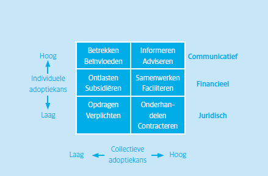

- [1. GOVERNANCE: De ontwikkel- en beheerorganisatie](#1-governance-de-ontwikkel--en-beheerorganisatie)
  - [1.1. Organisatiestructuur](#11-organisatiestructuur)
  - [1.2. Beheertaken uitvoering](#12-beheertaken-uitvoering)
  - [1.3. De organisatievorm](#13-de-organisatievorm)
  - [1.4. Template voor beheerdocument GEONOVUM](#14-template-voor-beheerdocument-geonovum)
- [2. FINANCIËN: De kosten en de opbrengsten](#2-financiën-de-kosten-en-de-opbrengsten)
  - [2.1. De baten van standaardisatie generiek](#21-de-baten-van-standaardisatie-generiek)
  - [2.2. Kosten en opbrengsten](#22-kosten-en-opbrengsten)
  - [2.3. Geschiktheid van opbrengsten bronnen](#23-geschiktheid-van-opbrengsten-bronnen)
  - [2.4. Kostenbesparingen bij standaardisatie](#24-kostenbesparingen-bij-standaardisatie)
  - [2.5. De business case](#25-de-business-case)
  - [2.6. Het opstellen van een business case](#26-het-opstellen-van-een-business-case)
- [3. COMMUNITY: De open invulling van een standaard](#3-community-de-open-invulling-van-een-standaard)
  - [3.1. Krechmer’s open standaarden model: ‘10 requirements’](#31-krechmers-open-standaarden-model-10-requirements)
  - [3.2. Concrete tips voor openheid](#32-concrete-tips-voor-openheid)
  - [3.3. Een praktijkvoorbeeld: de invulling bij Aquo](#33-een-praktijkvoorbeeld-de-invulling-bij-aquo)
  - [3.4. Het toetsbaar maken van het model](#34-het-toetsbaar-maken-van-het-model)
  - [3.5. Open invulling met Open Source Software](#35-open-invulling-met-open-source-software)
- [4. ARCHITECTUUR: Samenhang met andere standaarden](#4-architectuur-samenhang-met-andere-standaarden)
  - [4.1. De gelaagdheid van standaarden](#41-de-gelaagdheid-van-standaarden)
  - [4.2. De relatie met internationale standaarden](#42-de-relatie-met-internationale-standaarden)
  - [4.3. Voorbeelden van gelaagdheid van standaarden](#43-voorbeelden-van-gelaagdheid-van-standaarden)
  - [4.4. Sector overstijgende interoperabiliteit: Verzuiling](#44-sector-overstijgende-interoperabiliteit-verzuiling)
  - [4.5. De relatie met formele standaarden](#45-de-relatie-met-formele-standaarden)
  - [4.6. Strategieën voor omgang met lokalisatie profielen](#46-strategieën-voor-omgang-met-lokalisatie-profielen)
- [5. Linked Data & ontologieën](#5-linked-data--ontologieën)
  - [Inleiding](#inleiding)
  - [Opkomst van Linked Data](#opkomst-van-linked-data)
  - [Waarom Linked Data?](#waarom-linked-data)
  - [Impact op standaardisatie en beheer](#impact-op-standaardisatie-en-beheer)
  - [Training en opleiding](#training-en-opleiding)
  - [Hulpmiddelen](#hulpmiddelen)
- [6. KWALITEITSBELEID EN BENCHMARKING](#6-kwaliteitsbeleid-en-benchmarking)
  - [6.1. Kwaliteit van standaarden](#61-kwaliteit-van-standaarden)
  - [6.2. Kwaliteit van implementaties](#62-kwaliteit-van-implementaties)
- [7. ADOPTIE: stimuleren van het gebruik van standaarden](#7-adoptie-stimuleren-van-het-gebruik-van-standaarden)
  - [7.1. Succesfactoren voor adoptie van een standaard](#71-succesfactoren-voor-adoptie-van-een-standaard)
  - [7.2. Kiezen van de juiste middelen](#72-kiezen-van-de-juiste-middelen)
  - [7.3. Stappenplan](#73-stappenplan)
  - [7.4. Plugfest](#74-plugfest)
  - [7.5. Factoren voor adoptie](#75-factoren-voor-adoptie)
  - [7.6. Adoptie binnen gebruikersorganisaties](#76-adoptie-binnen-gebruikersorganisaties)
- [8. OPERATIONEEL: Proces voor de ontwikkeling en het beheer van een standaard](#8-operationeel-proces-voor-de-ontwikkeling-en-het-beheer-van-een-standaard)
  - [8.1. Verzamelen van wensen en eisen](#81-verzamelen-van-wensen-en-eisen)
  - [8.2. Voorbereiden veranderingsvoorstellen](#82-voorbereiden-veranderingsvoorstellen)
  - [8.3. Beoordeling en besluitvorming](#83-beoordeling-en-besluitvorming)
  - [8.4. Werkgroepen en stakeholders](#84-werkgroepen-en-stakeholders)
  - [8.5. Overgang naar nieuwe versie](#85-overgang-naar-nieuwe-versie)
  - [8.6. Vaste cyclus](#86-vaste-cyclus)
  - [8.7. Relatie met andere standaarden](#87-relatie-met-andere-standaarden)
- [9. COMMUNICATIE](#9-communicatie)
- [10. IMPLEMENTATIE-ONDERSTEUNING](#10-implementatie-ondersteuning)
- [11. Notes](#11-notes)

## 1. GOVERNANCE: De ontwikkel- en beheerorganisatie

[TODO:Inleiding over de BOMOS activiteit zelf. (hergebruiken/linken naar deel 1?)]

### 1.1. Organisatiestructuur

In hoofdstuk 4 zijn de verschillende activiteiten opgesomd die kunnen plaatsvinden in een standaardisatiecommunity. Figuur 2 schetst een globale organisatiestructuur hiervoor. Een belangrijk uitgangspunt is de scheiding tussen inhoudelijke activiteiten in de uitvoeringsorganisatie en de besluitvorming door het bestuur.

  
Figuur 2 - Organisatiestructuur

Het bestuur geeft opdracht aan een (not-for-profit) uitvoeringsorganisatie die verantwoordelijk is voor een groot deel van de beheertaken. Het bestuur verenigt de behoeften in dezen van zijn achterban en heeft het mandaat namens dezen te besluiten over zaken die de betreffende standaarden betreffen. Bestuur en uitvoeringsorganisatie werken bij voorkeur met wederzijdse eenhoofdige aanspreekpunten. Het bestuur is voornamelijk belast met de taak ‘besluitvorming’. In de praktijk komt het bestuur een paar keer per jaar bij elkaar, wat geen belemmering mag zijn voor de gewenste besluitvorming. Het bestuur moet de uitvoeringsorganisatie voldoende mandaat geven. In de praktijk zien we dat sommige besluiten ook schriftelijk (e-mail) aan bestuursleden voorgelegd kunnen worden voor goedkeuring, of dat de verantwoordelijkheid van bepaalde activiteiten (bijv. communicatie) bij een enkel bestuurslid worden belegd. Dit maakt het eenvoudiger om bilateraal overleg tussen de uitvoeringsorganisatie en het verantwoordelijke bestuurslid te voeren en ook besluiten tussentijds te nemen (en kan als alternatief dienen voor de wederzijdse eenhoofdige aanspreekpunten).

De kern is dat duidelijk moet zijn vastgelegd welke besluiten in de bestuursvergadering genomen dienen te worden; welke schriftelijk (e-mail) voorgelegd kunnen worden, welke door een specifiek bestuurslid genomen kunnen worden, en voor welke besluiten het mandaat bij  de uitvoeringsorganisatie ligt. In de praktijk worden vaak jaarplannen gebruikt voor de opdrachtformulering van het bestuur aan de uitvoeringsorganisatie. Op basis van rapportages over het jaarplan legt de uitvoeringsorganisatie dan verantwoording af aan het bestuur. Het jaarplan beschrijft welke taken uitgevoerd moeten worden; welke werkgroepen er zijn of opgestart moeten worden, wat de doelen voor de werkgroep zijn, etc. Het jaarplan wordt goedgekeurd door het bestuur en is daarmee de opdracht voor de uitvoeringsorganisatie. Het model uit hoofdstuk 4 kan als kapstok dienen om de taken in het jaarplan te benoemen. Het jaarplan maakt het ook goed mogelijk om afspraken te maken over uit te besteden taken (zie paragraaf 6.2). Feitelijke standaardontwikkeling vindt plaats in werkgroepen waarin de gebruikers van de standaarden participeren. De werkgroepen worden door de uitvoeringsorganisatie gecoördineerd. Veelal worden ook de daadwerkelijke uitwerkingen opgesteld door de uitvoeringsorganisatie op basis van discussies in de werkgroepen. De uitkomst van de werkgroep, een nieuwe versie van een standaard, kan door het bestuur vastgesteld worden en uitgebracht worden als nieuwe versie. De besluitvorming, wie (bestuur/werkgroep) bepaalt wat, moet helder geregeld zijn.

Bij voorkeur wordt onderscheid gemaakt tussen verschillende zwaartes van wijzigingen in standaarden, zodat de lichtste wijzigingen door de betreffende werkgroep of de uitvoeringsorganisatie zelf kunnen worden afgehandeld en alleen de meest fundamentele wijzigingen betrokkenheid van het bestuur vragen, tot aan een bestuursbesluit. Een werkgroep die continu overruled wordt door het bestuur is niet werkbaar.

Eventueel kan een adviesorgaan opgericht worden om het bestuur met gevraagd en ongevraagd advies ter zijde te staan. De uitkomst van een werk- groep zal in dat geval als voorstel naar het adviesorgaan gaan die daarover aan het bestuur zal adviseren. Het adviesorgaan bestaat bij voorkeur uit onafhankelijke en onbetwiste deskundigen, en kan een middel zijn om de onafhankelijkheid en expertise te versterken. Het is van belang dat deze deskundigen gekozen worden op basis van kennis en ervaring en niet op basis van belangen of vertegenwoordiging van een organisatie; immers aan hen wordt enkel gevraagd om inhoudelijk advies. De vertegenwoordiging van belangen is gevestigd in het bestuur.

Een typische inhoudelijke categorische afbakening van werkgroepen vindt plaats langs de volgende (gelaagde) lijnen:

*   architectuur
*   processen/services
*   gegevens/berichten
*   technische standaard/transactiestandaard
*   beveiliging

Een andere veel gebruikte afbakening is op basis van het probleemdomein, bijvoorbeeld de SETU kent een tweetal werkgroepen, te weten Bemiddeling en Verwerking. De werkgroep Bemiddeling houdt zich bezig met de standaarden van offerteaanvraag tot aan de plaatsing van een uitzendkracht, terwijl de werkgroep Verwerking de standaarden van plaatsing tot aan factuur tot haar scope rekent. In de praktijk zullen bij complexere standaarden bepaalde categorieën werkgroepen (bijv. ‘gegevens’) weer onderverdeeld worden in werkgroepen per probleemdomein (bijv. ‘facturatie’), waarmee een combinatie van beide indelingen wordt gerealiseerd.

 Bijzondere aandacht verdienen de leveranciers. Dit is regelmatig een heet hangijzer bij non-profit beheerorganisaties. Voor het welslagen van een standaard (‘zonder juiste implementatie geen werkende standaard’) vaak cruciaal, maar leveranciers kunnen ook conflicterende belangen hebben. In beginsel kunnen leveranciers gewoon als deelnemer in de standaard acteren en rollen in de werkgroepen vervullen tot aan deelname in het bestuur. De praktijk laat zien dat softwareleveranciers veelal zeer nuttige bijdragen leveren in werkgroepen waardoor het zeker aan te raden is om leveranciers toegang tot de werkgroepen te verlenen. Vaak heerst er angst dat leveranciers te nadrukkelijk een stempel gaan drukken op de standaard. Een aparte leveranciersgroep zoals aangegeven in figuur 2 is dan een optie waarmee de leveranciers enerzijds een platform wordt geboden terwijl ze anderzijds buiten de werkgroepen en bestuur kunnen worden gehouden. Softwareleveranciers zijn dan verenigd in een leveranciersgroep, die de uitvoeringsorganisatie van advies kunnen voorzien en overleg kunnen voeren met het adviesorgaan.

 De besluitvorming binnen de werkgroep kan afhankelijk zijn van de mogelijke deelname van leveranciers, en ook afhankelijk zijn van de opstelling van de leveranciers. In de praktijk zal de keuze voor de mate van invloed ook afhangen van de manier waarop de community is georganiseerd; indien de ontwikkeling van de standaard gedreven wordt vanuit het belang van de softwareleveranciers dan zullen deze een grotere invloed (willen) uitoefenen op ‘hun’ standaard. Wordt de ontwikkeling gedreven vanuit een (overheids-)gebruikersbehoefte dan zullen deze een grotere invloed (willen) uitoefenen.

 In het figuur is een eenvoudige basisstructuur geschetst van bestuur, uitvoeringsorganisatie en werkgroepen. Facultatief kan daar een adviesorgaan en/of leveranciersgroep aan toegevoegd worden. Naast deze geschetste mogelijkheden zijn er nog vele alternatieven, zowel eenvoudiger als complexer. Welke structuur ook gekozen wordt, bij voorkeur worden de verslagen van de verschillende gremia openbaar ter beschikking gesteld. Zie ook hoofdstuk 8, de open invulling.

### 1.2. Beheertaken uitvoering 
Voor de invulling van ontwikkelen beheertaken in een organisatiestructuur zijn verschillende mogelijkheden, variërend van het beleggen bij een standaardisatieorganisatie tot het volledig zelf invullen in een eigen organisatie. Het is geen doel op zich om voor elke standaard een eigen beheeren ontwikkelorganisatie op te tuigen. De praktijk laat zien dat weinig bestaande organisaties zijn berekend op het complete takenpakket, waardoor toch vele standaardisatiecommunities hebben besloten een eigen organisatie op te tuigen. Een deel van de taken wordt dan belegd bij de eigen organisatie, maar een deel van de taken kan ook belegd worden bij andere soorten organisaties. Zie figuur 3 voor mogelijkheden.

Het model maakt onderscheid tussen not-for-profit en profit organisaties. Dit onderscheid is relevant in het kader van openheid (zie hoofdstuk 8). Indien het beheer van een standaard is belegd bij een profit-organisatie kan er geen sprake zijn van een open standaard! Dat wil niet zeggen dat commerciële organisaties geen open standaarden kunnen ontwikkelen in opdracht van een bestuur (organisatie), of na ontwikkeling doneren aan een not-forprofit beheerorganisatie. Het ontwikkelen en beheren van standaarden dient altijd not-for-profit te gebeuren, waarbij een not-for profit organisatie wel het meest voor de hand liggend is.

Een eerste voor de hand liggende mogelijkheid is het beleggen van de beheertaken bij formele standaardisatieorganisaties. De wereld is hier wel veranderd in vergelijking met twintig jaar geleden toen het merendeel van de standaarden door deze formele organisaties werd ontwikkeld. In de huidige tijd wordt het merendeel van de standaarden buiten de formele standaardisatieorganisaties ontwikkeld in allerlei vormen van consortia, en dat aantal blijft groeien. Voor de semantische standaarden speelt dit in extreme mate. Deels heeft dit te maken met de traagheid van processen bij formele standaardisatieorganisaties, maar voornamelijk het gebrek aan inhoudelijke kennis en expertise. Voor semantische standaarden is domeinkennis essentieel.

Dit wil niet zeggen dat formele standaardisatieorganisaties geen waarde hebben, integendeel. Op een aantal punten hebben ze potentieel een belangrijke toegevoegde waarde. Bijvoorbeeld om de status van de standaard te verhogen. Zo is NEN3610 ontwikkeld door Geonovum, maar voor extra status ook uitgebracht als NEN-norm. Daarnaast is secretariële ondersteuning voor werkgroepen ook een prima taak die extern belegd kan worden.

De inhoudelijke kennis zal echter altijd zelf georganiseerd moeten worden. Onderzoeksorganisaties, zoals universiteiten en instituten, zijn een andere mogelijkheid om taken bij te beleggen. Voordeel is de schat aan inhoudelijke kennis, maar mogelijk ook een gebrek aan domeinkennis of kennis van het specifieke gebruik. Het tegenovergestelde is het geval bij brancheorganisaties; voordeel hier is de uitmuntende domeinkennis, maar nadeel is juist een gebrek aan inhoudelijke standaardisatie/ICT kennis. Vaak zijn (semantische) standaarden voor brancheorganisaties een ver van hun bed show. Het onderwerp wordt al snel afgedaan als iets van techneuten, wat het in de kern niet is; juist voor semantiek is domeinkennis van groot belang.

Een eigen organisatie oprichten is een mogelijkheid, evenals commerciële dienstverleners inschakelen. Dat laatste is wel op gespannen voet met de openheidprincipes. De eigen organisatie is de meest gekozen optie voor de kern van ontwikkelen beheertaken. Velen domeinen kennen inmiddels eigen organisaties die kennis hebben van zowel het domein als standaardisatie, bijvoorbeeld (Geonovum, EduStandaard, CROW, Informatiehuis Water, SETU, KING, etc.). Tot de kern van hun werk behoren de strategische beheeractiviteiten zoals geïdentificeerd in het model (hoofdstuk 4), en in grote mate ook de tactische en operationele activiteiten. In deze situatie zijn bepaalde activiteiten eenvoudig en zelfs beter om uit te besteden.

Een aantal suggesties:

**Moduleontwikkeling:** Moduleontwikkeling is riskant om binnen de ontwikkel- en beheerorganisatie te laten plaatsvinden. Daarmee wordt men ook leverancier en concurrent van partijen in de community. Beter is om moduleontwikkeling te stimuleren buiten de ontwikkel- en beheerorganisatie,mogelijk in de vorm van open source software. Dit kan andere leveranciers ook bewegen om de standaard te gaan ondersteunen en/of betrokken te raken bij de ontwikkeling daarvan. De beste aanpak is afhankelijk van de kenmerken van de community.

**Certificeren:** Essentieel bij certificeren is de onafhankelijkheid van de certificerende instelling. Gebruikelijk is dat de ontwikkel- en beheerorgasatie het toetsingskader opstelt, en vervolgens de daadwerkelijke toetsing (op basis van het toetsingskader) uitbesteedt aan externe partijen die zich specifiek richten op het toetsen en certificeren.

**Architectuur/Roadmapping/Benchmarking**; Ondersteuning en uitvoering hiervoor past uitstekend bij een research-organisatie in brede zin (Naast kennisinstituten, ook organisaties zoals CBS voor benchmarking). Met name voor benchmarking geldt dat dit beter bij een externe organisatie belegd kan worden.

**Communicatie:** Past vaak goed bij een brancheorganisatie die al een communicatieapparaat heeft ingericht. Uiteraard moet er dan wel een brancheorganisatie zijn die naadloos aansluit bij de standaard en die bereid is de communicatie als belangrijke taak mee te nemen. Communicatie rondom het beheer- en ontwikkelproces van een standaard vraagt om specifieke kennis van dat beheer en heeft een specifieke doelgroep zoals softwareleveranciers. Dit dient door een brancheorganisatie onderkend te worden. Andere opties zijn communcatieafdelingen van een andere partner organisatie.

Op hoofdniveau kunnen we concluderen dat er de keuze is om de ontwikkel- en beheertaken te beleggen bij:

1. Bestaande organisaties
2. Nieuwe organisaties
3. Combinatie van beiden

Het beleggen van alle taken bij een bestaande situatie klinkt ideaal, maar er is geen organisatie die alleenstaand voor het complete takenpakket is toegerust. Ook organisaties als NEN, Forum Standaardisatie, Nederland Open in Verbinding, etc. zijn daar niet op ingericht.

Daardoor is het in de praktijk vaak noodzakelijk om een nieuwe organisatie op te richten, als er binnen het domein nog geen organisatie bestaat gericht op standaardisatie. Optie 3, de combinatie van beide, betekent dat bepaalde taken door deze (nieuwe) specifieke domein standaardisatie organisatie worden opgepakt en andere taken door ander type organisaties, conform de beschrijving in deze paragraaf over het uitbesteden van taken.

### 1.3. De organisatievorm

Of het nu slechts een deel van de taken of alle taken door de nieuwe organisatie uitgevoerd moeten gaan worden, de nieuwe organisatie moet in beide gevallen opgericht worden waarvoor een rechtsvorm nodig is. Nederland kent tal van organisatie rechtsvormen 8 . Openheid van de standaard is absoluut een essentieel uitgangspunt. De definitie van openheid schrijft voor dat de (besluitvorming van de) standaard belegd wordt bij een not-for-profit organisatie. Daarmee worden een groot deel van de organisatievormen uitgesloten, en zijn slechts enkel voor de hand liggen, te weten:

1. Stichting
2. Vereniging
3. Overheidsorganisatie (als verzamelterm)

**De stichting:** Een stichting is een rechtspersoon en wordt opgericht bij notariële akte, door één of meerdere natuurlijke of rechtspersonen. In de regel heeft een bestuur een voorzitter, secretaris en penningmeester. Het bestuur is het enige verplichte orgaan van een stichting. Daarnaast kan er nog een raad van toezicht zijn, die toezicht houdt op het stichtingsbestuur. In tegenstelling tot een vereniging heeft een stichting geen leden. Een stichting kan wel donateurs hebben, maar die hebben geen zeggenschap. Een stichting kan ook vrijwilligers hebben.

**De vereniging:** Een vereniging is een rechtspersoon voor de Nederlandse wet. Een vereniging wordt meestal opgericht door bij de notaris hiervan een akte op te maken. Dit is niet noodzakelijk, maar zonder notaris heeft de vereniging beperkte rechtsbevoegdheid (de bestuurders zijn hoofdelijk aansprakelijk). Wanneer een vereniging bij de notaris opgericht is, zijn er ook statuten. Hierin staat tenminste het doel van de vereniging, de verplichtingen van de leden, het bijeenroepen van de algemene (leden)vergadering en het benoemen/ontslaan van de bestuurders. Een vereniging heeft een doel dat nagestreefd wordt. Dit doel mag niet het verdelen van winst onder de leden zijn. Wat niet wil zeggen dat er geen winst gemaakt mag worden, maar deze moet ingezet worden voor een bepaald doel (zoals het doel van de vereniging, kennisdeling, verbetering van de kwaliteit, liefdadigheid, etc.). Een vereniging heeft leden. Dit zijn mensen die lid zijn van de vereniging omdat zij het doel steunen. De leden betalen meestal contributie om de vereniging draaiend te houden. Leden hebben invloed in het beleid van de vereniging via een algemene (leden)vergadering (ALV). Zo’n vergadering wordt minstens jaarlijks gehouden en elk lid is hiervoor uitgenodigd en stemgerechtigd. De ALV heeft alle bevoegdheden die niet door de wet of de statuten geregeld zijn en is dus het hoogste orgaan van de vereniging.

**De overheidsorganisatie:** Er zijn verschillende vormen van overheidsorganisaties, waardoor een korte bespreking onmogelijk is. Het inzetten van een overheidsorganisatie zou op verschillende manieren kunnen: één overheidsorganisatie als beheerorganisatie voor alle aan de overheid gerelateerde standaarden, of per standaard één overheidsorganisatie. Daarnaast kan een enkele overheidsorganisatie de uitvoering van het beheer op zich nemen, maar kunnen meerdere overheden zich ook verenigen. Dit kan bijvoorbeeld in een vereniging. De keuze van de rechtsvorm dient weloverwogen te gebeuren, waarbij ook zaken als de eenvoud van het opzetten moet worden meegenomen. Bij een stichting speelt dat het mogelijk lastig is voor overheidspartijen om aan een stichting deel te nemen, en dat een stichting geen leden mag hebben. Bij een vereniging speelt de grote macht van de ALV. Met een stichting en vereniging is het wel eenvoudig om openheid aan te tonen. Bij zowel de stichting als de vereniging zijn de statuten belangrijk; deze regelen in feite het mandaat van de rollen in de organisatie.

Ondanks het feit dat een stichting geen leden kan hebben spreekt men bij HL7 Nederland wel over leden, maar hanteert men strikt formeel de term “aangeslotenen”. SETU kent geen leden, maar wel participanten. HL7 Nederland beschrijft de invulling van de organisatie in het openbare document “Nadere regeling democratisering HL7nl 2004”, gepubliceerd op hun website 9 . Een samenwerkingsverband zonder rechtsvorm kan in de praktijk goed werken voor het beheer maar kan in praktische zaken weer nadelig zijn doordat het samenwerkingsverband als zodanig geen bevoegdheden heeft tot het aangaan van overeenkomsten; hierbij zal altijd één van de partners deze overeenkomst moeten aangaan. Mogelijke nadelen die hieraan kleven zijn het verlies van identiteit; het gebonden zijn aan regels en beperkingen van de partner; minder slagvaardigheid etc. Het voordeel van een dergelijke organisatievorm is dat deze eenvoudig is in te richten en op te heffen zonder juridische consequenties. De organisatieinrichting kan in enige mate de vrijblijvendheid reduceren of op zijn minst expliciteren. De vrijblijvendheid van de deelnemers in standaarden is zeker een serieus aandachtspunt in het kader van een duurzaam toegepaste standaard.

### 1.4. Template voor beheerdocument GEONOVUM

[TODO: Invoegen]

## 2. FINANCIËN: De kosten en de opbrengsten

Een standaard ontwikkelen en beheren kost structureel geld. De hoeveelheid is sterk afhankelijk van de context en dynamiek van de standaard en het is niet eenvoudig hier generieke uitspraken over te doen. De eerste ontwikkelingen starten vaak met projecten die beginnen met budgetten vanaf 30.000 euro tot vele malen groter. Een eerste project levert ook niet direct een standaard op, maar heeft in een werkgroep de mogelijkheden en scope van een standaard onderzocht. Na de initiële ontwikkeling moet de standaard structureel worden beheerd en doorontwikkeld. Er zijn cases bekend die het beheer met budgetten in de order van 250.000 tot 900.000 euro (per jaar) hebben georganiseerd. Tot op heden is hier weinig onderzoek naar gedaan, met uitzondering van de Ethernet standaard: deze technische standaard heeft $10 miljoen dollar gekost om te ontwikkelen. Andere informatie bekend uit literatuur is dat de opbrengsten van verkoop van ISO standaarden voor de helft voorziet in de kosten die ISO maakt in de ontwikkeling en beheer van de ISO standaarden.

### 2.1. De baten van standaardisatie generiek

Er mogen dan weinig cijfers beschikbaar zijn maar er is voldoende economisch onderzoek gedaan naar de vooren nadelen van standaardisatie. Bijgaande tabel 29 geeft een samenvatting:

>>>>>  gd2md-html alert: inline image link here (to images/BOMOS-22.png). Store image on your image server and adjust path/filename if necessary.  (<a href="#">Back to top</a>)(<a href="#gdcalert4">Next alert</a>) >>>>> 

[TODO: TABEL INVOEGEN]

Voor semantische (domein) standaarden zijn met name relevant:

Positieve netwerkeffecten (wordt waardevoller met meer gebruikers)

*   Voorkomen van vendor lock-ins
*   Toename variëteit in producten en diensten
*   Schaalvoordeel
*   Verlagen transactiekosten

### 2.2. Kosten en opbrengsten

Wel is het mogelijk om te kijken naar de mogelijke kostenposten en opbrengsten van het beheer van standaarden. De balans vat deze samen.

>>>>>  gd2md-html alert: inline image link here (to images/BOMOS-23.png). Store image on your image server and adjust path/filename if necessary.  (<a href="#">Back to top</a>)(<a href="#gdcalert5">Next alert</a>) >>>>> 

[TODO: TABEL INVOEGEN]

#### 2.2.1. Debet

De voornaamste kosten zullen in principe gerelateerd zijn aan de personeelskosten voor de primaire taak van de organisatie; de ontwikkeling van nieuwe functionaliteit en het onderhouden van al bestaande functionaliteit in de standaarden. De standaarden worden gepubliceerd en mogelijk ook promotioneel onder de aandacht gebracht waarvoor communicatiekosten gemaakt worden. Bij communicatiekosten kan men naast de personeelskosten denken aan kosten voor het optuigen van een communicatieplatform, het organiseren van bijeenkomsten, de website en bijvoorbeeld drukwerk.

Vaak worden er specifieke software tools gebruikt zoals datamodelleersoftware waarvoor licentiekosten betaald moeten worden. Een andere potentiële kostenpost is de deelname aan verwante standaardisatieorganisaties waarvoor lidmaatschapskosten worden gerekend. In verschillende communities kan deze post variëren van 0 tot 15% en hoger, van het totale budget. Daarbij zijn dan vaak ook reiskosten noodzakelijk voor de internationale bijeenkomsten. Standaard bedrijfsvoeringkosten zijn ook van toepassing zoals ICTvoorzieningen (kantoorautomatisering), huisvesting en kosten van de accountant voor de jaarrekening. Goodwill kan ook als kostenpost worden beschouwd. Goodwill is dan de investeringen die men in de omgeving moet plegen die niet direct bijdragen aan de standaard zelf, zoals het deelnemen aan bijeenkomsten en accountmanagement. Vaak is dit een investering om goodwill van anderen in return te krijgen (als opbrengst). Tot slot zijn er de financieringskosten waarmee de activiteiten worden bedoeld om inkomsten te genereren voor de standaardisatieactiviteiten. Afhankelijk van het financieringsmodel kunnen dat kosten zijn voor het verwerven van leden tot aan het aanvragen van subsidies en dergelijke.

De verhoudingen kunnen door de tijd verschuiven, bijvoorbeeld in een bepaalde fase van een standaard kan er pas op de plaats gemaakt worden met de ontwikkeling en wordt de focus verlegd op de communicatie om de adoptie van de standaard te bevorderen. In lijn hiermee zullen kosten verschuiven van ontwikkeling naar communicatie.

#### 2.2.2. Credit

Potentiële bronnen van inkomsten zijn bijvoorbeeld stakeholders die geld uit de structurele begroting beschikbaar stellen voor de standaard. Dat kan een ministerie zijn, maar even goed een brancheof belangenorganisatie. Op dezelfde manier kunnen deze organisaties ook tijdelijk voor een bepaald doel (project)financiering beschikbaar stellen. Daarnaast, aangezien standaarden een maatschappelijk en economisch belang hebben, zijn er vaak mogelijkheden voor subsidie. Deze subsidies zijn ook een mogelijke bron van inkomsten; maar het verkrijgen daarvan kan omslachtig zijn, en er kunnen beperkende voorwaarden zijn voor de inzet van het geld.

Structurele financieringsvormen verdienen de voorkeur boven tijdelijke (project) financieringsvormen. Niemand zal namelijk een standaard willen implementeren waarvan het onzeker is of die volgend jaar nog wel beheerd wordt omdat de standaard werkt met aflopende projectfinanciering. Daarnaast is structurele financiering een eis voor opname op de pas-toe of leg-uit lijst met open standaarden van het Forum Standaardisatie.

Andere potentiële opbrengsten zijn gerelateerd aan de standaard zelf. Het is mogelijk om geld te vragen voor zowel het downloaden van de documenten met specificaties, of het kan gekoppeld worden aan het gebruik van de standaard. Beide vormen zijn niet bevorderlijk voor de adoptie van de standaard. In de praktijk is veel weerstand tegen het betalen voor het standaardisatiedocument, ongeacht het bedrag. Dit is wel het huidige business model dat het NEN hanteert voor haar normen. Ook in het kader van openheid (zie hoofdstuk 8) is het niet verstandig om geld te vragen voor de documenten of het gebruik van de standaard. Hoe beperkt het bedrag ook moge zijn, de standaarden worden er op zijn minst minder open door. In de praktijk worden dan ook regelmatig draft versies van deze standaarden gebruikt, omdat deze nog gratis verspreid mogen worden.

Dienstverlening gerelateerd aan de standaard is een andere mogelijkheid. Te denken valt daarbij aan consultancy over de standaard of implementatieconsultancy. Diensten aanbieden bijvoorbeeld in de vorm van een centrale berichtenmakelaar, of andere vormen van het leveren van software/hardware zijn ook mogelijkheden. Tot slot zouden er inkomsten gekoppeld kunnen worden aan dienstverlening op het gebied van validatie en certificatie. Al deze vormen van dienstverlening brengen wel een risico met zich mee. Naast een beheerorganisatie wordt de organisatie ook een dienstverlener. Dat kan conflicterend zijn: vooral door andere dienstverleners in de markt wordt dat opgevat als oneerlijke concurrentie. Ook kan er een verwevenheid ontstaan tussen het dienstverleningsproduct en de standaard zelf, indien blijkt dat het eigen product een bepaald deel van de standaard niet goed ondersteunt, kan ervoor gekozen worden de standaard te wijzigen in plaats van te investeren in een product dat de standaard wel volledig ondersteunt. Duidelijke scoping van welke dienstverlening de beheerorganisatie op zich neemt en welke men overlaat aan de markt is essentieel.

Naast de structurele financiering uit de begroting van een belangrijke stakeholder is de meest voor de hand liggende inkomstenbron een (lidmaatschaps)bijdrage van de stakeholders. Hiervoor kan op basis van de trits ‘belang-betaling-zeggenschap’ de kosten verhaald worden bij dezelfde partijen waar ook de baten liggen. Verschillende typen organisaties kunnen verschillende bijdrage voor tarieven hebben gerelateerd aan de potentiële opbrengsten van de stakeholder door het gebruik van de standaard. Het spreekt voor zich dat een partij die een wezenlijke bijdrage levert aan het beheer van een standaard daar ook invloed op zal willen uitoefenen. Een risico daarbij is dat het belang (en dus de zeggenschap) gelijkgeschakeld wordt met de financiële bijdrage. Dit heeft ook consequenties voor de openheid.

Voor een volwassen standaard is het eenvoudiger om inkomsten te genereren uit de standaard zelf of aanverwante diensten, maar daarbij moet men voorzichtig te werk gaan om zo min mogelijk weerstand tegen de standaard te creëren. Een standaard die zichzelf kan financieren uit inkomsten, bijvoorbeeld door lidmaatschapsgeld en licentie-inkomsten, kan nog steeds een open standaard zijn. Winst maken is uit den boze. Om dit te voorkomen kan de organisatievorm een belangrijke rol spelen.

### 2.3. Geschiktheid van opbrengsten bronnen

De vorige paragraaf schetste een beeld van potentiële opbrengsten. De keuze van welke bronnen voor opbrengsten aangeboord worden is situationeel, maar deze paragraaf tracht te ondersteunen bij het maken van de keuzes voor geschikte bronnen van inkomsten.

De geschiktheid van een type opbrengst wordt algemeen geldend bepaald door:

*  kosten en opbrengsten in evenwicht brengend
*  open en transparantimage_tooltip
*  voldoende breed draagvlak

In andere woorden, opbrengstbronnen die geen draagvlak hebben, niet transparant zijn en de beheerorganisatie winstgevend maken zijn niet geschikt.

Om geschikte bronnen van inkomsten te bepalen is een onderscheid in verschillende situaties noodzakelijk:

1. Onderscheid tussen ontwikkeling en beheer
2. Mate van volwassenheid: onderscheid tussen een bewezen standaard en een standaard in de beginfase van de levenscyclus

[TODO: HAAKJE/VERWIJZING NAAR BOMOS 2i]

Daarnaast hanteren we een drietal uitgangspunten:

*  aansluiten bij open standaard (toegankelijk)
*  adoptie niet belemmerend
*  waar het voordeel zit, vindt betaling plaats.

Op basis van deze uitgangspunten hebben licenties vanwege de beperkte openheid, maar vooral omdat het adoptie belemmerend werkt, een twijfelachtige status. Dit geldt zowel voor betalen voor het specificatiedocument, als wel op betalen voor gebruik van de standaard. Gezien de ongewenstheid wordt dit niet beschouwd als potentiële opbrengsten bron voor een open standaard.

#### 2.3.1. Ad 1. Onderscheid tussen ontwikkeling en beheer

Een onderscheid tussen initiële ontwikkeling en lopend beheer is relevant omdat de eerste over het algemeen eenvoudiger te financieren is dan de tweede. Opdrachtgevers zijn in de meeste gevallen wel geneigd om een project te financieren rond een bepaald probleem waarin een standaard de oplossing is. Als de standaard eenmaal ontwikkeld is in het project, dan is het echter een stuk lastiger om de continue financiering te vinden voor het beheer. Regelmatig haken de initiële opdrachtgevers af, of op zijn minst is er veel overtuiging nodig voor nut en noodzaak voor continue financiering. Uitleggen wat onder lopend beheer valt is dan ook noodzakelijk: de standaard aanpassen aan de veranderende omgeving. Bijvoorbeeld wetgeving is veranderd, afhankelijke standaarden zijn veranderd, of innovaties op technisch vlak. Lopend beheer kan wel leiden tot een nieuwe versie van een standaard. (Overigens soms, bijvoorbeeld door het NEN, wordt beheer nauwer gedefinieerd als het beschikbaar houden op een website, en kan beheer niet leiden tot een nieuwe versie van een standaard)

Projectfinanciering en subsidie zijn op zich prima voor incidentele zaken zoals de initiële ontwikkeling maar ook specifieke uitbreiding van de standaard. Echter aangezien ze niet structureel zijn, is het minder handig deze bronnen in te zetten voor het beheer van een standaard. Structureel op de begroting (bijv. financiering door overheid) is natuurlijk een ideaal scenario, maar niet voor elke beheerorganisatie weggelegd. Bij het ontbreken hiervan wordt het nagenoeg noodzakelijk om een lidmaatschapsmodel te bestuderen. De gewenstheid van het lidmaatschapsmodel (soms ook contributie of participanten genoemd aangezien een stichting geen leden mag hebben) is afhankelijk van de voordelen die exclusief voor de leden gelden, en het kostenaspect. Als iedereen kan participeren tegen gediversifieerde tarieven dan is dit een acceptabel alternatief. Bijvoorbeeld op type organisatie en omzet. Het lidmaatschapsgeld mag voor geen enkele deelnemer een grote barrière vormen. Als er geen voordelen aan het lidmaatschap verbonden zijn zal niemand geneigd zijn om deel te nemen.

Voordelen van een lidmaatschap liggen op een tweetal punten:

1. Zichtbaar maken dat organisatie de standaard ondersteunt. (bijvoorbeeld logo op website, twee kanten uit: de logo van het participerende organisatie op de website van de standaard, en anderzijds dat de participerende organisatie het logo van de standaard mag gebruiken op websites en flyers)
2. Deelname aan werkgroepen. Deelname aan werkgroepen is vaak zeer waardevol aangezien het kennis geeft van de processen in de branche, en de toekomst ontwikkeling van de standaard. Het geven van voordelen aan lidmaatschap heeft consequenties voor de openheid van de standaard; hier moet gezocht worden naar een juiste balans.

Sommige standaardisatieorganisaties maken in hun tarieven onderscheid tussen sturende leden en deelnemende leden. Dit begint wel twijfelachtig te zijn in relatie tot openheid. Ook wordt soms getracht veel opbrengsten bij leveranciers te behalen maar dit kan de adoptie van de standaard schaden.

#### 2.3.2. Ad 2. Mate van volwassenheid

Als een standaard een grote mate van volwassenheid heeft, gekenmerkt door brede adoptie van de standaard, dan is dienstverlening door de beheerorganisatie ook een potentiële inkomstenbron. Te denken valt aan verschillende vormen van dienstverlening:

*   certificering
*   opleiding
*   implementatieondersteuning

Certificering kan op verschillende manieren ingezet worden, ook als middel om financiële opbrengsten te genereren (zie hoofdstuk 13 certificeren). In het kader van opleidingen kan bijvoorbeeld gedacht worden aan het geven van opleidingsdagen tot aan complete cursussen over de standaard. De marge op de cursus kan een inkomstenbron zijn, helemaal gecombineerd met certificeren (het volgen van een opleiding verplicht stellen voor het certificaat).

Tot slot is implementatieondersteuning een middel, dat kan in lichte mate door het geven van betaalde adviezen over correct gebruik van de standaard, tot aan het uitvoeren van complete implementatietrajecten. Hiermee wordt de beheerorganisatie ook een marktpartij en daar kleven nadelen aan.

Kort samengevat zal dienstverlening een inkomstenbron zijn die naar mate de standaard volwassener wordt meer mogelijkheden gaat bieden voor inkomsten. Een inkomstenbron die in de praktijk niet veel voorkomt, maar voor de toekomst niet uitgesloten moet worden is de donatie. Vooral structurele donaties zijn een prettige financieringsvorm. Dit leidt tot het volgende model:

Overigens zijn de kosten van het beheren van een standaard ook niet gelijk door de jaren heen. Sommige kostenposten kunnen flink veranderen. Tegenwoordig zien we posten als tactisch beheer flink stijgen, vooral door de relaties tussen de vele (internationale) standaarden die afstemming vergen. Indien de adoptie van de standaard succesvol is zal ook een post als implementatieondersteuning flink kunnen stijgen.

### 2.4. Kostenbesparingen bij standaardisatie

Natuurlijk wordt de vraag gesteld of standaarden niet goedkoper kunnen worden ontwikkeld en beheerd. Dat is niet eenvoudig want veel standaardisatie-initiatieven, in het bijzonder ook in industriestandaardisatie, hebben de volgende kenmerken:

*  minimale kostenoriëntatie
*  hobbyisme in de positieve zin van het woord

Dat wil zeggen dat er veelal geen vet zit op de budgetten, en dat standaardisatieorganisaties keuzes moet maken in wat wel en niet uitvoerbaar is binnen het budget. Een relevante vraag is dan ook hoe verstandig de minimale kostenoriëntatie is in relatie tot de kwaliteit van de standaard en ook de adoptie van een standaard.

Een complexe standaard ontwikkelen kan miljoenen kosten, de voornaamste kosten zijn niet voor de ontwikkelen beheerorganisatie, maar voor de individuele deelnemers zoals:

*  de tijd van de vrijwilligers
*  de reis en vergaderkosten
*  memberships fees en kosten voor aanschaf andere standaarden

Efficiëntie kan mogelijk behaald worden in de doorlooptijd van het standaardisatie-proces. Tijd is geld en het ontwikkelproces voor standaarden is regelmatig extreem tijdrovend. Een tijdsbesparing in het ontwikkelproces kan veel kosten besparen. Voorbeeld hiervoor is de pressure cooker in de afvalbranche, waarin in een week het fundament voor de standaarden is gelegd.

De verschillende standaardisatieorganisaties per sector willen nog wel eens het wiel opnieuw gaan uitvinden, meestal uit onwetendheid, wat ook inefficiëntie tot gevolg heeft. Bijvoorbeeld de ontwikkelen beheerprocessen kunnen waarschijnlijk gekopieerd worden van een andere standaard in plaats van deze zelf te ontwikkelen. Daarnaast bijvoorbeeld is de kern van een validatie-service hetzelfde voor elke XML gebaseerde standaard; toch bouwen nog veel beheerorganisaties hun eigen validatie-service. Algemeen kan gesteld worden dat door middel van online tools de inzet van de vrijwilligers efficiënter gemaakt worden. Onderstaande tabel 30 geeft als samenvatting een aantal suggesties weer om standaardisatie efficiënt in te vullen:

>>>>>  gd2md-html alert: inline image link here (to images/BOMOS-25.png). Store image on your image server and adjust path/filename if necessary.  (<a href="#">Back to top</a>)(<a href="#gdcalert7">Next alert</a>) >>>>> 

Besparingen door middel van innovatieve aanpakken in het ontwikkelproces kunnen ook een valkuil zijn. Een grote kostenpost zijn de face-to-face meetings. Besparingen hierop zijn telefonische conferenties of mailinglists and IRC chats. Met name in de open source community is de mening dat face-to-face meetings overbodig zijn en dat asynchrone communicatie voldoende moet zijn, ook om wereldwijd met alle tijdzones te kunnen opereren.

Echter open source software ontwikkelen is niet gelijk aan open standaard ontwikkeling. Hetzelfde proces hanteren is dus een valkuil. Bij standaarden gaat het om complexe materie en functionaliteit, waarbij wederzijds begrip en ook vertrouwen van groot belang zijn. Directe communicatie, face-to-face en telefonische conferenties zullen hier belangrijk zijn. Efficiëncy betekent de juiste mate van face-to-face, teleconferenties, en eventueel mailinglist  gebruik, onder andere voor het afhandelen van de technische zaken. In andere woorden: innovatieve ontwikkelaanpakken zoals de pressure cooker en gebruik van Web 2.0 (zie hoofdstuk 7) kunnen zeker besparingen opleveren, maar zullen kostbare face-to-face meetings niet vervangen.

### 2.5. De business case

De business case van standaardisatie is een veel gehoord onderwerp. Voordat het besluit tot investering genomen kan worden is eerst inzicht in de business case noodzakelijk. Eigenlijk gaat het om verschillende business cases:

1. De business case van de standaard (oftewel de keten)
2. De business case van een individuele organisatie om de standaard te implementeren
3. De business case van een nieuwe versie van een standaard.

De eerste business case is voor de overheid interessant om beleid rond standaardisatie op af te stemmen. Uiteraard is deze business case ook relevant voor de standaardisatie-organisatie, maar een individuele organisatie kan er niet veel mee. Deze heeft een andere business case nodig, specifiek voor haar rol in de keten.

Kwantitatieve onderzoeken naar de business case van standaardisatie zijn lastig uit te voeren en leiden niet altijd tot nuttige inzichten. Dit neemt niet weg dat kwalitatief onderzoek wel relevant kan zijn en wel goed uitvoerbaar is. Alleen al het inzicht te weten bij welke partijen de voordelen zitten en het identificeren van de organisaties die geen voordelen hebben is waardevol. Daarnaast is het waardevol om te weten welke partijen relatief meer voordeel hebben dan andere partijen ook al hebben ze dezelfde rol. Zo kan bijvoorbeeld de marktleider minder voordeel hebben ten opzichte van de runner-up, net zoals een organisatie die een moderne back-office heeft mogelijk meer voordeel kan hebben. Op basis van deze inzichten kan potentieel het gedrag van de deelnemers in de werkgroepen worden verklaard. De kwantitatieve business case is lastig omdat standaarden geen doel zijn maar een middel om het doel van interoperabiliteit te behalen. De business case gaat dan feitelijk ook om interoperabiliteit. In lijn hiermee zijn er in de praktijk vaak geen projecten die als doel hebben een standaard te implementeren, maar juist projecten die interoperabiliteit voor bijvoorbeeld inkoop realiseren. Dit betekent dat de business case van het project breder is dan de standaard. Bijvoorbeeld regelmatig zien we projecten die van een papieren uitwisseling overstappen naar een digitale gestandaardiseerde uitwisseling waarbij ook procesoptimalisatie gaat plaatsvinden. De standaard is daarmee een (belangrijk) onderdeel geworden van een veel groter project. Het is daarbij lastig toe te wijzen welke opbrengsten en kosten aan de standaard toekomen binnen het grotere project. Daarbij is er ook sprake van kwalitatieve baten, die vervolgens kwantitatief uitgedrukt moeten worden.

Bijzondere aandacht verdient ook business case type 3: Vervangende standaard/ nieuwe versie. Hiervoor is het relatief eenvoudig de business case op te stellen, maar deze is in de praktijk niet positief te krijgen. Bijvoorbeeld rond e-facturatie: Als een organisatie al e-factureert met bijvoorbeeld UBL of SETU, dan is de business case naar een nieuwe standaard (UN/CEFACT Cross Industry Invoice) niet of nauwelijks positief te krijgen. Daarom zullen er altijd een zeer lange tijd ook nog oude standaarden (bijv. EDI) in gebruik zien, omdat er geen positieve business case voor de nieuwe/andere standaard is, zolang er geen interoperabiliteitsprobleem is. Eén van wereldwijd meest succesvolle standaard, RosettaNet (www.rosettanet.org), illustreert dit ook: ondanks dat deze standaard al jaren een XML versie heeft ontwikkeld is er nauwelijks migratie vanuit de oude EDI versie, en nog steeds een lage adoptie van de XML versie.

### 2.6. Het opstellen van een business case

Ondanks de geschetste moeilijkheden en de verschillende poging-en die al gedaan zijn, proberen we toch een aanpak te schetsen die inzicht kan bieden in de business case. De aanpak in deze paragraaf beschreven is gebruikt om een business case voor een semantische standaard in de juweliersbranche op te stellen: Stappenplan:

1. Beschrijf huidige situaties en toekomstscenario’s en identificeer stakeholders.
2. Bepaal de kosten en baten in de keten op basis van het raamwerk.
3. Verdeel de kosten en baten naar verschillende stakeholders (Probeer de kosten en baten per stakeholder te kwantificeren.)

De eerste drie stappen worden toegelicht:

#### 2.6.1. Beschrijf huidige situaties en toekomstscenario’s en identificeer stakeholders. 

De eerste stap begint met een analyse van de stakeholders; wat zijn de partijen die een relatie hebben tot het interoperabiliteitsprobleem waarin een mogelijke standaard een oplossing kan bieden. Voor het identificeren  van de stakeholders, kan de NEN stakeholderanalyse gebruikt worden (zie paragraaf 7.4).

Vervolgens wordt de huidige situatie geanalyseerd; wat zijn de uitgangsposities van waaruit de primaire stakeholder moeten vertrekken. Daarbij dient ook het beeld van het toekomstscenario met standaard helder te zijn, zodat de migratiepaden van de huidige situatie naar de toekomstscenario’s duidelijk zijn.

Het figuur geeft dit weer voor de primaire stakeholder de juwelier in dit voorbeeld. Uiteraard is het bij de implementatie de bedoeling om ervoor te zorgen dat zoveel mogelijk partijen in toekomstscenario 1 of 2 terecht komen en de standaard gaan gebruiken.

#### 2.6.2. Bepaal de kosten en baten in de keten op basis van het raamwerk.

In stap 2 wordt een kosten-baten model opgesteld. Wat zijn in generieke zin de eenmalige investeringen, de operationele kosten en de baten die van toepassing zijn op de standaard. Voor vele standaarden zal dat redelijk gelijk  zijn, vandaar dat gestart kan worden met het model uit de juweliersbranche, en deze vervolgens aan te passen waar nodig. Het model uit de juweliersbranche is hieronder weergegeven.

#### 2.6.3. Verdeel de kosten en baten naar verschillende stakeholders.

 De verschillende kosten en baten zullen niet op alle stakeholders betrekking hebben, en ook de mate zal verschillen. In deze stap worden de kosten en baten uit het raamwerk van stap 2 een niveau dieper gespecificeerd, en toegekend aan de stakeholder met een gedefinieerde relatie.

>>>>>  gd2md-html alert: inline image link here (to images/BOMOS-26.png). Store image on your image server and adjust path/filename if necessary.  (<a href="#">Back to top</a>)(<a href="#gdcalert8">Next alert</a>) >>>>> 

Als voorbeeld zijn de tabellen van 3 stakeholders in de juweliersbranche toegevoegd.

[TODO: Figuur (eigenlijk tabel) 12 en 13 toevoegen]

>>>>>  gd2md-html alert: inline image link here (to images/BOMOS-27.png). Store image on your image server and adjust path/filename if necessary.  (<a href="#">Back to top</a>)(<a href="#gdcalert9">Next alert</a>) >>>>> 

Op basis van dit eenvoudige stappenplan kan toch op een eenvoudige manier inzichten in de business case van een standaard ontstaan, zonder blind te focussen op de getallen. Uiteraard kan na stap 3 een poging gedaan worden om de geïdentificeerde kosten en baten uit te gaan drukken in geld.

## 3. COMMUNITY: De open invulling van een standaard

Openheid is een belangrijk aspect van een duurzame standaard. Een definitie van een open standaard is gegeven in paragraaf 2.2. Maar wat betekent dat voor de beheerorganisatie?

### 3.1. Krechmer’s open standaarden model: ‘10 requirements’

Ken Krechmer heeft een model ontwikkeld waarmee de openheid concreet gemaakt wordt en waarmee hij standaardisatieorganisaties kan vergelijken. In het model maakt hij onderscheid tussen de verschillende openheidaspecten (requirements) en de verschillende gezichtspunten op standaarden. Als gezichtspunten/rollen hanteert hij de ontwikkelaar van de standaard, de implementator van de standaard in een product, en de gebruiker van de standaard (product waarin de standaard is verwerkt). Niet elk openheidsaspect is voor elke rol even interessant, zoals het model ook laat zien:

>>>>>  gd2md-html alert: inline image link here (to images/BOMOS-28.png). Store image on your image server and adjust path/filename if necessary.  (<a href="#">Back to top</a>)(<a href="#gdcalert10">Next alert</a>) >>>>> 

[TODO: TOEVOEGEN FIGUUR 6]

Deze 10 criteria voor open standaarden betekenen het volgende voor de beheerorganisatie:

1. **Open Meeting** betekent dat iedereen mag meedoen in het standaardisatie proces. Geen stakeholders uitsluiten. Ook het mogelijk maken om tegen lage kosten op een ‘per-meeting’ basis deel te nemen is belangrijk. Dit maakt het ook voor studenten of voor MKB bedrijven mogelijk om aan te sluiten. Meetings moeten duidelijk aangekondigd worden en er moeten zo min mogelijk barrières zijn voor stakeholders om deel te nemen. Een ontwikkelen beheerorganisatie moet zuinig zijn op stakeholders die willen participeren. In veel gevallen is het niet eenvoudig om voldoende stakeholders op de been te krijgen die actief willen participeren. Dus in plaats van drempels is stimulering meer op zijn plaats. De valkuil is om meetings alleen open te stellen voor slechts een bepaalde groep van (betalende) stakeholders.
2. **Consensus** gaat over de besluitvorming binnen de organisatie. Is er een (groep van) organisatie(s) die dominant zijn? In principe zou iedere participant gelijke rechten moeten hebben en kunnen meebeslissen. De valkuil is om een dominante groep (bijv. het bestuur/partijen die financieel fors bijdragen) te hebben die volledige controle heeft.
3. **Due Process** gaat over de processen hoe stemrondes zijn georganiseerd en de processen voor verzoeken tot heroverweging (appel) van beslissingen. Er moeten procedures zijn voor klachten, en die procedures moeten inzichtelijk zijn. Hetzelfde geldt voor de procedures voor besluitvorming, en in het bijzonder het proces om mogelijke patstellingen te doorbreken. Valkuil is om dit niet georganiseerd te hebben.
4. **One World** betekent dat idealiter voor hetzelfde doel er één standaard op de wereld wordt gebruikt, ook ter voorkoming van handelsbarrières. Dit wil uiteraard niet zeggen dat het voor een specifiek doel of context niet mogelijk zou zijn om een nieuwe standaard neer te zetten. Maar het betekent ook dat er geen regionale of nationale standaard gecreëerd dient te worden als een wereldwijde standaard voldoet. In algemene termen betekent One World ook dat de standaardisatieorganisatie niet verkokert, met oogkleppen op, een standaard ontwikkelt zonder wetenschap van andere standaarden/initiatieven. De valkuil is om als standaardisatieorganisatie oogkleppen op te hebben, en alleen bezig te zijn met eigen standaarden terwijl er goede standaarden beschikbaar zijn, eventueel als halffabricaat. Open betekent hier open in relatie met andere standaardisatieorganisaties om geen overlappende maar aansluitende zaken te ontwikkelen. Een andere valkuil is een te beperkte scope te kiezen voor de te ontwikkelen of beheren standaard; bijvoorbeeld nationaal in plaats van wereldwijd.
5. **Open IPR** (intellectuele eigendomsrechten) is het aspect waar de meeste discussie over is geweest, waarbij met name ‘royalty free’ en ‘onherroepelijk’ de kernwoorden uit de definitie van open zijn. Standaardisatieorganisaties en leveranciers hebben lang getracht om ‘RAND’ (Reasonable and Non-Discriminatory) op te nemen in de definitie van openheid. Deze standaardisatieorganisaties voldoen dan ook vaak op dit punt niet aan de definitie van open, wat betekent dat vele standaarden die in de perceptie open zijn, volgens de definitie niet open zijn op dit punt. De definitie van open standaard laat aan duidelijkheid niks te wensen over, en voorkomt discussie over RAND, bijvoorbeeld wat is reasonable? Dat leidt tot veel discussie. Royalty free en onherroepelijk beschikbaar zou de standaard moeten zijn. De valkuil is om dit niet geregeld te hebben, wat bij veel semantische standaardisatieorganisaties het geval is. De intenties zijn goed (open), maar door het niet expliciet te regelen kan dat tot problemen leiden in de toekomst. Ook is vaak niks geregeld over de rechten van de bijdrage die ‘vrijwilligers’ vanuit externe partijen leveren in werkgroepen van de standaard. Dit is een potentieel gevaar voor de duurzaamheid van de standaard.
6. **Open Change**: Als een leverancier alleen gedwongen wordt om de standaard open beschikbaar te stellen, maar zelf op elk moment wijzigingen kan doorvoeren, zullen de voordelen van standaarden nooit bereikt worden en behoudt de ene leverancier zijn macht. Een open manier van wijzigingen in de standaard doorvoeren is van groot belang, maar krijgt tot op heden weinig aandacht. Standaardisatieorganisaties die niet voldoen aan open meeting, consensus en due process kunnen per definitie niet voldoen aan open change. Een open invulling kan geschieden door het beschrijven van wijzigingsprocessen waarbij geen partij een bijzondere status heeft in de besluitvorming. De valkuil is om het proces van wijzigingen niet open in te richten, helemaal omdat er vaak geen aandacht voor is.
7. **Open Documents** betekent dat alle documenten open beschikbaar zijn. Dat betekent dat niet alleen de standaarden zelf maar ook ‘work in progress’ beschikbaar moet zijn, notulen van meetings, e.d. Daarmee kunnen gebruikers van de standaard de complete achtergrond doorgronden. De valkuil is om alleen de standaarden zelf open beschikbaar te stellen.
8. **Open Interface** is vooral relevant voor technische standaarden, en heeft betrekking op het ruimte laten voor leveranciers voor gesloten uitbreidingen, en daarnaast ook de ruimte bieden voor backward en forward compabiliteit. Valkuil: het niet adresseren van backward compabiliteit en de ruimte bieden voor tijdelijke uitbreidingen (forward compabiliteit).
9. **Open Access:** Eindgebruikers vertrouwen er vaak op dat hun leverancier(s) de standaarden correct hebben geïmplementeerd. Om ‘Open Access’ te  bereiken moet het mogelijk te zijn om de implementatie van de standaard te testen (conformiteit); dat kan door middel van conformiteittesten (testprotocollen) tot aan officiële certificatie. Een andere mogelijkheid zijn zogenoemde plugfesten waarbij de interoperabiliteit tussen verschillende implementaties van een standaard inzichtelijk wordt gemaakt. De valkuil is om hier van uitstel naar afstel te gaan. De standaarden moeten een bepaalde mate van volwassenheid hebben wil dit zinvol zijn. Daarom wordt het vaak uitgesteld. En van uitstel volgt afstel. Een open invulling betekent ook het inzichtelijk (open) maken van het gebruiken van de standaard in implementaties, bijvoorbeeld door het publiceren van implementatieoverzichten.
10. **Ongoing Support** is het leveren van ondersteuning op de standaard gedurende de levenscyclus. De valkuil is het stoppen met het leveren van ondersteuning als de interesse van leveranciers afneemt. Een open invulling betekent op zijn minst dat de levenscyclus van een standaard beschreven is waarmee gebruikers garantie krijgen over de ondersteuning op de standaard. Idealiter dient de ondersteuning pas af te lopen als er geen interesse meer is in de standaard bij de eindgebruiker.

Veel van de huidige discussies over openheid gaan over slechts twee aspecten van openheid te weten, ‘One World’ en vooral ‘Open IPR’, terwijl de andere aspecten daardoor onderbelicht raken. Alle punten helpen bij het inrichten van maximaal open standaardisatieorganisatie. Tot op heden is er geen organisatie bekend die op alle punten volledig open is. Volledig open op al deze punten is een utopie, maar deze punten zijn wel aandachtspunten, en kunnen het denkproces helpen om standaardisatie meer open te krijgen. Overigens is het goed te weten dat de formele standaardisatieorganisaties in veel gevallen niet (of slechts ten dele) voldoen aan de aspecten 6-10.

### 3.2. Concrete tips voor openheid

Op basis van het voorgaande zijn er een aantal concrete tips op te stellen: Maak besluitvorming open door:

*   Publiceren van de notulen van verschillende gremia.
*   Consensus besluitvorming.
*   Geen partijen uitsluiten bij bijeenkomsten.
*   Een website met daarop alle documenten (ook drafts) kosteloos beschikbaar.
*   Een duidelijke wijzigingsprocedure.
*   Het testbaar maken van de standaard door middel van testprocedures, validatie, certificatie en/of plugfests.
*   Regel structurele financiering.
*   Veel aandacht besteden aan de relatie met andere standaarden in de omgeving.
*   De rechten expliciet hebben vastgelegd; de intellectuele eigendomsrechten op de standaarden, copyrights op documenten, de bijdrage van personen in werkgroepen en in de totstandkoming van de standaarden. Versiebeheer vastleggen: hoe om te gaan met backward en forward compatabiliteit, en daarnaast de ondersteuning vastleggen op basis van de levenscyclus van een standaard.
*   Het vastleggen in een document van de ontwikkelen beheeraspecten.

### 3.3. Een praktijkvoorbeeld: de invulling bij Aquo

Zoals al eerder is aangegeven wordt bij toepassing van het model van Krechmer al snel duidelijk dat openheid niet zwart/wit is en dat er bij elke standaard wel een paar punten zijn die niet honderd procent open zijn. Mogelijk is daar een goede reden voor, mogelijk kan dat in de toekomst aangepast worden. Echter transparantie van de mate van openheid is al een sterk winstpunt 17 . Het voorbeeld van Aquo (voorheen IDsW, thans: Informatiehuis Water) laat dit ook perfect zien. Zelfs voor de Aquo standaard, die door een expertgroep als voldoende open werd bestempeld, waren er verbeterpunten.

### 3.4. Het toetsbaar maken van het model

Het model van Krechmer is een ideaal startpunt maar kan aangevuld worden om meer praktische handvatten te bieden. Daartoe hebben we de criteria verder uitgewerkt in variabelen per criteria. Deze variabelen zijn beter te relateren aan de praktijksituatie. Tot slot kunnen er scores toegekend worden per variabelen; dat maakt openheid tussen standaarden ook vergelijkbaar. Theoretisch gezien zou er dan bijvoorbeeld een minimale score kunnen worden gedefinieerd willen we spreken over een open standaard. Echter dat doet geen recht aan het feit dat bepaalde variabelen belangrijker zijn dan andere variabelen.

Het model op de volgende pagina is een invulling van de 10 criteria van Krechmer en is een hulpmiddel om de beheer-activiteiten op een open manier in te vullen.  

>>>>>  gd2md-html alert: inline image link here (to images/BOMOS-29.png). Store image on your image server and adjust path/filename if necessary.  (<a href="#">Back to top</a>)(<a href="#gdcalert11">Next alert</a>) >>>>> 

>>>>>  gd2md-html alert: inline image link here (to images/BOMOS-210.png). Store image on your image server and adjust path/filename if necessary.  (<a href="#">Back to top</a>)(<a href="#gdcalert12">Next alert</a>) >>>>> 

>>>>>  gd2md-html alert: inline image link here (to images/BOMOS-211.png). Store image on your image server and adjust path/filename if necessary.  (<a href="#">Back to top</a>)(<a href="#gdcalert13">Next alert</a>) >>>>> 

>>>>>  gd2md-html alert: inline image link here (to images/BOMOS-212.png). Store image on your image server and adjust path/filename if necessary.  (<a href="#">Back to top</a>)(<a href="#gdcalert14">Next alert</a>) >>>>> 

[TODO: TOEVOEGEN TABEL 2]

Het Forum Standaardisatie toetst standaarden op onder meer openheid voor opname op de pas-toe of leg-uit lijst. In deze bredere toets zijn de criteria van Krechmer ook verwerkt. Het model hier gepresenteerd is een verdieping, bedoeld als handreiking om openheid vorm te geven en kan niet gebruikt worden in het formele proces van opname voor de lijst van pas-toe of leg-uit. Meer informatie over de toetsingscriteria is te vinden via de website van het Forum.[^1]

### 3.5. Open invulling met Open Source Software

Onderdeel van het takenmodel is ‘moduleontwikkeling’, dit wil zeggen dat de organisatie software kan (laten) ontwikkelen waarin de standaard geïmplementeerd is. Gevaarlijk is om dit als standaardisatieorganisatie zelf ‘commercieel’ te doen aangezien de standaardisatieorganisatie een concurrent wordt van andere leveranciers in de markt. De ondersteuning van de standaard door andere leveranciers zal dan snel afnemen. Door het ontwikkelen op basis van open source wordt dit deels ondervangen. De open source module waarin de standaard is verwerkt komt dan vrij beschikbaar waardoor de commerciële leveranciers dit verder kunnen oppakken, en op termijn kan de standaardisatieorganisatie haar handen er vanaf trekken. Het is dan ook voornamelijk een middel (stimulans) om de markt in beweging te krijgen.

Verder is Open Source Software een prima alternatief voor gesloten source software. Het voornaamste verschil is het business model. Voor de adoptie van een standaard is het belangrijk dat de standaard geïmplementeerd wordt in alle software, ongeacht het business model. Het is in enige mate gevaarlijk, vanuit adoptie oogpunt, om een bepaald type leverancier een voorkeursbehandeling te geven aangezien daarmee weerstand gecreëerd wordt bij andere leveranciers.

Open Source Software dient zeker niet verward te worden met open standaarden. Dit zijn wezenlijk andere concepten, waarbij vanuit het oogpunt van interoperabiliteit alleen open standaarden essentieel zijn.

## 4. ARCHITECTUUR: Samenhang met andere standaarden

Zoals in hoofdstuk 2 geschetst is interoperabiliteit het doel en zijn standaarden het middel. Dit hoofdstuk gaat in op deze relatie tussen verschillende standaarden.

### 4.1. De gelaagdheid van standaarden

Om interoperabiliteit (uitwisselbaarheid) te bewerkstelligen tussen organisaties of systemen is een complexe set van standaarden nodig. Dit maakt de materie uitermate lastig want het gaat niet meer om het kiezen of beheren van één standaard, maar het gaat om een set van standaarden die op sommige gebieden sterk aan elkaar gerelateerd zijn. Een onderscheid is daarbij te maken in standaarden voor technische zaken en standaarden voor de semantiek van informatie-uitwisseling. Het interoperabiliteitsraamwerk 21 in figuur 7 laat dit zien; tussen haakjes staan voorbeelden van standaarden waarmee dit kan worden ingevuld.

Voor technische interoperabiliteit moeten er keuzes gemaakt worden, waarbij vaak gekozen wordt voor een technische filosofie waarbij een familie van standaarden hoort; Echt veel keuzes zijn er eigenlijk niet. Bijvoorbeeld als communicatiemechanisme is het Internet met als standaarden TCP/IP, HTTP, etc. voor de hand liggend. Op het gebied van messaging (transport) mechanisme is er misschien meer keuze, maar tegenwoordig is Web service als familie hier ook voor de hand liggend. De keuze voor Web services brengt een keuze voor de individuele standaarden (zoals SOAP, WSDL, etc.) met zich mee. Een voorbeeld van een alternatief is de familie van ebXML standaarden. Overigens is de keuze voor deze technische standaarden alleen niet voldoende. Om interoperabiliteit te bereiken zijn doorgaans nog profielen nodig bovenop deze standaarden waarin beschreven staat hoe de opties in de standaarden ingevuld moeten worden. Ook al is dit niet domeinspecifiek wordt dit nu vaak per domein ingevuld, vooral om gebruikers een complete interoperabiliteitsoplossing te kunnen bieden in combinatie met de semantische standaarden.

Tot slot is de keuze voor de technische standaard XML tegenwoordig voor de hand liggend. In het verleden was EDI de aangewezen technologie. Deze wordt nog veel gebruikt in bestaande situaties, maar niet meer in nieuwe situaties.

De technische standaarden zijn randvoorwaardelijk, maar de echte uitdaging ligt bij de semantische standaarden waarin de betekenis van de informatieuitwisseling centraal staat. Verticale semantische standaarden zijn gericht op een specifieke sector, terwijl horizontale sectoroverstijgend zijn. In de praktijk zijn verticale standaarden noodzakelijk om goed aan te sluiten bij de context van de organisatie. Verticale standaarden kunnen een nadere invulling zijn van horizontale standaarden, zie hiervoor de volgende paragraaf.

Om het nog complexer te maken zijn er standaarden die gebruikt worden om standaarden te maken, denk bijvoorbeeld aan de standaard UML, als taal om diagrammen te tekenen die bijvoorbeeld het proces en data-model van een standaard bevatten.

### 4.2. De relatie met internationale standaarden

BOMOS focust zich op de semantisch standaarden. Semantische standaarden kennen een ongekende complexiteit in vergelijking met andere standaarden en worden anders ontwikkeld en beheerd. Het merendeel van de IT-standaarden wordt al buiten de officiële standaardisatieorganisaties (zoals ISO en NEN) ontwikkeld, namelijk in zogenoemde industrieconsortia zoals W3C en OASIS. Wanneer we naar semantische standaarden kijken, gaat het echter nog een stap verder aangezien die grotendeels door een eigen organisatie ontwikkeld worden.

De praktijk laat zien dat alleen een onderscheid tussen horizontale en verticale standaarden te beperkt is. Internationale verticale standaarden hebben vaak nog een specifieke invulling nodig om bijvoorbeeld in de context van een land (zoals Nederland) perfect te kunnen aansluiten bij de bedrijfsprocessen in die context. Dit is noodzakelijk om interoperabiliteit te kunnen behalen. Op nationaal niveau ontstaan dan standaarden, ook wel afspraken of toepassingsprofielen genoemd, die een verdere invulling bevatten van een internationale standaard. Daarnaast worden er ook regelmatig specifieke codelijstjes voor de nationale context toegevoegd. Dit leidt tot de volgende classificatie:

*   Internationale horizontale standaard
*   Internationale verticale standaard
*   Nationale standaard/toepassingsprofiel/afspraak/taxonomie
*   Nationale vocabulaires, codelijstjes, etc.

Ook in de organisaties is dit terug te zien: HL7 is de internationale standaard, en daarnaast is er HL7 Nederland. Bij het internationale HR-XML is het SETU dat Nederlandse HR-XML profielen maakt.

Alle vormen, of het nu een internationale horizontale standaard is of een nationaal codelijstje, moeten allemaal ontwikkeld en beheerd worden! Overigens wil het niet zeggen dat alle vier de classificaties voor een bepaald toepassingsdomein moeten voorkomen. In de praktijk kan elke willekeurige combinatie voorkomen, afhankelijk van de situatie.

Tijdens de adoptiefase is nog wel eens een gehoorde opmerking dat men alleen de internationale standaard wil adopteren in plaats van de nationale. De argumentatie is meestal dat men wereldwijd zaken doet, of dat de internationale standaard breder aansluit of breder bekend is. In de praktijk zal dit echter leiden tot beperkte interoperabiliteit aangezien de internationale standaard minder goed zal aansluiten en veelal ook te veel vrijheidsgraden kent. Omdat interoperabiliteit het doel is van standaarden is het geen verstandige keus. Men zou zich moeten richten op de nationale standaard die zorg draagt voor aansluiting bij internationale standaarden en zorg draagt voor optimale toepassing in de Nederlandse context.

Belangrijk aandachtspunt daarbij is dat in een situatie van bijvoorbeeld een internationale verticale standaard in combinatie met een nationaal toepassingsprofiel, dat voor beide een andere naam wordt gehanteerd om verwarring in de praktijk voorkomen.

### 4.3. Voorbeelden van gelaagdheid van standaarden

#### 4.3.1. Voorbeeld 1: Uitzendbranche

[TODO: dit voorbeeld is welicht niet meer relevant ivm de adoptie van de NLCIUS standaard]

[TODO: INVOEGEN TABEL 3]

>>>>>  gd2md-html alert: inline image link here (to images/BOMOS-214.png). Store image on your image server and adjust path/filename if necessary.  (<a href="#">Back to top</a>)(<a href="#gdcalert16">Next alert</a>) >>>>> 

#### 4.3.2. Voorbeeld 2: Onderwijs

EduStandaard maakt en beheert toepassingsprofielen (door EduStandaard “afspraken” genoemd) voor het Nederlandse onderwijsveld. Men maakt hier gebruik van verschillende internationale standaarden waaronder de IMS familie, maar ook specifiek IEEE LOM (Learning Object Metadata) voor metadata. De EduStandaard afspraken maken vervolgens gebruik van vocabulaires.

>>>>>  gd2md-html alert: inline image link here (to images/BOMOS-215.png). Store image on your image server and adjust path/filename if necessary.  (<a href="#">Back to top</a>)(<a href="#gdcalert17">Next alert</a>) >>>>> 

[TODO: INVOEGEN TABEL 4]

IEEE LOM (is een standaard in het onderwijs om leermateriaal te metadateren). Echter aangezien landen verschillende onderwijssystemen kennen is een landelijk toepassingsprofiel nodig. Voor IEEE LOM zijn er velen, zoals UK LOM Core (Groot-Brittannie), CanCore (Canada), NORLOM (Noorwegen) en voor Nederland NL-LOM. Binnen dit toepassingsprofiel worden verschillende vocabulaires gebruikt, bijvoorbeeld “Referentiekader taal en rekenen”, die is bedoeld om de werkelijke basiskennis en vaardigheden van taal en rekenen in beeld te brengen. De vocabulaire is opgebouwd uit niveaus met een natuurlijke opbouw, onafhankelijk van leeftijd en onderwijsvorm, om de doorlopende leerlijnen op het gebied van taal en rekenen te bevorderen. Deze vocabulaire wordt gebruikt bij het metadateren van leermateriaal om aan te duiden welk niveau het leermateriaal nastreeft (classificatie).

#### 4.3.3. Andere voorbeelden

XBRL is een voorbeeld van een internationale verticale standaard (in de financiële sector) waarvoor nationale taxonomieën zijn opgesteld, bijvoorbeeld de US GAAP of in Nederland door het SBR programma.

In het kader van e-factureren heeft de Nederlandse overheid gekozen voor een internationale horizontale standaard (UBL), en heeft men vervolgens zelf een factuurmodel ontwikkeld om de vrijheidsgraden te beperken. Dus ook hier is er sprake van een nationaal toepassingsprofiel om uiteindelijk interoperabiliteit te kunnen bereiken, alleen is dit toepassingsprofiel nog niet echt gestandaardiseerd. Overigens voor e-factureren rond flexibele arbeid heeft de Nederlandse overheid gekozen voor het gestandaardiseerde factuurmodel van SETU, waarin de internationale horizontale standaard OAGIS wordt gebruikt.

Tot slot, ook binnen de standaarden zelf kan weer gelaagdheid ontstaan, op verschillende manieren. Onderstaand voorbeeld is afkomstig van de StUF-standaard waarin we binnen de StUF familie relaties zien tussen verticale-sectormodellen, en horizontale standaarden. Daarnaast illustreert dit voorbeeld ook dat binnen de semantische StUF standaard op de onderste laag (protocol bindingen) ook technische zaken worden afgesproken die normaal gesproken niet bij een semantische standaard horen. Deze ‘transportlaag’ wordt vaak toch meegenomen om een totaaloplossing voor het domein te kunnen bieden voor interoperabiliteit, ondanks dat dit transport onderwerp niet sector-specifiek is.

### 4.4. Sector overstijgende interoperabiliteit: Verzuiling

Door de sector-specifieke aanpak van de semantische standaarden ontstaat de angst voor verzuiling van sectoren. Interoperabiliteit over sectoren heen wordt niet opgelost, en wordt zelfs mogelijk steeds lastiger. Het potentiële probleem is alom bekend, en oplossingen worden daarvoor bedacht maar tot op heden stranden deze in zeer lage adoptie en gebrek aan draagvlak en ondersteuning. Dat kan twee oorzaken hebben;

1. Het probleem van sectoroverstijgende interoperabiliteit wordt nog niet als nijpend beschouwd aangezien binnen de sector nog grotere uitdagingen liggen.
2. De voorgestelde technische oplossingen zijn vaak uitermate complex. Bijvoorbeeld een technisch fraaie oplossing is de UN/CEFACT Core Components standaard. Deze standaard is grofweg tien jaar oud, maar kan op het gebied van adoptie nog wel een boost gebruiken.

herzien: is UN/CEFACT core components 10 jaar oud? Zijn er andere delen van de tekst verouderd? 

De kern van de oplossing zit hem waarschijnlijk niet in de techniek, maar in de beheerorganisaties actief in de verschillende domeinen. Deze zullen minder verkokerd moeten optreden en meer moeten samenwerken met de collega beheer-organisaties in aanverwante sectoren. Daar is de laatste jaren dan ook al verbetering in opgetreden. Mede ook op basis van het ‘open’ gedachtegoed, want in een ‘open world’ (zie paragraaf 8.1) zijn er geen concurrerende standaarden en sluiten standaarden perfect op elkaar aan.

### 4.5. De relatie met formele standaarden

De vorige paragrafen maken helder dat semantische standaarden in de meeste gevallen een gelaagdheid kennen en daarmee voortbouwen of gebruik maken van andere standaarden. Interessant daarbij is een probleem dat generiek is voor het ontwikkelen van standaarden, maar in de pressure cooker (zie hoofdstuk 7) nadrukkelijk naar voren komt: de omgang met formele (o.a. ISO, CEN, NEN) standaarden. Uitgangspunt is namelijk dat er zoveel mogelijk hergebruik plaatsvindt van bestaande standaarden en dat niet het wiel opnieuw uitgevonden wordt.

Bij formele standaarden zijn er een aantal pijnpunten:

**Het niet kunnen inzien van de formele standaarden:** Een aantal keren werd in de sessies melding gemaakt dat een bestaande formele standaard mogelijk al een (deel)oplossing bevat. Echter niemand weet het zeker want niemand heeft de standaard ingezien omdat er kosten aan verbonden zijn. Ook al kunnen de kosten beperkt zijn, de drempel is te hoog. Nu moest door de begeleider na afloop van de dag de standaard maar aangeschaft worden, om er soms na drie minuten achter te komen dat de standaard niet bruikbaar was. Dit staat snelle voortgang (in de pressure cooker) in de weg. In de praktijk blijkt (bijv. bij Geonovum en SETU) dat zelfs een ‘gratis registratie’ al als een te hoge drempel wordt ervaren.

**De kosten tijdens het ontwikkelen van standaarden:** De kosten voor een formele standaard zijn gemiddeld grofweg 100 euro per standaard. Relatief een klein bedrag bij de ontwikkeling van een nieuwe standaard, soms hooguit zonde als direct na aanschaf blijkt dat die niet relevant is. Maar een groter probleem is het aantal, bijna nooit is het een standaard die aangeschaft moet worden. In het geval van de pressure cooker voor de afvalsector ging het naast de aanschaf van een DIN standaard, ook om de aanschaf van NEN-, ENen ISO-standaarden, waarbij een ISO standaard uit vier delen bestaat die los aangeschaft dienen te worden. Dan nemen de kosten, maar ook de frustratie over het gedoe verder toe. Dit gedoe heeft vaak ook met inkoop-proces binnen een organisatie te maken. Al snel ontstaat een “laat maar, zal toch wel niet nuttig zijn” gevoel.

Dit probleem kan ondervangen worden door de werkgroep/pressure cooker onder te brengen bij het NEN, aangezien NEN werkgroepen onbeperkt inzage hebben in de standaarden. Echter aan het onderbrengen van de werkgroep bij NEN zijn ook kosten verbonden.

**Hergebruik:** De waarde van de formele standaarden is groot. Ook in de pressure cooker voor de afvalsector werd genoeg waardevols in de bestaande formele standaarden gevonden, waardoor zeker niet het wiel opnieuw uitgevonden hoefde te worden. Alleen dan wordt het onduidelijk hoe de formele standaarden hergebruik toestaan. Er bestaan twee opties:

* Verwijzen naar de formele standaard, maar dat leidt tot kosten voor implementaties (zie onder).
* Een stuk uit de formele standaard overnemen. 
  
Dit laatste is met name nuttig als de formele standaard veel breder (of voor een ander domein) van toepassing is maar dat de keuzes ook prima van toepassing zijn op ‘onze’ standaard. Wel leidt het tot vraagstukken rondom de openheid van het eindresultaat. Het NEN hanteert als vuistregel dat 10% overgenomen mag worden na overleg met het NEN. Dit laatste is ook noodzakelijk zodat NEN kan controleren of er geen patenten worden geschonden die op de formele standaarden kunnen rusten.

**De kosten voor de implementaties:** Als verwezen wordt naar een bestaande formele standaard, dan zal elke leverancier die de standaard wil implementeren deze formele standaard moeten aanschaffen. De eigen standaard kan dan wel open en gratis beschikbaar zijn, maar door de verwijzing creëren we toch een adoptiedrempel, en mogelijk risico dat de standaard verkeerd geïmplementeerd wordt omdat men tijdens de implementatie besluit de formele standaard niet aan te schaffen. Dus worden alle implementatie-partijen opgezadeld met kosten en wordt zo toch een adoptie en interoperabiliteits-drempel gecreëerd, wat niet de bedoeling was.

### 4.6. Strategieën voor omgang met lokalisatie profielen
Als we in een nationale, sectorspecifieke context, een internationale standaard willen gebruiken, dan creëren we een belangrijke afhankelijkheid. De invulling van de relatie tussen de nationale en internationale standaard kan op verschillende manieren worden ingevuld, afhankelijk van de context en de gekozen strategie. Idealiter wordt gewoon de internationale standaard volledig geadopteerd, maar in de praktijk weten we dat een internationale standaard bijna nooit een op een overgenomen kan worden; soms zijn veranderingen beperkt: slechts wat extra zaken die voor de specifieke nationale context toegevoegd moeten worden om interoperabiliteit te kunnen bereiken.

De volgende situaties kunnen zich voordoen:

*  De specifieke context vergt uitbreidingen/aanpassingen aan de standaard
*  Er zitten vele overbodige zaken in de standaard die zorgen voor extra complexiteit die niet nodig is voor de specifieke context
*  Er worden fouten gevonden in de internationale standaard
*  Er missen zaken in de standaard die niet specifiek zijn voor de context
*  Er is behoefte aan een nieuwe standaard

Algemeen gesproken kunnen dan de volgende activiteiten ondernomen worden:

*   Aanpassen in de internationale standaard (en brengen de aanpassingen niet terug naar de internationale standaard) (Adaptations)
*   Toegestane uitbreidingen aan de standaard invullen (Extensions)
*   Zaken uit de standaard halen (Ommissions) • Passen de standaard tijdelijk aan (we brengen de gewenste aanpassingen in bij de internationale standaard, maar hebben nu een oplossing nodig die tijdelijk is, totdat de internationale standaard is aangepast) (Temporary Adaptations)  

>>>>>  gd2md-html alert: inline image link here (to images/BOMOS-217.png). Store image on your image server and adjust path/filename if necessary.  (<a href="#">Back to top</a>)(<a href="#gdcalert19">Next alert</a>) >>>>> 

Met name om interoperabiliteit internationaal mogelijk te maken is het verstandig om zoveel mogelijk in lijn te blijven met de internationale standaarden en een strategie te kiezen aan de rechterkant van het figuur, waar mogelijk compliant profiling. Echter dat vergt afstemming met de internationale standaard, waaraan kosten verbonden zijn, ondermeer door het bezoeken van de internationale standaardisatie bijeenkomsten. Een noodzakelijkheid om interoperabiliteit in internationale context na te streven. 

## 5. Linked Data & ontologieën
### Inleiding
Linked data is al langere tijd in opkomst. De standaarden en technologieën die hieronder vallen – zoals RDF, SPARQL, SKOS en OWL – worden steeds meer in de praktijk geadopteerd. Dat begon in de academische wereld maar heeft zich de afgelopen jaren uitgebreid naar de publieke sector en het bedrijfsleven.  
Linked Data verandert de semantische standaardisatiediscipline. Dit hoofdstuk licht die veranderingen toe. Het gaat niet enkel om het gebruik van nieuwe technologieën en hulpmiddelen. Linked Data betekent een andere benadering tot semantische interoperabiliteit: van het standaardiseren van berichten (of ‘transacties’) naar het standaardiseren van de onderliggende domeinbeschrijving.

Enige basiskennis van de werking van Linked Data wordt in dit hoofdstuk verondersteld . Eerst komen de verschillen met conventionele semantische standaarden aan bod, zowel op het vlak van beheer en doorontwikkeling volgens BOMOS als in de toepassing door gebruikers. Tenslotte wordt er een overzicht geboden van digitale middelen die van nut kunnen zijn bij beheer en (door)ontwikkeling van het belangrijkste onderdeel van dit nieuwe soort semantische standaard: de ontologie.

Aan de basis van het hoofdstuk staat het volgende onderscheid tussen de twee soorten semantische standaarden (zie ook figuur 1):  
1. Conventionele semantische standaarden. Deze standaarden lossen het interoperabiliteitsprobleem op door middel van gezamenlijke afspraken over de inhoudelijke structuur van berichten of transacties.
2. Semantische standaarden op basis van Linked Data. Deze standaarden lossen het interoperabiliteitsprobleem op door een gezamenlijke taal voor het beschrijven van dingen of gebeurtenissen in een domein vast te leggen (in een ontologie). Dankzij die gezamenlijke taal is de gemeenschap niet meer afhankelijk van vaste berichtstructuren voor eenduidige interpretatie van de gedeelde data. (Het uitwisselen van gestandaardiseerde berichten blijft overigens gewoon mogelijk als daar binnen de gemeenschap behoefte toe is.) 

### Opkomst van Linked Data
In de afgelopen jaren is in zowel de publieke als private sector steeds vaker de Linked Data benadering toegepast. Dit hoofdstuk beschrijft initiatieven in de publieke sector, de private sector en bij niet-gouvernementele organisaties.

#### Publieke sector
Binnen de publieke sector heeft de cultuursector altijd vooropgelopen. Het Europeana project (al gestart in 2008) was baanbrekend: Europeana Collections biedt inmiddels toegang tot meer dan 50 miljoen  gedigitaliseerde items - boeken, muziek, kunst en meer - met geavanceerde zoek- en filterfuncties om het zoeken te vergemakkelijken. Net als in de andere sectoren begon het ook hier met de ontwikkeling van de modellen om de metadata van de collecties in te beschrijven. Ook andere culture instellingen hebben verschillende modellen in Linked Data uitgedrukt, bijvoorbeeld de Koninklijke Bibliotheek met de Nederlandse Thesaurus van Auteursnamen en de Rijksdienst Cultureel Erfgoed met onder andere het Archeologisch Basisregister.

Op het gebied van bouw en infrastructuur zijn zogenaamde Object Type Libraries (OTL) een bekend fenomeen. Een OTL is een soort semantische bibliotheek binnen de eigen organisatie. ProRail en Rijkswaterstaat zijn bekende organisaties met een op Linked Data gebaseerde kantine? :P. Daarnaast is daar COINS, een andere belangrijke standaard die op Linked Data is gebaseerd, bedoeld voor de uitwisseling van BIM-modellen. 
Organisaties in de sector van geografische informatie waren er ook vroeg bij, met Geonovum als trekker van het Platform Linked Data Nederland. Het Kadaster had al snel de eerste modellen van de Basisregistraties Adressen en Gebouwen gepubliceerd, en vervolgens ook andere datasets. Na de publicatie van de modellen zijn de basisregistraties zelf als Linked Data gepubliceerd, en dan ook op “productie”-niveau, dat wil zeggen met persistente URIs, actueel en gemonitord. Daarnaast wordt op [labs.kadaster.nl](https://labs.kadaster.nl/) ter inspiratie een groot aantal voorbeelden gegeven van de mogelijkheden die Linked Data biedt. Een belangrijke vervolgstap is dat de NEN3610 (het semantische ‘moedermodel’ van Nederlandse geo-informatiemodellen) inmiddels ook als Linked Data beschikbaar is.

Zo zijn er nog vele andere initiatieven in de publieke sector te noemen, zoals die in de landbouw en de vreemdelingenketen. Maar ook de Onderwijssector heeft al vele stappen richting Linked Data gezet op basis van de ROSA , waarbij wederom de semantische modellen het startpunt zijn. Het voert te ver om die in dit hoofdstuk allemaal te belichten.

#### Private sector
In het bedrijfsleven zijn er branches en gemeenschappen waar de rol van Linked Data steeds groter wordt, al is dat meestal in een verkennende fase. Het bedrijfsleven lijkt vooral nieuwsgierig naar de enorme hoeveelheid werk die in de academische wereld is verricht naar semantische technologieën en wat dit concreet kan betekenen om hun problemen te adresseren.

Een voorbeeld is te vinden in de uitzendbranche. Partijen uit die branche hebben in samenwerking met TNO het meerjarige Flexible IT (FIT) with Ontologies-project opgezet. Met dit project verkennen de betrokkenen een overstap van uitwisseling middels de SETU-berichtstandaarden naar uitwisseling middels de SETU ontologie. 

[NXP voorbeeld hier]

[Voorbeeld zonder gebruikersgemeenschap: JSON-LD wordt gebruikt door zoekmachines om informatie over websites te verzamelen. De opkomst van JSON-LD laat ook zien dat Linked Data verbinding vindt met veelgebruikte data-formaten.]

#### Niet-gouvernementele organisaties: het FAIR-initiatief

### Waarom Linked Data?
In de praktijk zijn er verschillende toepassingen van Linked Data technologieën te zien.
Linked Data maakt het mogelijk om rijke datasets te delen en gecontroleerd open te stellen zonder dat de die dataset de bron hoeft te verlaten. De Europeana Collections zijn hier een voorbeeld van. Niet alleen de data binnen zo een dataset is gelinkt, ook de datasets onderling zijn dat. Met een query-taal als SPARQL wordt het vervolgens mogelijk om de hele set van datasets te bevragen. Dit is waar de visie van het Semantische Web over gaat. Hoe meer Linked Data, hoe krachtiger de query’s die mogelijk worden.  
Met name overheden gebruiken Linked Data steeds meer om data openbaar te maken voor het publiek, het liefst op een manier waarmee geïnteresseerden de data makkelijk automatisch kunnen opvragen en verwerken. Hier is het bekende vijf-sterren model op van toepassing:

**1 ster:** de data is beschikbaar via internet; in welk formaat maakt niet uit.  
**2 sterren:** de beschikbare data heeft een machine-leesbaar structuur (geen scan bijvoorbeeld).  
**3 sterren:** de data is beschikbaar in een niet-gepatenteerd formaat (zoals .csv en niet MS Excel).  
**4 sterren:** Linked Data gepubliceerd met behulp van W3C standaarden (RDF en SPARQL).  
**5 sterren:** al het bovenstaande en de dataset is gelinkt aan andere Linked Open Data.  

Linked Data wordt ook ingezet door digitaliserende organisaties om hun data en systemen verder te integreren, zoals te zien bij Rijkswaterstaat en ProRail met hun OTLs. De scope van dit soort inspanningen is vaak eerst intern en breidt zich vervolgens uit naar grote leveranciers of andere vaste partnerorganisaties. Door die uitbreiding wordt er met relatief weinig inspanning extra voordeel uit de stap naar Linked Data behaald.

Linked Data maakt het verder voor machines mogelijk om de betekenis (semantiek) van data in te lezen en zo zelf nieuwe verbindingen te leggen, verbindingen die normaal gesproken alleen door mensen gelegd konden worden. Linked Data is een essentieel component van nieuwe generatie Kunstmatige Intelligentie (A.I.) technieken, waarbij enorme hoeveelheden ruwe data wordt gecombineerd met geformaliseerde domeinbeschrijvingen om steeds slimmere machines te bouwen. 

Linked Data vormt de kern van een nieuwe aanpak tot het vergroten van interoperabiliteit tussen partijen in een branche of waardeketen. De semantische standaard die men hiervoor vastlegt, bevat een of meer ontologieën. Net als bij andere soorten semantische standaarden is het doel om het voor de gebruikersgemeenschap zo makkelijk mogelijk te maken om onderling koppelvlakken aan te leggen. Het Flexible IT with Ontologies-project van de uitzendbranche is een voorbeeld van een gebruikersgemeenschap die de overstap verkent naar informatie-uitwisseling middels een gestandaardiseerde ontologie. 

Het gebruik van Linked Data is onderhevig aan het bekende netwerk-effect. Voor elk van bovenstaande categorieën geldt: hoe meer wijdverspreid de toepassing van Linked Data wordt, des te groter de voordelen voor de gebruikers.

### Impact op standaardisatie en beheer
In de beschrijving van de BOMOS-activiteiten wordt geen onderscheid gemaakt tussen de soorten semantische standaarden. Het BOMOS-model is bij zowel de conventionele aanpak als bij de Linked Data-benadering van toepassing. Maar de precieze invulling van de activiteiten verschilt wel degelijk tussen de twee.
De invulling van BOMOS is altijd al een opgave omdat elke gemeenschap een unieke context is waar maatwerk voor nodig is. Maar zelfs als de context grotendeels gelijk blijft, zoals het geval is in het eerdergenoemde FIT with Ontologies-project van de uitzendbranche, dan nog brengt de overstap naar Linked Data veranderingen voor de beheerorganisatie met zich mee. Dat komt door het kernverschil tussen de twee aanpakken: met de conventionele aanpak standaardiseer je berichten en documenten die uitgewisseld worden, met de Linked Data-aanpak standaardiseer je een taal die het domein beschrijft (de ontologie) (en niet de berichten die daaruit voortvloeien). 

#### Hergebruik
Ontologies ontstaan zelden in een ‘green-field’ scenario. Juist digitale waardeketens waar al vergevorderde uitwisselingsafspraken gemaakt zijn maken sneller de stap naar een oplossing op basis van Linked Data. Bij ontwikkeling van de nieuwe oplossing in die situaties, waar dus reeds standaarden voor informatie-uitwisseling aanwezig zijn, is hergebruik van groot belang. De documentatie van deze standaarden bevat vaak veel informatie die van waarde is voor de nieuwe oplossing, zoals gedetailleerde beschrijvingen van ketenprocessen en bedrijfsregels (‘business rules’ in het Engels). Hergebruik zorgt niet alleen voor tijdsbesparing in het ontwikkelproces van de nieuwe oplossing, maar ook voor meer vertrouwen in het eindresultaat en dus voor een hogere adoptie door de gebruikersgemeenschap.

### Training en opleiding
De overstap naar gestandaardiseerde uitwisseling op basis van Linked Data betekent dat er een andere technology stack gebruik wordt (met o.a. OWL, RDF en SPARQL). Dat vraagt om andere kennis en vaardigheden, zowel van de betrokkenen bij ontwikkeling en beheer van de standaard als bij de gebruikers.  
De beheerorganisatie dient voldoende expertise over deze technologieën in huis te hebben om haar beheertaken uit te kunnen voeren, zoals het inschatten van impact van verandervoorstellen op de standaard of het beantwoorden van technische vragen. Dat spreekt voor zich. Maar ook aan de kant van de gebruikersorganisaties zal men waarschijnlijk het een en ander moeten bijleren. Uit ervaring blijkt dat de meeste softwareontwikkelaars weinig of geen ervaring hebben met deze relatief onbekende technologieën. Om de actieve deelname van gebruikers in het ontwikkelproces te borgen is er vaak enige training en opleiding nodig. De beheerdersorganisatie kan daarin voorzien.

Training en opleiding is ook van belang wanneer de gebruikersgemeenschap al standaarden voor informatie-uitwisseling toepaste voordat men de overstap naar Linked Data maakte. De gebruikers en zelfs de beheerders zijn dan gewend te denken in termen van de oude technology stack en de gebruikte methoden van uitwisseling. In die gevallen wordt de stap naar de Linked Data aanpak vaak behandeld als een wisseling van syntax, terwijl er in werkelijkheid ook een andere denkwijze nodig is. Dat geldt voor zowel de ontwikkelingsfase als voor de daadwerkelijke toepassing van de semantische standaard. Bij de ontwikkeling loop je anders het risico dat de status quo een te grote invloed heeft op hoe de ontologie gemodelleerd wordt, met verarming van semantiek van het model tot gevolg. Bij de toepassing kan de oude denkwijze leiden tot omslachtige manieren van data opvragen of uitwisselen, wat leidt tot verarming in de semantiek van de data. Zo observeerde de beheerders van de Basisregistratie Adressen en Gebouwen (BAG) dat veel gebruikers bij het opvragen van data onbedoeld ook de hele historie van de data meevroegen.  

#### Een tussenweg
Het is overigens niet zo dat de keuze enkel bestaat uit ofwel een volledige overstap maken naar Linked Data, of alles te houden bij het oude. Er zijn gradaties mogelijk. Welke gradatie de juiste is zal per gemeenschap verschillen. 

Ook betekent de adoptie van een gestandaardiseerde ontologie niet dat organisaties intern naar die technologie over moeten stappen. In principe volstaat het om door middel van mappings een tussenlaag aan te brengen die de vertaling maakt tussen de relevante interne systemen van de gebruiker en de gemeenschappelijke ontologie. Dankzij die mappings kan men vervolgens door middel van RESTful APIs toch Linked Data uitwisselen, terwijl de huidige systemen in stand kunnen blijven.
Deze strategie werd ook in het FIT with Ontologies-project gehanteerd. Een belangrijk doel in dat project was het bewaken van backwards compatibility met de berichtuitwisseling volgens de conventionele SETU-standaarden. Met andere woorden, het moest met de nieuwe techniek mogelijk blijven om SETU-berichten te ontvangen en verwerken. Men heeft daarom gewerkt aan de FIT engine: nieuwe technologie die het mogelijk maakt om SETU-berichten om te zetten naar Linked Data en andersom. Met de FIT engine kunnen de partijen die de overstap naar uitwisseling van Linked Data gemaakt hadden alle vruchten hiervan plukken, zonder dat hun bestaande koppelingen met klanten daarvoor op de schop hoeven. Technisch vereiste van de nieuwe SETU-ontologie is dat deze alle concepten en relaties bevatte die nodig zijn om de bestaande SETU-berichten mee uit te drukken. 

#### Aandachtspunten voor beheer
Gefeliciteerd, de eerste versie van de nieuwe semantische standaard op basis van Linked Data is af. De gebruikersgemeenschap gaat naarstig aan de slag met implementeren. Waardoor wordt het beheer en doorontwikkeling vanaf nu gekenmerkt?
Ten eerste is hetgeen dat in beheer genomen wordt, de nieuwe standaardontologie, meer modulair van aard dan je als beheerder van een conventionelere standaard gewend bent. Doorontwikkeling is nog meer gericht op samenstelling van bestaande ontologieën en andere bouwblokken dan bij de conventionele aanpak het geval was.  Dit is bijvoorbeeld te zien in de Geo-standaarden. Daar hebben nieuwe ontologieën relatief weinig toegevoegd. Er zijn veel bestaande vocabulaires geassembleerd. De gezamenlijke afspraken gaan dan over hoe je die zaken compileert. Dat was met de conventionele aanpak voor semantische standaarden al in mindere mate bijvoorbeeld met XML Schema, maar met ontologieën is dat meer en voor grotere blokken.

Dat neemt niet weg dat een deel van de domeinbeschrijving in een eigen ontologie gemodelleerd is. Die eigen ontologie moet doorontwikkeld worden om mee te gaan met een ?. De uitdaging hierbij is om dit zo zorgvuldig en precies te blijven doen. De geavanceerdere toepassingen van ontologieën, zoals complexe query’s of automatisch redeneren, zijn namelijk gevoeliger voor fouten. Meer nog dan bij andere semantische standaarden is dus de nauwkeurigheid en coherentie van de ontologie van kritisch belang. 

Niet alle wijzigingsverzoeken leiden tot veranderingen in de gemeenschappelijke ontologie. Soms is het beter om een uitbreiding te ontwikkelen, die vervolgens in gebruik wordt genomen door het deel van de gebruikersgemeenschap dat hier profijt van heeft. Ontologieën en Linked Data zijn hiervoor gemaakt. Als beheerder is het zaak om uitbreidingen voor de gebruikers expliciet en inzichtelijk te maken. Hier kan je vervolgens controle en analysen op uitvoeren.

In het FIT with Ontologies-project maakt men gebruik van een centraal platform om in een browser uit de SETU-ontologie een specifieke berichtdefinities voor een set aan uitwisselingspartners bij elkaar te klikken. Deze specifieke berichtdefinities zien er anders uit, maar voldoen allen aan de ontologie en zijn eenduidig te vertalen naar feiten uit die ontologie. Doordat deze verschillende berichtdefinities centraal opgeslagen staan, wordt gedetailleerde gebruiksanalyse mogelijk, vergelijkbaar met het code coverage concept uit de software engineering. Deze term duidt op het uitzoeken welke delen (e.g. concepten, relaties) van een ontologie door wie in welke berichten daadwerkelijk worden gebruikt, alsmede de trends daarin.  Bevindingen uit code coverage testen bieden belangrijke aanwijzingen voor doorontwikkeling en kunnen discussies over de standaard voeden met echte gebruiksdata.  

### Hulpmiddelen
Er zijn een aantal hulpmiddelen die voor beheerders van gemeenschappelijke ontologieën van nut kunnen zijn.

| Middel             | Ontwikkelaar                           | Omschrijving                                                                          |
| ------------------ | -------------------------------------- | ------------------------------------------------------------------------------------- |
| Semantic Treehouse | TNO                                    | Publicatie- en beheeromgeving voor gezamelijke datamodellen                           |
| Pool Party         | Semantic Web Company GmbH              | Knowledge management, data analytics and content organisation                         |
| Topbraid Composer  | TopQuadrant                            | Integrated Development Environment (IDE) voor Semantic Web, inclusief ontology editor |
| Protégé            | Stanford University School of Medicine | Ontology editor (gratis en open source)                                               |

## 6. KWALITEITSBELEID EN BENCHMARKING

### 6.1. Kwaliteit van standaarden
[Hier is veel overlap met BOMOS 2i en 2n, maar ook dingen die daar nog niet voldoende in terug komen. De categorieën uit ‘kwaliteitsinstrument gebruiken’ worden niet gebruikt in nieuwer werk]

Veel organisaties streven naar interoperabiliteit, waarbij semantische standaarden een middel zijn om dit doel te behalen. De afgelopen jaren zijn dan ook vele semantische standaarden geïntroduceerd. Er is echter weinig bekend over de kwaliteit van semantische standaarden. Dat is opmerkelijk, want de kwaliteit van die standaarden is ongetwijfeld van invloed op de mate waarin het doel van interoperabiliteit behaald kan worden.

In tegenstelling tot andere disciplines, zoals software-engineering, is er weinig literatuur en kennis beschikbaar over wat een kwalitatief goede standaard is die een effectieve bijdrage levert aan interoperabiliteit. Dit definieert ook ons kwaliteitsbegrip: fitness for use! (definitie van kwaliteitsgoeroe Juran). Het overheidsbeleid richt zich voornamelijk op de openheid van een standaard, wat slechts één kwaliteitsaspect is. Een kwalitatief hoogwaardige standaard is ongetwijfeld een open standaard, maar het omgekeerde is niet noodzakelijkerwijs waar: een open standaard hoeft niet per definitie een kwalitatief hoogwaardige standaard te zijn. Overigens wordt in de toetsing van standaarden voor de ‘’pas-toe-of leg-uit lijst’ van de Nederlandse overheid een sterke nadruk gelegd op de openheid, maar onderkent ook dat er meer kwaliteitsaspecten (bruikbaarheid, potentieel en impact) zijn die ook meegenomen worden in de toetsing voor opname op de lijst.

Semantische standaarden worden meestal door eigen organisaties ontwikkeld, en niet binnen grote standaardisatieorganisaties. Dit kan impact hebben op de kwaliteit; op zijn minst zal de kwaliteit daardoor sterk verschillen per semantische standaard.

#### 6.1.1. Wat vinden de standaardisatieorganisaties zelf van de kwaliteit?
Een onderzoek onder 37 beheerorganisaties van standaarden (waaronder internationale standaarden zoals XBRL, HR-XML, ACORD en HL7 en nationale standaarden zoals SETU, StUF en Aquo) laat zien dat meer dan 90 procent van de ondervraagde opstellers van standaarden vindt dat de kwaliteit van hun standaard verbeterd kan worden (zie figuur 17). Daarnaast vindt ook een zeer ruime meerderheid dat een verbetering in kwaliteit van hun standaarden zal bijdragen aan betere interoperabiliteit.

#### 6.1.2. Wat moet er dan gebeuren?
Ook laat het onderzoek zien dat de kwaliteit van een standaard essentieel is om het uiteindelijke doel van interoperabiliteit te behalen (meer dan 90 procent van de respondenten is die mening toegedaan). Minder overtuigend maar nog steeds zeer nadrukkelijk is de relatie tussen het kwaliteitsniveau en de kans op succesvolle adoptie van een standaard. Er is dus ruimte voor kwaliteitsverbeteringen die kunnen leiden tot betere interoperabiliteit en betere adoptie van de standaarden. Het is echter lastig de kwaliteit te verbeteren als de kwaliteit niet bekend is. De respondenten (meer dan 80 procent) willen een instrument gebruiken om de kwaliteit van hun standaarden te bepalen. Maar dan moet dit wel beschikbaar zijn.

Overigens laten de uitkomsten ook zien dat standaardisatieontwikkelaars zeker geneigd zijn om hoge kwaliteit na te streven en open te staan voor een kritische blik op hun werk door toepassing van een kwaliteitsinstrument. Een eventueel gebrek aan kwaliteit van een standaard heeft meerdere oorzaken, maar uit te sluiten valt de motivatie van de standaardisatieontwikkelaars. Eerder onderzoek heeft aangetoond dat juist bij semantische standaarden de ontwikkelaars intrinsiek gemotiveerd zijn; dat wil zeggen dat ze hun werk als hun hobby beschouwen.

Een grotere waarschijnlijkheid is de relatie tussen het budget en de kwaliteit van standaarden. Standaarden worden vaak met een miniem budget ontwikkeld wat ongetwijfeld consequenties heeft voor de kwaliteit, bijvoorbeeld doordat het budget op is de standaard wordt opgeleverd terwijl eigenlijk nog een ronde van review en verwerking een betere standaard zou opleveren.

Een andere mogelijke reden is het gebrek aan standaardisatie-expertise, aangezien het nog te weinig als ‘vak’ wordt gezien. Ook het polderen bij het standaardiseren met werkgroepen draagt niet positief bij. Regelmatig worden te veel opties in standaarden opgenomen om alle deelnemers in werkgroepen tegemoet te komen. Het resultaat is een te complexe standaard die in de praktijk slecht implementeerbaar is en leidt tot niet interoperabele implementaties die allemaal wel voldoen aan de standaard.

#### 6.1.3. Een kwaliteitsinstrument
[TODO: Herzien/linken/samenvoegen met BOMOS 2i, 2n en beschikbare BOMOS profielen]

Hoe ziet zo’n instrument waarmee we de kwaliteit van een standaard inzichtelijk kunnen maken eruit? Om een kwaliteitsinstrument te ontwikkelen is veel kennis nodig: wat is een kwalitatief goede standaard? Welke kwaliteitsaspecten zijn van invloed, en hoe zijn die te meten? Maar ook over het onderwerp zelf: wat is een semantische standaard? Uit welke componenten bestaat een semantische standaard? Want daar zal de kwaliteitsthermometer in gestoken moeten worden. Het is noodzakelijk te weten hoe de kwaliteitsthermometer eruit kan zien, maar ook waar we hem in kunnen steken. Dit is complexe materie wat nog in de kinderschoenen staat. Voorlopig is er een eerste versie van een kwaliteitsmodel beschikbaar.

Deze eerste versie is gebaseerd op voornamelijk het domein van softwareengineering, waar kwaliteit al jaren onder de aandacht is. Dat heeft geleid tot meerdere ISO-standaarden (met name ISO 9126) die de kwaliteit van software beschrijven. Op basis hiervan is het in figuur 19 weergegeven kwaliteitsmodel voor semantische standaarden gedestilleerd en getoetst met experts.

De hoofdcategorieën zijn:

**Effectiviteit:** de mate waarin de standaard in de specifieke situatie de functies biedt en implementeert die expliciet of impliciet vereist zijn.  
**Betrouwbaarheid:** de mate waarin een standaard een op een gespecificeerd niveau blijft presteren onder specifieke condities zoals foutieve implementaties of verschillen in implementaties tussen partijen.  
**Bruikbaarheid:** de mate waarin een standaard begrepen, geleerd en gebruikt/ toegepast kan worden door gebruikers in de specifieke situatie.  
**Portabiliteit:** de mate waarin een standaard de mogelijkheid heeft om in verschillende omgevingen ingezet te worden.  
**Onderhoudbaarheid:** de mate waarin een standaard eenvoudig aangepast kan worden aan een veranderende situatie.  
**Adoptiegraad**: de mate waarin de standaard is geaccepteerd door verschillende partijen.  
**Openheid:** de mate waarin de standaard voldoet aan openheidscriteria op het gebied van intellectueel eigendom en (onderhoudsen beheer)processen.

Het kwaliteitsmodel in figuur 19 laat niet de volledig uitwerking voor elk kwaliteitsattribuut zien. Ter illustratie: het kwaliteitsattribuut Volwassenheid (onder Betrouwbaarheid) bevat meerdere attributen, zoals bijvoorbeeld Stabiliteit. Deze attributen kunnen weer meerdere metrieken bevatten, en daarnaast wordt vastgelegd hoe de waarde van de metriek bijdraagt aan de uiteindelijke waarde voor het attribuut. Een eenvoudig voorbeeld: het attribuut Stabiliteit heeft als metriek de hoeveelheid releases van een standaard in de afgelopen vijf jaar. Een potentiële meting van één release (in vijf jaar) kan door middel van het scoringsmechanisme leiden tot de waarde ‘zeer stabiel’ voor het attribuut Stabiliteit. Echter de onderste lagen van detaillering van attributen en metrieken is nog in ontwikkeling. Gelukkig is er veel waarop gebouwd kan worden. Bijvoorbeeld voor verdere detaillering van het kwaliteitsattribuut Openheid kan de uitwerking van openheid in hoofdstuk 8 als basis gebruikt worden.

#### 6.1.4. Het kwaliteitsinstrument gebruiken
De relatie tussen interoperabiliteit en standaarden is die van doel-middel. Zonder het kwaliteitsaspect in ogenschouw te nemen worden standaarden te veel gezien als heilige graal. De standaard wordt het doel, in plaats van een middel om op een effectieve en efficiënte manier interoperabiliteit te bereiken. Een aandachtsverschuiving naar de kwaliteit van standaarden voorkomt dat standaarden een doel op zich worden en zal de relatie tussen standaarden en interoperabiliteit versterken.

Het huidige kwaliteitsmodel is niet af maar is toch een startpunt om te gebruiken om de kwaliteit van een standaard te bekijken. Bij de ontwikkeling wordt ook gekeken naar de kosten van een kwaliteitsmeting, waarbij vooral de uren relevant en kostbaar zijn. Uitgangspunt is dat de kwaliteitsmeting in slechts een paar uur uitgevoerd kan worden, zodat de kosten beperkt zijn en opbrengst dan ook al snel de kosten zal overtreffen. Het is met name geschikt voor de standaardisatie-ontwikkelaar zelf die de eigen standaard goed kent en het model als denkkader kan gebruiken om de eigen standaard mee te analyseren.

 De belangrijkste vraag is wat het gebruik van het kwaliteitsinstrument voor standaarden oplevert. Kort samengevat:

* een model om naar de standaard te kijken: een frisse blik • inzicht in wat van invloed is op de kwaliteit van een standaard
* ideeën voor verbetering van de standaard
* ideeën voor aanpassingen in het standaardisatieproces

Het helpt de standaardisatieontwikkelaar om met een frisse blik naar de standaard te kijken en daarbij een gevoel te krijgen hoe de kwaliteit te beïnvloeden is. Gedurende het gebruik zal de standaardisatieontwikkelaar ideeën ontwikkelen hoe de standaard te verbeteren is of mogelijkheden zien om het standaardisatieproces te veranderen om een hogere kwaliteit te bereiken.

In ultieme vorm is het kwaliteitsinstrument een meetinstrument (zoals een thermometer) voor standaarden, dat wil zeggen een compleet gereedschap inclusief ‘tool’ en ‘gebruikshandleiding’. Op dit moment ligt er een bruikbaar kwaliteitsmodel, met een stevig fundament, dat als ‘bril’ kan worden gebruikt om standaarden in de praktijk mee te toetsen.

### 6.2. Kwaliteit van implementaties
De kwaliteit van de standaard kan nog zo goed zijn, als de kwaliteit van de implementaties achterblijft wordt er ook geen interoperabiliteit bereikt. Deze sectie gaat in op mogelijke vormen certificering, compliancy testing, validatie, en andere vormen van toetsen van het toepassen van de standaard, met daarbij eventueel een beloning. Certificering hanteren we als containerbegrip voor alle vormen hiervan.

Nadat de standaard is ontwikkeld en in enige mate is geadopteerd in de markt komt nagenoeg altijd de certificeringsvraag wel boven drijven. Soms zijn het leveranciers, als early adopters van de standaard die zich graag in de markt door middel van een stempel positief willen onderscheiden (oftewel: ze willen graag return op hun investment als early adopter). En soms blijken in de praktijk implementaties niet interoperabel te zijn wat de vraag van certificering om interoperabiliteit te garanderen oproept. Deze verschillen laten al zien dat certificering verschillend ingezet kan worden om simpelweg verschillende vragen in te vullen.

#### 6.2.1. Doel van certificeren
Vanuit een standaardisatie-organisatie bekeken kan certificering een positieve bijdrage leveren aan:

**Interoperabiliteit en transparantie.** Indien het correct gebruiken van de standaard gemarkeerd wordt met een certificaat zal het voor organisaties eenvoudiger zijn om samenwerkingspartners te vinden met wie men interoperabel is.

**Adoptie bevorderen.** Early adopters de kans geven zich er positief mee te onderscheiden. Voor leveranciers kan het noodzaak worden om een certificaat te verkrijgen omdat ze anders buiten de markt vallen. Certificaat kan dan bijvoorbeeld gevraagd worden in aanbestedingen.

**Financiën.** Certificering kan ingezet worden als potentiële bron van inkomsten om het beheer van standaarden te financieren. Uitgangspunt hierbij is gebruikers van de standaard betalen voor de ontwikkeling hiervan.

Dit zijn verschillende doelstellingen die niet altijd verenigbaar zijn: bijvoorbeeld de uitvoering van een interoperabiliteitscertificaat zal grondiger uitgevoerd moeten worden dan een adoptie-certificaat. Dat betekent dat de kosten voor uitvoering hoger zullen liggen waardoor er minder ‘winst’ gemaakt kan worden op het certificaat, en daardoor een kleinere bijdrage voor de financiën van een standaardisatie-organisatie zal opleveren, en eerder kosten-neutraal zal zijn.

Samenvattend kan certificering ingezet worden als:
* Interoperabiliteits-instrument
* Adoptie-instrument
* Financieel instrument

#### 6.2.2. Wie of wat kan worden gecertificeerd? 
Bij een certificeringtraject is er altijd iets of iemand dat gecertificeerd wordt. Dit kan een natuurlijk persoon, een organisatie, een implementatie-proces, een product of zelfs een project zijn. Er moet echter wel een keus gemaakt worden, het is niet mogelijk om hetzelfde certificaat uit te reiken aan (bijvoorbeeld) zowel een persoon als een pakket.

**Organisatie:** Een organisatie kan gecertificeerd worden indien de organisatie zich bijvoorbeeld gecommitteerd heeft aan bepaalde afspraken, zoals de implementatie van de standaard voor een bepaalde datum, of een hoeveelheid van implementaties. Daarnaast kan een organisatie certificaat ook als kapstok certificaat dienen. Bijvoorbeeld een organisatiecertificaat wordt uitgedeeld als er een minimale hoeveelheid aan implementaties van de standaard in projecten, producten, personen of processen heeft plaatsgevonden.

**Natuurlijke personen:** Een persoon kan gecertificeerd worden op basis van zijn kennis en expertise, bijvoorbeeld door het volgen en succesvol afronden van een opleiding, of door het (aantoonbaar) uitvoeren van een hoeveelheid aan projecten met de standaard.

**Projecten:** Semantische standaarden worden vaak ingezet in de uitwisseling van informatie. Een project tussen twee (of meer organisaties), waarin eventueel ook producten worden ingezet, kan dan gecertificeerd worden.

**Producten:** Voor veel standaarden is het cruciaal dat de standaard is geïmplementeerd in producten en diensten die aangeboden worden op de markt. Door aanschaf van een gecertificeerd product kan een organisatie eenvoudig gebruik maken van de standaard.

**Implementatieproces:** Als het proces (de aanpak) gecertificeerd is dan geeft dat vertrouwen in het resultaat van dat proces. In het geval bij standaardisatie zou een projectaanpak voor gebruik van de standaard in projecten kunnen certificeren, wat vertrouwen geeft dat het projectresultaat een succesvolle implementatie van de standaard bevat.

**Opleidingsmateriaal:** Als de opleiding, of het opleidingsmateriaal, is gecertificeerd dan geeft dat vertrouwen in de kennis die wordt verkregen om op basis daarvan een project te kunnen uitvoeren.

Bij het toekennen van het certificaat hoort meestal het gebruik maken van een logo dat door de beheerorganisatie wordt uitgegeven. Openheid en het voorkomen van intellectueel eigendomsrecht betekent niet dat er geen beschermd logo gebruikt mag worden. Uiteraard staat dat openheid niet in de weg.

#### 6.2.3. Waarop kan worden gecertificeerd?
Er bestaat een spanningsveld tussen het aantal soorten certificaten dat uitgereikt wordt en omvang van gestelde eisen per certificaat. Enerzijds is het wenselijk om het aantal soorten certificaten beperkt te houden, dit om te voorkomen dat een organisatie vele certificeringtrajecten moet doorlopen (bovendien daalt de ‘waarde’ van een certificaat bij een toenemend aantal soorten). Anderzijds is het niet wenselijk dat een organisatie álle onderdelen van de te ontwikkelen standaarden moet kunnen ondersteunen om gecertificeerd te kunnen worden. Een algemeen certificaat kan weinig zeggend zijn, terwijl bij twintig specifieke certificaten niemand er meer iets van begrijpt.

In de meeste situaties bestaat een semantische standaard uit een familie van standaarden. Een afweging die gemaakt moet worden is op welk niveau de certificering wordt ingevoerd: voor de gehele set of voor een deel functionaliteit (vaak: de standaard). Daarbij moet ook bedacht worden dat ieder versienummer van een standaard dan een certificaat krijgt: het aantal explodeert al snel.

Een grote hoeveelheid aan certificaten is niet verstandig als adoptie het doelstelling is voor certificering aangezien de herkenbaarheid en waarde van het certificaat dan afneemt. Daarnaast moet er ook een stimulans zijn om bijvoorbeeld een nieuwe versie te implementeren, bijvoorbeeld door de uitgifte van een nieuw certificaat. Een deel van de oplossing om bijvoorbeeld de hoeveelheid certificaten een halt toe te roepen, is een bepaalde geldigheidsduur van het certificaat. Bijvoorbeeld in plaats van SETU timecard v1.2 certificaat uit te geven, zou SETU timecard 2010 certificaat (waarin is aangegeven dat SETU timecard v.1.2 de versie van de standaard is) een alternatief kunnen zijn dat zijn waarde verliest in 2011 of 2012. Hiermee wordt de versieproblematiek ondervangen.

Overigens is er een gevaar van doorschieten: bijvoorbeeld als er nieuwe versies van een standaard uitgebracht moeten worden om de financiën van de beheerorganisatie op orde te brengen.

#### 6.2.4. Wie geeft het certificaat uit en wie doet de toetsing?
Voor het uitgeven van het certificaat zijn er logische kandidaten: de standaardisatie-beheer organiatie, de branche-organisatie, formele standaardisatieorganisaties (NEN), onafhankelijke kennisinstelling-en (zoals bv. TNO), certificeringsinstellingen (bv. DNV) of andere belangenbehartigers. Er is een belangrijk onderscheid tussen de toetser en de uitgever. Beide rollen kan bij dezelfde partij zijn belegd, maar kan ook opgedeeld worden tussen verschillende partijen wat een onafhankelijkheid en betrouwbaarheid waarborgt. Dat laatste verdient de aanbeveling want de betrouwbaarheid van een certificaat is van groot belang. De uitgever heeft eindverantwoordelijkheid en geeft de certificaten uit, en stelt het toetsingskader op. De uitvoering van de toets (op basis van het toetsingskader) kan dan door een andere en zelfs meerdere partijen worden uitgevoerd. Het stelt wel eisen aan het toetsingskader, immers onafhankelijk van de toetser zou het resultaat van de toets gelijk moeten zijn.

In veel gevallen zou de uitgever en opsteller van het toetsingskader de standaard beheerorganisatie kunnen zijn al dan niet in samenwerking met de branche-organisatie. De uitvoering kan dan belegd worden bij een onafhankelijke kennisinstelling, certificeringsorganisatie, of bij meerdere consultancybureaus. Als de toetsing licht van aard is, dan is de splitsing minder logisch.

Scheiding tussen uitgever en toetser draagt bij aan de onafhankelijkheid van de toetsing en indien fixed-price afspraken gemaakt kunnen worden over de kosten van een toetsing wordt tevens het (financieel) risico voor de standaardisatie-organisatie beperkt. Keuzes kunnen nog gemaakt worden wie het aanspreekpunt is, waar de aanvraag tot certificeren wordt ingediend, gebruik van certificaat/logo en ondermeer een klachtenprocedure.

Het pakket van eisen is de publieke versie van het toetsingskader, en geeft aan de certificatieaanvrager aan waarin de implementatie moet voldoen. Het toetsingskader is niet publiek beschikbaar en geeft aan hoe de meting/ beoordeling plaatsvindt.

Daarnaast moet er een beroepsprocedure zijn met een partij als aanspreekpunt indien er een meningsverschil is over de al dan niet toekenning van een certificaat.

#### 6.2.5. Waarop wordt getoetst?
Conformance aan een standaard is niet triviaal. De meeste semantische standaarden zijn uitgedrukt in XML Schema. Om uitspraken over conformance te doen is het niet voldoende om te controleren of de XML instantie technisch valideert ten opzichte van het XML Schema. Dit laatste is technisch prima uit te voeren (ook al moeten er wel meerdere XML schema validators gebruikt worden voor goede resultaten), maar zegt niks over de vraag of de juiste informatie ook op de juiste plek is ingevuld. Immers als Amsterdam de waarde is van het element ‘Achternaam’ en ‘Jansen ‘ de waarde van het element ‘Woonplaats’, dan zal dit technisch prima valideren (tenzij woonplaats een waarde moet bevatten uit een lijst), maar toch voldoet het hoogstwaarschijnlijk niet aan de standaard. Deze semantische validatie is een lastig uit te voeren. Voorgaand voorbeeld was misschien helder, maar stel dat het zou gaan om de elementen ‘geboorteplaats’ en ‘woonplaats’, dan is correct gebruik niet te controleren zonder bewijsstukken of iets dergelijks.

Daarnaast is verschil in harde (onbetwistbare en betekenisvol op het gebied van interoperabiliteit) toetsing en zachte toetsing (betwistbaar of betekenisloos op het gebied van interoperabiliteit.) Bijvoorbeeld een zachte toetsing is de belofte van een organisatie om de standaard te implementeren door ondertekening van een convenant: dit is niet betwistbaar (convenant is wel/ niet ondertekend), maar betekent op dit moment niet veel op het gebied van interoperabiliteit. Het moge duidelijk zijn dat zachte toetsing relatief eenvoudig is en harde toetsing complexer.

De exacte invulling van de toetsingsprocedure (het toetsingskader) en de aspecten waarop getoetst zal worden (pakket van eisen) moet ingevuld worden en is situatieafhankelijk. We stellen wel een aantal uitgangspunten voor:

* De toets moet zo objectief (‘hard‘) mogelijk zodat bij certificeringtrajecten eenduidig aangetoond kan worden waarom een partij wel of juist niet gecertificeerd wordt. Dit voorkomt onnodige discussies en risico’s. Bovendien kan alleen getoetst worden op zaken die ook vastgelegd zijn in de standaard (of het pakket van eisen).
* Naast de structuur van berichten (syntax) is het wenselijk om de inhoud van berichten te controleren. Dit kan deels door gebruik te maken van in de standaard vastgelegde ‘business rules’. Ook is het in sommige gevallen wenselijk om de samenhang tussen berichten te toetsen.

Personen zijn bijvoorbeeld eenvoudiger toetsbaar op basis van een examen. Organisaties zijn eenvoudig toetsbaar op intenties en beloftes. Het proces is ook relatief eenvoudig toetsbaar, maar bij projecten, producten en organisaties (anders dan op intenties) wordt het complex.

Andere variaties zijn er op het gebied dat voor een organisatie-certificaat bijvoorbeeld de organisatie alleen de standaard mag gebruiken (en geen alternatieven), of in een aantal (percentage) gevallen de standaard inzet, of minimaal één geval (dan is men ‘in staat’).

Sommige certificaten vereisen dat er een aantal XML instanties (voorbeelden) worden ingeleverd die vervolgens worden gevalideerd. Uiteraard moet er dan nagedacht worden over wat een goede hoeveelheid voorbeelden is, en daarnaast moet men zich wel realiseren dat men de bron van de voorbeelden niet kan garanderen: bijvoorbeeld misschien komen ze wel niet uit het te certificeren systeem, maar zijn ze met de hand aangemaakt.

#### 6.2.6. Hulpmiddel voor keuzes rond certificaten
In deze sectie is tot nu laten zien dat certificering complex is, en er meerdere keuzes gemaakt kunnen worden.

De figuur laat vrij eenvoudig zien dat doelstellingen rond adoptie en financiën in enige mate te combineren zijn, maar dat met name een interoperabiliteit doelstelling een andere invulling van certificering nodig maakt in vergelijking met de andere doelstellingen.

#### 6.2.7. Andere vormen van certificering

Een nadeel van certificering is de impact die het heeft op de markt. Dit houdt in dat rekening gehouden moet worden met juridische zaken (bijvoorbeeld een leverancier die de beheerorganisatie gaat aanklagen omdat het ook een certificaat wil), maar ook dat beheerorganisatie zijn onafhankelijkheid en daardoor draagvlak verliest. Of als opmaat, of om geen risico’s te nemen wordt er vaak gebruik gemaakt van een alternatief. Naast certificering is er validatie. In feite is certificering het geven van een stempel na succesvolle validatie. Echter als het certificeringdoel wegvalt kunnen er lagere eisen gesteld worden aan validatie. Ondanks het wegvallen van het ‘stempel’ kan validatie toch deels voor dezelfde doelstellingen gebruikt worden:

**Interoperabiliteit:** In principe kan dezelfde test voor certificatie ook als validatie worden uitgevoerd, maar dan zonder stempel.  
**Financiën:** Ook voor een service gericht op validatie kan geld gevraagd worden. Echter dat zal nooit veel meer zijn dan de daadwerkelijke kosten van validatie, waarmee het geen cash cow zal worden.  
**Adoptie:** Het beschikbaar hebben van een helpdesk waarin validatie vragen gesteld kunnen worden helpt de adoptie. Echter certificering zal een veel groter effect hebben op de adoptie.

Vooral de interoperabiliteit doelstelling is prima te realiseren met validatie, en wordt door veel beheerorganisaties al ingezet. Tooling is hiervoor laagdrempelig beschikbaar (bijvoorbeeld de eValidator, of het zelf configureren van open source tools).

Met een plugfest wordt interoperabiliteit in de keten getoond door te laten zien dat de samenwerking tussen meerdere systemen werkt die aan elkaar geplugt zijn. Een plugfest met adoptie doelstelling is een openbare demonstratie van interoperabiliteit door meerdere leveranciers, en is ook een vorm van publieke validatie waarbij de resultaten een vorm van certificering zijn; immers de winnaar zal de winst gaan uitdragen in commerciële uitingen. Zowel certificering als plugfest hebben als doel transparantie richting de markt, om de markt in beweging te brengen. Maar een plugfest kan ook gebruikt worden voor een interoperabiliteit doelstelling, daarmee krijgt het plugfest een besloten karakter en worden de resultaten niet gepubliceerd. Voor meer informatie over plugfests zie hoofdstuk 11.

Validatie kijkt ook naar individuele systemen maar dan zonder doel van transparantie van de markt maar als doel ondersteuning richting organisaties en projecten. Tot slot kunnen er pilot projects gestart worden om interoperabiliteit in de keten te testen.

Overigens zou het dus goed mogelijk zijn om validatie te gebruiken voor de interoperabiliteit doelstelling, en daarnaast op een andere manier certificatie) in te richten voor adoptie of financiële doelstellingen. De volgende figuur laat zien waar de verschillende concepten voor gebruikt kunnen worden.

#### 6.2.8. De praktijk
Terwijl validatie zeer gebruikelijk is geldt dit zeker niet voor certificatie. Over het algemeen wordt dit als ‘gevaarlijk’ gezien, en zou alleen toegepast moeten worden als het zeer zorgvuldig is ingericht. Het betekent immers nogal wat: een leverancier die het certificaat niet krijgt kan daarmee nadelige gevolgen ondervinden in de markt. De leverancier kan overgaan tot rechtszaken om het certificaat te bemachtigen. Dat leidt tot kosten voor de beheerorganisatie en negatieve publiciteit. Daarnaast is de standaardisatieorganisatie in veel gevallen afhankelijk van de kennis van leveranciers in de werkgroepen voor de totstandkoming van de standaard. Mogelijkerwijs staakt de leverancier ook de medewerking aan de werkgroep. De standaardisatieorganisatie kan zijn neutraliteit verliezen, wat schadelijk is voor adoptie en verdere ontwikkeling van de standaard.

Daardoor zijn er meerdere semantische standaardisatieorganisaties die certificering overwogen hebben, maar tot op heden wordt certificering weinig toegepast. We denken wel dat het een kwestie van tijd is, met de opkomst van standaarden wordt de roep op certificering alleen maar groter.

## 7. ADOPTIE: stimuleren van het gebruik van standaarden
Veel standaardisatieorganisaties zoeken naar mogelijkheden om het gebruik van hun standaard te stimuleren. Dit kan op verschillende manier gedaan worden. Een strategie daarvoor wordt een adoptiestrategie genoemd.

### 7.1. Succesfactoren voor adoptie van een standaard
Uit werkgroepen van het Forum Standaardisatie komt een aantal kritieke succesfactoren naar voren die bij de adoptie van verschillende standaarden een rol hebben gespeeld:

1. De standaard moet volwassen zijn; anders durft niemand te investeren.
2. Adoptie van een standaard vergt tijd, soms meerdere jaren.
3. De voordelen moeten voor iedereen helder zijn, voor het bedrijfsproces, maatschappelijk en financieel;
4. Er moet een betrokken probleemeigenaar zijn, juist ook omdat adoptie vele jaren duurt; écht commitment is onontbeerlijk.
5. Er is een kritieke massa van gebruikers nodig.
6. Een dominante partij of een dominant proces kan adoptie sterk stimuleren.
7. Er moet een actieve community zijn die betrokken is bij ontwikkeling en gebruik van de standaard.
8. Er is geld nodig voor ondersteuning, opleiding, beloning etc.
9. Gebruik een goede mix van adoptiemiddelen.

### 7.2. Kiezen van de juiste middelen
Het is niet gemakkelijk om de juiste strategie te kiezen voor het bevorderen van de adoptie van een standaard. Soms is een dergelijke strategie niet nodig en wordt de standaard volledig ‘gedragen’ door partijen in het veld. Vaak hangt een standaard echter samen met een bredere ontwikkeling. Denk bijvoorbeeld aan een standaard voor digitalisering van een keten. De invoering van de standaard hangt dan samen met de vraag of een organisatie aan de slag gaat met die digitalisering.

De middelen voor adoptie kunnen onderverdeeld worden in drie groepen:

*   Financieel: de ‘peen’ – het stimuleren van de adoptie door het faciliteren van het gebruik van de standaard. Voorbeelden van middelen zijn het geven van subsidie of het bieden van implementatie-instrumenten die de kosten van een implementatie verminderen.
*   Communicatief: de ‘preek’ – het geven van voorlichting over de voordelen die de standaard biedt voor organisaties. Bijvoorbeeld door het schrijven van artikelen of het organiseren van seminars.
*   Juridisch: de ‘zweep’ – het verplichten van het gebruik van een standaard. Bijvoorbeeld door de standaard op te nemen op de lijst met open standaarden voor ‘pas toe of leg uit’ van het Forum Standaardisatie.

Meestal is er niet één altijd passende strategie. De keuze zal afhangen van de bestaande en gewenste situatie en van tal van omgevingsfactoren. Adoptiemiddelen kunnen bijvoorbeeld verschillen in of afhangen van:

*   de keuze voor de primair aan te spreken doelgroepen: alle gebruikers specifieke gebruikers, softwareleveranciers
*   de middelen die worden ingezet: verleiding, contracten, wetgeving, commerciële dwang
*   de aanpak: klein beginnen, of direct groot; eerste kleine groep, of direct de hele doelgroep; eerst een klein deel van de standaard en later meer
*   de bestaande situatie in de doelgroep: Is gegevensverkeer daar al gemeengoed? Worden daar al oudere of andere standaarden gebruikt?
*   de dominante voordelen die de standaard met zich mee moet brengen of het dominante probleem waarvoor zij een oplossing is: Waar vallen de grootste baten van de standaard? Waar de kosten? Wie voelt het meest de huidige beperkingen?
*   intrinsieke aspecten van de standaard: Hoe complex is deze? Wat is zijn werkingsgebied? Welke kennis is nodig voor de toepassing ervan?

Voorbeelden van adoptiemiddelen:

*   Informeren/adviseren
    *   Informatie-event organiseren
    *   Voorlichtingsdagen
    *   Presentatie op een congres
    *   Artikelen in magazines
    *   Advies over gebruik van de standaard
*   Betrekken en beïnvloeden
    *   Collectieve business case opstellen en verspreiden
    *   Documenteren cases
    *   Publiceren overzicht met gebruikers
    *   Open standaardisatieproces
    *   Oprichten klankbordgroep
    *   Community building
    *   Oprichten samenwerkingsplatform
    *   Afstemmen softwareleveranciers van gebruikers
*   Samenwerken en faciliteren
    *   Testbed voor implementatie van de standaard
    *   Uitvoeren van gezamenlijke pilots
    *   Plugfest organiseren
    *   Partnerschappen realiseren
    *   Validators
    *   Business case tool
    *   Referentie implementaties
*   Ontlasten en subsidiëren
    *   Subsidie voor invoering
    *   Financiering implementatie bij software leveranciers
    *   Opstellen van een specifiek plan van aanpak
    *   Het invoeren van een eigen implementatie die als ‘broker’ fungeert
    *   Certificering
    *   Gratis implementatie ondersteuning
*   Onderhandelen en contracteren
    *   Bestuurlijke verankering bij gebruikers
    *   Opstellen convenant
    *   Contract opstellen tussen sturende actor en ketenpartijen
*   Opdragen en verplichten
    *   Opleggen via de lijst met open standaarden voor ‘pas toe of leg uit’
    *   Wettelijke dwang

### 7.3. Stappenplan
Het Integratie Adoptie Instrument beschrijft vijf stappen om de juiste keuzes te kunnen maken voor adoptie in een bepaalde sector organisaties:

#### 7.3.1. Stap 1: Geschiktheid 
Er moet een goede ‘match’ zijn tussen de standaard en de vragen in de betreffende sector:

*   Hoe groot is het interoperabiliteitsprobleem?
*   Hoe complex is de aard van hun interacties?
*   Sluit de standaard daar goed bij aan?

Adoptie kan alleen succesvol zijn indien er een voldoende match is.

#### 7.3.2. Stap 2: Individuele business case
Vervolgens is het van belang te onderzoeken hoe de doelgroep er precies uit ziet:

*   Welke partijen zijn betrokken?
*   Hoe valt de business case bij hen uit?
*   Hoeveel ruimte zit er in die business case voor verandering?
*   Is er bijvoorbeeld een partij die een ‘first mover’ voordeel heeft?

Dit geeft een goed beeld van de business case per (soort) organisatie in het netwerk. Een sterkere individuele business case leidt tot een hogere individuele adoptiekans.

#### 7.3.3. Stap 3: Collectieve analyse
Naast de individuele business case moet er ook gekeken worden naar de collectieve business case. Welk voordeel biedt de standaard voor het netwerk van organisaties als geheel?

Een sterke collectieve business case leidt tot een hogere collectieve adoptiekans.

#### 7.3.4. Stap 4: Middelen keuze en planning
Vervolgens moet gekeken worden naar de middelen die passend zijn bij de individuele en collectieve adoptiekans.

Een hoge individuele adoptiekans leidt doorgaans tot een communicatief middel. Immers: de kans is hoe dan ook al groot dat een organisatie besluit tot adoptie van de standaard.

Een gemiddelde individuele adoptiekans leidt doorgaans tot een financieel middel. Er is een duwtje in de rug nodig om over te gaan tot adoptie van de standaard. Een lage individuele adoptiekans leidt doorgaans tot een juridisch middel. Zonder dwang zal een organisatie waarschijnlijk niet overgaan tot adoptie van de standaard. 

### 7.4. Plugfest
Een zogenoemd ‘plugfest’ of ‘plugtest’ (ook wel ‘connectathon’ genoemd) is een adoptiemiddel op het gebied van samenwerken & faciliteren. De kern van een plugfest is om leveranciers die de standaard geïmplementeerd hebben bij elkaar te laten komen, en interoperabiliteit tussen de leveranciers/systemen ter plekke gaan testen aan de hand van scenario’s.

Tijdens een plugfest wordt in een bijeenkomst de implementatie van een standaard getoetst door te onderzoeken of de door de standaard beoogde informatie-uitwisseling tot stand komt. Om dit te toetsen kunnen scenario’s gebruikt worden. In deze scenario’s worden stappen doorlopen die tijdens normaal dagelijks gebruik van de standaard ook worden doorlopen. De scenario’s richten zich op de uitwisseling van informatie tussen applicaties.

Indien een scenario niet succesvol wordt doorlopen dan kan worden onderzocht waar dit aan ligt. Dit hoeft overigens niet altijd aan de implementatie van de standaard te liggen, maar kan ook andere oorzaken hebben die de interoperabiliteit in de weg staan. Indien mogelijk wordt het euvel ter plaatse verholpen waarna het scenario nogmaals doorlopen kan worden.

Vanuit een standaardisatie-organisatie bekeken kan het organiseren van een plugfest een positieve bijdrage leveren aan:

**interoperabiliteit:** plugfests bieden leveranciers die de standaard hebben geïmplementeerd de mogelijkheid de implementatie van die standaard te toetsen tegen andere implementaties van andere leveranciers. Eventuele fouten kunnen direct of in later stadium gecorrigeerd worden en onderdelen van de standaard die nog onvoldoende helder gespecificeerd blijken, komen op deze manier boven tafel.

**transparantie:** leveranciers weten na afloop van een plugfest met welke collegae zij kunnen samenwerken op basis van de standaard. Indien er publiek aanwezig is bij het plugfest dan krijgt dit een beeld van de wijze waarop verschillende leveranciers met de standaard omgaan en welke applicaties van leveranciers goed samenwerken.

**adoptie:** leveranciers kunnen zich onderscheiden door te participeren aan een plugfest. Door publiek uit te nodigen kan de standaard ook onder aandacht van eindgebruikers gebracht worden.

#### 7.4.1. Een voorbeeld: plugfesten in de onderwijspraktijk 
NOiV heeft in samenwerking met Kennisnet tweemaal een plugfest georganiseerd rondom de Digitale leermaterialen standaarden van Kennisnet. Beide malen is het plugfest zowel door leveranciers als door eindgebruikers goed bezocht. Voorafgaand aan het plugfest is nauw contact met participerende leveranciers onderhouden en is hen gevraagd alvast leermaterialen aan te leveren. Deze materialen zijn door Kennisnet vooraf getoetst en op basis van de resultaten kregen leveranciers een tweede mogelijkheid een verbeterd pakket met leermateriaal aan te leveren. De scores van de tweede toets zijn tijdens het evenement bekend gemaakt. Tijdens het plugfest zijn leveranciers in staat gesteld te laten zien hoe goed zij leermaterialen die in de standaard zijn opgeslagen kunnen gebruiken in hun software. Tegelijkertijd was er de mogelijkheid voor gebruikers om te kijken of hun eigen materiaal in verschillende applicaties van verschillende leveranciers werkte. Bijna alle leveranciers die de eerste keer meededen hebben ook de tweede keer geparticipeerd. Er zijn zelfs leveranciers bijgekomen. De winnaars van het plugfest nemen de uitslag op in promotie-uitingen van hun bedrijf.

#### 7.4.2. Leerpunten, aandachtspunten, do’s and don’ts
**Kies**: Een plugfest gericht op interoperabiliteit is een compleet ander plugfest dan die gericht op adoptie/transparantie. Een plugfest gericht op interoperabiliteit kan bijvoorbeeld besloten zijn, gericht op ondersteuning richting leveranciers, en passend in de vroege levensfase van een standaard. Een plugfest gericht op adoptie is zeer open, met publiciteit, gericht op transparantie en passend in een volwassen levensfase van een standaard. Een keuze is dan ook noodzakelijk.

**Bepaal duidelijk wat en hoe getoetst wordt.** Mogelijkerwijs is dit niet de gehele standaard, maar slecht onderdelen ervan. Communiceer de toetsingscriteria en het toetsingsproces.  
**Betrek leveranciers vroegtijdig;** zij zijn de kern van een plugfest.  
**Creëer winst voor leveranciers.** Combineer bijvoorbeeld het plugfest met de mogelijkheid om hun producten te demonstreren aan eindgebruikers. Zorg eventueel voor aandacht in de media voor de standaard en voor de leveranciers.  
**Alle deelnemers zijn winnaars!** Dit moet ook gecommuniceerd worden. Immers de deelnemers stellen zich kwetsbaar op en werken mee aan transparantie. Dat kan niet gezegd worden over de niet-deelnemers.  
**Geef leveranciers de kans zich goed voor te bereiden.** Werk eventueel mee aan toetsingen van implementaties voorafgaand aan het plugfest via bijvoorbeeld andere validatietechnieken.  
**Zorg voor voldoende expertise tijdens het plugfest** die kan helpen bij de implementatie van de standaard. Dit kunnen medewerkers van de standaardisatie-organisatie zijn, maar ook eventuele externe experts.  
**Het werken met een panel wordt ontraden,** aangezien dit subjectieve scores oplevert en veel tijd kost in de voorbereiding.  

### 7.5. Factoren voor adoptie
Een andere manier om te kijken naar de adoptie van een standaard is door te analyseren welke factoren bijdragen aan het adoptieproces. Bij ieder van deze factoren zijn er instrumenten die de adoptie kunnen verbeteren:

**Relatieve voordelen** dragen bij aan de adoptie van een standaard. Een organisatie heeft voordeel bij het gebruik van een standaard. Deze voordelen kunnen zichtbaarder gemaakt worden door:

* voordelen te communiceren
* business cases te tonen
* best practices te ontwikkelen

Hoge **adoptie kosten** hebben een negatieve invloed. Getracht kan worden deze kosten te verminderen. Bijvoorbeeld door:

* Subsidie te verlenen
* Implementaties makkelijker te maken, bijvoorbeeld door hulpmiddelen beschikbaar te stellen.

**Institutionele effecten** hebben betrekking op afspraken vanuit de wet of in een sector, die een meer of minder verplichtend karakter hebben voor het gebruik van de standaard. Instrumenten zijn ondermeer:

* Contractuele afspraken maken met gebruikers
* Opnemen in wettelijke afspraken of via de lijst voor ‘pas toe of leg uit’
* Andere juridische verplichtingen

Een belangrijk, vaak vergeten factor is Community ideologie. Een sterke community rondom een standaard kan bijdragen aan de adoptie. Door de community te versterken en zo mogelijke ‘evangelisten’ te zoeken kan de adoptie versterkt worden.

Een toenemend gebruik versterkt zichzelf vanwege netwerkeffecten. Dit kan daarom ook onderdeel uitmaken van de adoptiestrategie. Bijvoorbeeld door een grote organisatie te strikken die gebruik gaat maken van de standaard, door het organiseren van partnerships, gratis implementaties of het organiseren van een plugfest.

### 7.6. Adoptie binnen gebruikersorganisaties 
Een standaardisatie-organisatie heeft doorgaans vooral een netwerkperspectief op de adoptie van hun open standaarden. Een ander perspectief is dat van een individuele organisatie. Deze individuele organisatie moet keuzes maken op het gebied van de te gebruiken standaarden. Het Forum Standaardisatie heeft een boekje uitgegeven met als titel ‘Sturen op Open Standaarden’[Nog relevant?]. Dit boekje schetst de mogelijkheden voor een organisatie om gericht te sturen op de adoptie van open standaarden. Sturingsmiddelen zijn onder andere:

**Compliance management:** waarin een organisatie definieert hoe het met verplichte standaarden omgaat.  
**Het IT-beleid:** waarin een organisatie de grote lijnen op het gebied ICT en open standaarden definieert. Architectuur management: de modellen en principes (waaronder de toe te passen standaarden) waaruit het ICT-landschap is opgebouwd.  
**Portfolio management:** de kwaliteitscriteria van projecten, de inzet van middelen voor ICT-innovatie en –vernieuwingsprojecten. Dit is bijvoorbeeld van belang voor het toekennen van middelen aan een migratie naar een bepaalde (nieuwe) open standaard.  
**Inkoop en leveranciersmanagement:** de eisen die aan leveranciers worden gesteld.

Voor een standaardisatie-organisatie zijn dit aangrijpingspunten om de adoptie binnen een specifieke partij te stimuleren. Daar zit ook de samenhang met de adoptiemiddelen die een standaardisatie-organisatie kan inzetten. Bijvoorbeeld:

1. Door juridische middelen (pas toe of leg uit, opname in de wet) wordt een organisatie gedwongen om binnen het compliance managementproces te bepalen hoe een bepaalde standaard wordt ingebed.
2. Door voorbeelden te geven of referentiemodellen te bieden kan gestimuleerd worden dat een organisatie een standaard opneemt in de doelarchitectuur. Een voorbeeld is de opname van StUF als onderdeel van de gemeentelijke model architectuur (GEMMA) in diverse gemeentelijke referentiemodellen.
3. Via financiële middelen kan de migratie naar een standaard meer prioriteit krijgen in het portfolio management proces.
4. Tenslotte kan door bijvoorbeeld het bieden van modelbestekken de adoptie worden versneld op het gebied inkoop. Ook de manifesten ‘open leveranciers’ van Nederland Open in Verbinding zijn een voorbeeld van het sturen aan de inkoopkant.

## 8. OPERATIONEEL: Proces voor de ontwikkeling en het beheer van een standaard
Operationele proces voor de ontwikkeling en het beheer van een standaard

De primaire standaardisatieactiviteit is het operationele proces: Op welke manier komt de uiteindelijke standaard nu tot stand?

Daarbij is een aantal aspecten van belang:

*   Hoe worden wensen en eisen verzameld?
*   Hoe worden wensen en eisen vertaald naar concrete wijzigingsvoorstellen?
*   Hoe vindt besluitvorming plaats over wijzigingsvoorstellen?
*   Op welke manier wordt omgegaan met versies van een standaard?

### 8.1. Verzamelen van wensen en eisen
Misschien wel de belangrijkste stap is het verzamelen van wensen en eisen. Dit moet zowel gebeuren bij het opstellen van een nieuwe standaard als bij het wijzigen van een bestaande standaard.

Kenmerk voor een open standaard is dat iedereen zijn of haar wensen kan indienen. Deze groep is idealiter zo groot mogelijk – dit vergroot immers het draagvlak van de standaard. Wel kan het zo zijn dat er door het bestuur van de standaardisatieorganisatie bepaalde richtingen zijn uitgezet die hiervoor een beperking vormen. Deze beperking kan bijvoorbeeld betrekking hebben op de overall functionele scope van de standaard. Er zijn verschillende mogelijkheden om wensen en eisen te verzamelen:

*   Het inrichten van een website of wiki waar gebruikers ideeën kunnen achterlaten. Ondermeer Kennisnet en Surf Foundation hebben een dergelijke website ingericht. Gebruikers kunnen daar ook met elkaar discussiëren over ideeën of wijzigingsvoorstellen.
*   Via een formele consultatie. Hierbij wordt een formele vraag gesteld aan partijen rondom de standaard over toekomstige ontwikkelingen, wensen of eisen.
*   Door het organiseren van workshops of discussiebijeenkomsten met stakeholders uit de community. Tijdens deze bijeenkomsten kunnen lopende ontwikkelingen worden besproken. Zo kan er bijvoorbeeld een nieuweontwikkeling zijn bij één van de deelnemers, die ook voor anderen relevant is. Deze ontwikkeling kan dan aanleiding geven tot uitbreiding van de standaard.

Welke vorm ook gekozen wordt, of combinatie van vormen: uiteindelijk moet dit proces leiden tot een lijst met wensen en eisen die beoordeeld moet worden.

Het verzamelen van wensen en eisen is een doorlopend proces. Wel kan het soms zinvol zijn om vanuit de beheerorganisatie partijen in de community actief te wijzen op de mogelijkheid om wensen en eisen aan te leveren.

Bij het opstellen van een nieuwe standaard kan een ‘pressure cooker’ proces worden gevolgd, waarin in korte tijd met een aantal sleutelspelers de eerste aanzet voor de standaard wordt gegeven. Aan het eind van dit hoofdstuk is een voorbeeld hiervan opgenomen.

### 8.2. Voorbereiden veranderingsvoorstellen
Niet ieder idee of wens leidt automatisch tot een veranderingsvoorstel voor de standaard. Grofweg zijn er de volgende mogelijkheden:

*   Het idee is meer een vraag die specifiek is voor de implementatie bij een bepaalde partij. Bijvoorbeeld wanneer een organisatie nog weinig ervaring heeft met de standaard. In een dergelijk geval kan vanuit de community of vanuit de beheerorganisatie mogelijke ondersteuning worden geboden bij het oplossen van het probleem. Het is dan niet nodig de standaard te wijzigen.
*   Een wens of idee heeft betrekking op aanpassing of uitbreiding van de bestaande standaard. Dit kan voortkomen uit veranderde wetgeving, veranderde processen of andere veranderde behoefte. Bijvoorbeeld: het SoFi-nummer moet worden vervangen door het BurgerServiceNummer.
*   Het voorstel heeft betrekking tot fundamentele wijziging of uitbreiding van de standaard. Denk aan:
    *   Functionele uitbreiding, bijvoorbeeld het voorstel Standaard Uitwisselings Formaat (StUF) niet alleen te gebruiken voor de uitwisseling van basisgegevens (StUF-BG), maar ook voor zaakinformatie (StUF-Zaken).
    *   Naast semantische standaardisatie ook op transportniveau vastleggen hoe gegevens uitgewisseld moeten worden. Bijvoorbeeld: vastleggen dat bepaalde XML-berichten enkel via SOAP mogen worden uitgewisseld.
    *   Toepassing van de standaard in nieuwe sectoren.

Op een moment dat de indiener dit aangeeft dient de wens of eis opgenomen te worden als ‘request for change’ of ‘wijzigingsverzoek’.

Afhankelijk van de inrichting van beheerorganisaties kan er door een secretariaat of ondersteunende experts alvast een eerste sortering worden gemaakt aan de hand van de genoemde categorieën. Ook kan er een eerste inschatting worden gemaakt van de impact van een wijzigingsvoorstel.

Door dit te laten doen door een secretariaat of ondersteunende experts kan de uiteindelijke beoordeling later vlotter verlopen. Daarbij is het wel van belang dat hierbij primair een neutrale rol wordt aangenomen: het is bij een open standaard uiteindelijk de standaardisatie community die beslist. Soms kunnen er wensen of eisen zijn die buiten het operationele proces vallen en die op tactisch of strategisch niveau besluitvorming vereisen door het bestuur van de standaardisatie organisatie. Deze kunnen dan direct richting het bestuur worden doorgeleid.

### 8.3. Beoordeling en besluitvorming
Periodiek moet de lijst met ‘requests for change’/’wijzigingsverzoeken’ worden doorlopen. Daarbij moeten de wijzigingsverzoeken worden beoordeeld en moet worden besloten of een wijziging wordt doorgevoerd in de standaard.

#### 8.3.1. Manier van besluitvorming
Er zijn verschillende manieren waarop de besluitvorming georganiseerd kan worden. Een open standaard vereist dat er sprake is van ofwel meerderheidsbesluitvorming ofwel consensus. Bij consensus moet iedereen het eens zijn over de voorgestelde wijziging. Bij meerderheidsbesluitvorming moet minimaal de helft plus één akkoord zijn met een voorgestelde wijziging.

Soms kan de besluitvorming gedaan worden door een werkgroep, soms door een hoger orgaan. In dat geval zal een werkgroep doorgaans een belangrijk advies geven over de wijziging. Uiteindelijk is het van belang dat iedere belanghebbende betrokken kan zijn in het besluitvormingsproces.

#### 8.3.2. Aandachtspunten
Bij de beoordeling en besluitvorming moet gekeken worden naar tal van aspecten:

*   De wijze van inpassing in de standaard: is het technisch gezien mogelijk een wijziging in te passen en welke stappen zijn daarvoor nodig?
*   De impact van de wijziging op bestaande systemen en processen.
*   De toegevoegde waarde van de wijziging (in ITIL-termen de business justification): wat levert het op en staat dit in verhouding tot de kosten?

### 8.4. Werkgroepen en stakeholders
Werkgroepen zijn een belangrijk instrument voor het verzamelen, voorbereiden en beoordelen van wijzigingsverzoeken. Ondanks openheid kan om praktische redenen de deelname aan werkgroepen gelimiteerd zijn. Daarbij wordt vaak onderscheid gemaakt in type stakeholder, mede omdat het verstandig is dat de werkgroep een goede afspiegeling bevat van de stakeholders. NEN gebruikt hiervoor een stakeholderanalyse waarin de stakeholders worden geïdentificeerd door gebruik te maken van een generieke waardeketen. Deze zijn de volgende:  
[TODO:INVOEGEN FIGUUR 4 EN 5]

>>>>>  gd2md-html alert: inline image link here (to images/BOMOS-221.png). Store image on your image server and adjust path/filename if necessary.  (<a href="#">Back to top</a>)(<a href="#gdcalert23">Next alert</a>) >>>>> 

>>>>>  gd2md-html alert: inline image link here (to images/BOMOS-222.png). Store image on your image server and adjust path/filename if necessary.  (<a href="#">Back to top</a>)(<a href="#gdcalert24">Next alert</a>) >>>>> 

### 8.5. Overgang naar nieuwe versie
Een standaard wordt (idealiter) gebruikt door een groot aantal organisaties. De wijziging van een standaard heeft potentieel dan ook veel impact. Het kan er toe leiden dat een groot aantal systemen en processen aangepast moet worden. Behalve een bewuste keuze per wijzigingsverzoek vereist dit dat de beheerorganisatie ook nadenkt over het algemene versiebeleid.

Allereerst is het daarbij van belang vast te leggen welke soorten versies er zijn. Zo kunnen er ‘major releases’ zijn die een grote wijziging omvatten, maar ook ‘minor releases’ die slechts kleine aanpassingen inhouden. Voor gebruikers moet duidelijk zijn welke versie van de standaard men mag gebruiken. Mag men bijvoorbeeld tegelijkertijd twee versies gebruiken of niet?

Binnen de standaard geeft dit ook eisen op het gebied van migratie en compatibiliteit tussen versies. Soms worden er binnen de standaard voorzieningen getroffen om dit mogelijk te maken. Vaak wordt er bijvoorbeeld gekozen om standaarden tot een bepaalde versie backwards compatible te maken. Bijvoorbeeld: alle minor wijzigingen op een major versie zijn backwards compatible. Indien er een dergelijke afspraak is, is het goed dit expliciet te maken. Zodoende kunnen gebruikers van de standaard zich hier op instellen bij het maken van keuzes over de toe te passen versie.

### 8.6. Vaste cyclus
Om gebruikers niet voor verrassingen te plaatsen is het wenselijk om te werken met een vaste cyclus van releasemomenten. Deze principes moeten op strategisch en tactisch niveau worden vastgelegd: ze zijn immers van invloed op de werking van de beheerorganisatie.

Veel organisaties kiezen er voor om maximaal één keer per jaar een grote release door te voeren, indien nodig aangevuld met een ‘minor’ release met slechts kleine wijzigingen. Denk daarbij aan correctie van kleine fouten in de specificatie, aanvulling met voorbeelden, etc. 

Door deze keuze kan een duidelijke jaarplanning worden opgesteld voor het operationele proces. Bijvoorbeeld: in januari een aantal workshops beleggen, in april wijzigingsvoorstellen in de werkgroep en in juni de uiteindelijke wijzigingen vaststellen. Het tweede halfjaar kan worden benut voor het volgen van de ervaringen bij gebruikers en het helpen bij de overgang naar nieuwe versies. Eventuele correcties kunnen in een ‘minor’ release in december worden meegenomen.

Aan deze cyclus kan ook de versienummering worden gekoppeld. Uitgaande van bijvoorbeeld drie posities x, y en z (bijvoorbeeld versie 3.1.5) kan x bijvoorbeeld corresponderen met de hoofdversie (het ingeslagen ontwikkelpad), y met de major release en z met de minor release.

Tip: minimaliseer het aantal wijzigingen. Het is wenselijk het aantal wijzigingen beperkt te houden. Immers: een wijziging kan betekenen dat gebruikers van de standaard systemen of processen moeten aanpassen. Het feit dat er een maximum aantal wijzigingen per jaar is vastgelegd betekent daarmee nog niet dat er automatisch ook zoveel nieuwe versies moeten komen.

### 8.7. Relatie met andere standaarden
In veel gevallen is er een relatie met een andere standaard. Bijvoorbeeld een internationale standaard waarvoor een toepassingsprofiel is ontwikkeld. Naast wijzigingen vanuit de eigen community moet in een dergelijk geval ook rekening gehouden worden met wijziging van de onderliggende (internationale) standaard.

Het is van belang dit in het wijzigingsproces te onderkennen. Drie aspecte zijn daarbij met name van belang:

*   Er moet afgesproken worden in hoeverre er een vaste relatie is tussen de ‘eigen’ standaard en de gerelateerde of onderliggende standaard: mag willekeurig een versie worden gebruikt? Of wordt een bepaalde versie voorgeschreven?
*   Bij wijzigingen van de internationale/onderliggende standaard moet worden bepaald of dit impact heeft op eigen standaard.
*   Er moet vastgelegd worden of en zo ja welke relatie er is tussen het releaseschema en versienummer van de eigen standaard en de onderliggende standaard.

In hoofdstuk 9 wordt dieper ingegaan op de relatie met andere standaarden. [TODO: BLAUWE VLAKKEN NOG NIET MEEGENOMEN]

## 9. COMMUNICATIE
Een standaard is een product, met alle facetten die daarbij horen. Zo heeft een product een naam, en een standaard dan ook. Meestal is het een afkorting waar men later spijt van krijgt. Bijvoorbeeld doordat de technologie onderdeel is van de naam, zoals bijvoorbeeld bij alle standaardisatie-organisaties met XML in de naam, bijvoorbeeld HR-XML Consortium. Deze organisaties moeten zich hernoemen als de techniek zich evolueert. (HR-XML heet nu HR Open Standards). Dit is te voorkomen, maar lastiger is het te voorkomen dat de naam vaak een afspiegeling is van de scope van de standaard zodat de naam ook herkenbaar is in de praktijk. Echter de scope van de standaard zal ook gedurende de jaren gaan wijzigen, waardoor de naam de lading niet meer dekt. Een naam die een brede scope dekt is dan ook verstandig. 

Uiteraard is een belangrijke vereiste van de naam uitermate praktisch: Is de domeinnaam behorende bij de naam van de standaard nog vrij? Dit is in de praktijk vaak een blokkade. 

Daarbij is ook de uitstraling van de naam zeer verschillend; Floricom heeft waarschijnlijk voor de meesten een frissere uitstraling dan Stosag. Deze uitstraling moet uiteraard passen bij de gewenste uitstraling; bijvoorbeeld een wat saaiere naam past over het algemeen prima bij de gewenste uitstraling van een standaard. De uitstraling, of ook wel branding genoemd, zal voor een standaard vaak kernwaardes bevatten zoals betrouwbaar, maar ook innovatief. Bij een goede branding, zullen andere organisaties zich graag willen verbinden, en bijvoorbeeld ook aan logo-vermelding gaan doen. Een positief teken. 

Zoals al bij de naamgeving naar voren komt: Communicatie is zeker geen bijzaak, maar is een erg belangrijk aspect. Een belangrijk onderdeel van communicatie is de promotie van een nieuwe standaard. Immers een nieuw product wordt ook niet automatisch door de consument gevonden, maar heeft vaak een marketingcampagne om bekendheid te creëren. Dit is ook nodig voor de standaard, waarbij nagedacht moet worden wie de doelgroep is; de primaire stakeholders, of juist software leveranciers die de standaard moeten implementeren, en op een andere as; richt je de promotie op de developers/techneuten, of op de projectleider/management laag? Het 1 hoeft het andere niet uit te sluiten, maar de boodschap voor de verschillende groepen kan wel verschillend zijn. Richting business meer gericht op de business voordelen, efficiency, nieuwe marktkansen, en richting de techneuten meer op de technische inbedding/architectuur, software componenten, validatie, etc.

Samenhangend met de promotie is ook community building. De waarde van bv. een goede mailinglist is niet te onderschatten. Ook een specifieke Linkedin groep. Het gaat erom de doelgroep rechtstreeks op eigen initiatief te kunnen benaderen. Uiteraard moet het geheel wel in overeenstemming zijn met de AVG, wat vooral in de praktijk betekent dat gevraagd moet worden voor toestemming voor het verzenden van e-mails, e.d. 

Een ander belangrijk onderdeel van communicatie is de publicatie-aanpak. Het is niet meer van deze tijd om alleen PDF documenten te publiceren, dus elke standaard zou nu ook online-documentatie moeten hebben (al dan niet na inlog). We verwachten nu een online web omgeving, die er goed uitziet, en eenvoudig is in gebruik. Dezelfde online omgeving kan ongetwijfeld ook gebruikt worden voor het ontwikkelproces van de standaard. Online publiceren biedt voordelen op het gebied van het bieden van implementatie-ondersteuning, bijvoorbeeld implementatie-voorbeelden kunnen direct gelinkt (en getoond) worden aan een stukje tekst uit de online-publicatie. Maar ingrijpender ook impact op het standaardisatie-proces. Bijvoorbeeld versie-management wordt nu mogelijk op delen van het document, ipv dat versies van standaard altijd betrekking moeten hebben op het gehele document. 

Goede voorbeelden zijn:

*   SETU (Semantic Tree House / TNO)
*   xxxccx (W3C Tooling, Geonovum)
*   xxxxx (W3C?, Logius)

Een tip: Omdat de standaard web presence moet hebben, is het relatief eenvoudig om ook een “nieuwspagina” op de website te hebben. Met de beste intenties zie je vaak in het begin nieuwsitems ontstaan, die op een gegeven moment opdrogen. Het ziet er dan vaak knullig uit dat het laatste nieuwsitem op de site een jaar oud is….wat zijn weerklank heeft op de uitstraling van de standaard. Doe geen nieuwsitems, tenzij je hebt ingeregeld dat de stroom berichten niet op afzienbare tijd gaat opdrogen.

Tot slot: Het is goed om een meldpunt voor klachten ingeregeld te hebben. Hoe goed je het ook denkt te doen als beheerorganisatie onbewust kan er toch ontevredenheid bij personen ontstaan. Uiteindelijk word je er als beheer-organisatie alleen maar beter van als deze ontevredenheid expliciet kenbaar gemaakt kan worden; dan heb je ook mogelijkheden om er op te acteren. Ontevredenheid die blijft sluimeren en onderwater speelt is veel lastiger om op te acteren. Veelal zijn de beheerorganisaties klein, en voorkomen moet worden dat klachten over de beheerder bij de beheerder ingediend moet worden. Beter is om een stuurgroeplid aan te wijzen, en dit via de website kenbaar te maken. Bijvoorkeur een liefst onafhankelijk lid. 

## 10. IMPLEMENTATIE-ONDERSTEUNING

Het eerste begin van elke standaard is lastig. Mede door het bekende fenomeen van netwerk-effecten zullen velen de kat uit de boom kijken, en wachten met implementaties. Dit is lastig te doorbreken. 

Daarnaast zijn de eerste implementaties vaak ook de eerste serieuze testcase voor de standaarden. Informatie over deze implementaties is dan ook weer waardevolle input in het beheerproces van een standaard. 

Ook zullen de eerste implementaties niet altijd even goed zijn. Ook kan de implementatie-last behoorlijk hoog zijn, en ten allen is het goed om te voorkomen dat de standaard te boek komt te staan als lastig en duur om te implementeren. 

Implementatie-ondersteuning is dan ook een prima middel om (eerste) implementaties van de grond te krijgen, de kosten voor de implementators relatief te beperken en de kwaliteit van de implementaties te verhogen. Daarnaast is het ook wederkerig; het is voor de standaardisatie-organisatie een unieke kans om input te vergaren over de kwaliteit van de standaard, en/of er verbeterpunten te adresseren zijn. 

Dat er implementatie-ondersteuning moet zijn is triviaal, maar de invulling is wel lastiger. Met name omdat er een balans gevonden moet worden wat de beheer-organisatie invult, en wat overgelaten wordt aan consultancy door commerciele ondernemingen. Als beheerorganisatie is het ongewenst om te concurreren. 

Een helpdesk functionaliteit is minimaal voor een beheerorganisatie. Overigens zien we steeds meer dat ook de community ingezet kan worden als helpdesk. Neem bijvoorbeeld het Geoforum ([https://geoforum.nl/](https://geoforum.nl/)) waar ook vragen gesteld kunnen worden over de geo-standaarden. 

Met het bieden van opleidingen kom je als beheerorganisatie al sneller in het vaarwater van anderen. Toch kan het in een beginstadium wel essentieel zijn om het aan te bieden, vooral ook om de kwaliteit van de implementaties te verhogen, en implementaties laagdrempeliger maken.

Daarvoor kan het ook helpen om bijvoorbeeld open source modules te ontwikkelen. Daarmee ontstaan er meer implementatie-opties, meer vrijheid, en mogelijk eenvoudiger implementaties. Leveranciers worden hiermee ook voor het blok gezet, en als beheerorganisatie kom je nu direct in het vaarwater van leveranciers. Deze zullen niet allemaal gelukkig hiervan worden, terwijl ze hard nodig zijn voor een succesvolle adoptie van de standaard. Module-ontwikkeling is dan ook een activiteit die zeer zorgvuldig aangepakt moet worden, en pas in het vizier moet komen als er een probleem rond implementaties is ontstaan.

Laag drempeliger is het om pilots te organiseren. Door als beheerorganisatie de pilots in de promotionele spotlights te zetten kan er een drive bij de betrokken stakeholders ontstaan. Het geeft immers ook een innovatieve uitstraling. Pilots passen vooral bij nieuwe (versies) van standaarden, en kunnen maar beperkt gedaan worden. 

In hoofdstuk 6 is al uitgebreid stilgestaan bij het onderwerp certificatie. Vooral een lichtere vorm van certificatie, validatie is een goede vorm van implementatie-ondersteuning. In een begin fase is het verstanding om de validatie resultaten niet te publiceren, daarmee is het puur een middel voor leveranciers om de implementaties te beproeven en te verbeteren. Een goede zaak. In een later stadium kan er meer openheid gecreëerd worden, en ook een vorm van naming & shaming: welke leverancier haalt goede resultaten tijdens de validatie en welke niet….daarmee schuift het ook al automatisch op richting certificatie. 

Met validatie wordt je als beheer-organisatie ook scheidsrechter; met name als er meningsverschillen ontstaan over het correct gebruik van de standaard. Enerzijds is dat prima, anderzijds kom je daarmee als beheerorganisatie tussen de partijen te staan, terwijl er bovenstaan gewenster is. 

<!-- Footnotes themselves at the bottom. -->
## 11. Notes

[^1]:
     Zie: http://www.open-standaarden.nl/aanmelden/criteria-voor-de-aanmelding-vanopen-
    standaarden
