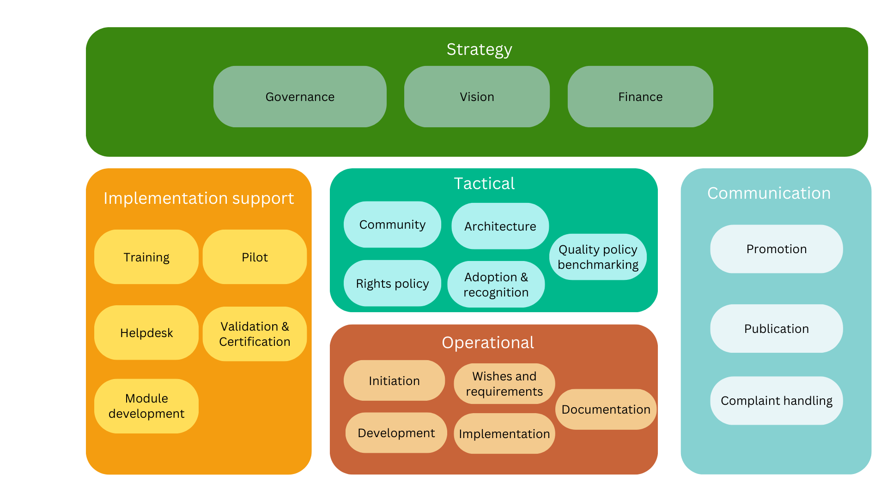
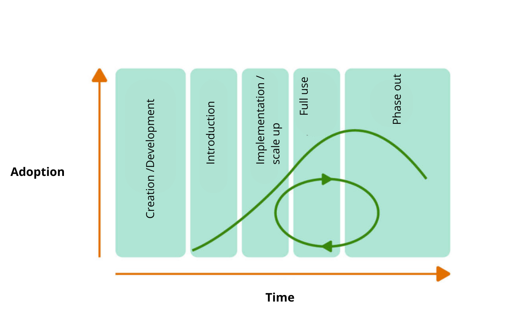

# The Management and Development Model: Design for development and management

The [figure below](#fig-bomos-activiteitendiagram) shows the Management and Development Model: a layered structure of subjects necessary for the development and management of an open standard.

The structure consists of a series of elements:

* Three main layers: strategy, tactical and operational.
* Two support layers: implementation support and communication.
* A series of activities that can be implemented in each layer.

## Necessary structure for each situation

The structure of the development and management subjects is situationally dependent; in other words, different situations can result in a different structure for the optimum result. Every subject can be implemented in a minimum and a maximum scenario, or may not in fact be relevant for a specific organisation. In other words there is no automatic requirement that every subject is implemented. Indeed, too much emphasis on formalisation can have a counterproductive result.

The model only describes those subjects that can be implemented via activities, some of which may be necessary. It is up to the responsible officer at an organisation for the management and development of standards to select and to structure the relevant components on the basis of the model shown here. Wherever relevant, any advantages and disadvantages of a specific structure will be shown, for a subject or activity.

As a result of the situational dependence it is not possible to identify core subjects, but one thing is clear, namely that governance always has to be organised in order to make a decision-making process possible.

Depending on the situation, the next step is to determine which subjects should be given priority. The figure shows the three traditional layers: strategy, tactical and operational. These are flanked by two support processes: communication and implementation support. 
The model could suggest that these subjects operate in isolation, because no relationships between them are shown. However, the opposite is the case: many subjects are related - both within a main group and between the main groups.

This makes harmonisation between the subjects essential. The model says nothing about the organisation form or its integration in a management organisation. In practice, multiple activities can be entrusted to a single organisation components or multiple organisation component can be involved in a single activity. The best practice organisation structure ([Part 2: The Substantiation](https://logius-standaarden.github.io/BOMOS-Verdieping)) discusses this in more detail.

## The subjects from the model 
The activities referred to can be interpreted as follows:

**Strategy**: Course-setting activities related to the strategic (long) term:

* Governance: laying down policy for  your own administrative organisation (such as the legal form); the bylaws (charter) and forming alliances with other organisations. Regulation of the decision-making process is crucial.
* Vision: the description of a direction for development. This is the spot on the horizon that provides the focus for the long term.
* Financing: having a financial model for the long term that guarantees revenue in line with demand.

**Tactical**, Activities that ensure stability in the medium term:

* Adoption & recognition: Activities relating to certification, the compulsory nature or promotion of the standard.
* Architecture: Layout of the standard and the related processes and techniques.
* Community: Management and support for forums and stakeholders.
* Quality policy benchmarking: developing policy that ensures the quality of implementations of the standard.
* Rights policy: Determining the intellectual property rights.

**Operational**, the practical activities that lead to new versions of standards, including:

* Initiation: Identifying new ideas (for example for a new specification and new work) and all activities that relate to its successful organisation (e.g. analysis of interests, business case, agenda setting).
* Wishes and requirements: setting out the wishes and requirements for the specification to be developed and managed, also known by the name Maintenance Requests (MRs).
* Development: the substantive elaboration of solutions for the ideas, wishes and requirements drawn up in the previous phases, at conceptual level. As far as possible, these solutions are kept separate from technologies intended for further elaboration in (a new version of) the specification.
* Implementation: the actual adaptations implemented in the specification and any technical structure, based on the conceptual solutions.
* Documentation: providing an appropriate record of the results of the primary management process. Not only the availability of the specification, but for example also enabling a historical overview of requests for change (maintenance requests) and their most recent status.

**Implementation support**, support activities aimed at promoting implementations of the standard, including:
* Training: Offering training opportunities to various user groups ranging from information meetings through to online courses.
* Helpdesk: Providing support to various user groups, for example by telephone or email according to a service level agreement (e.g. answering questions within 24 hours). Drawing up and updating a list of frequently asked questions can also be a helpdesk activity.
* Module development: (Encouraging) the development of widely distributed software modules to implement the standard. This can be achieved by encouraging the market to develop software of, if the market refuses to move, developing and distributing software in-house, to get the market moving.
* Pilot: Trials with the implementation of the specifications. Some standardisation organisations require one or more pilots to have been conducted before a standard is officially released.
* Validation & Certification: Offering possibilities for testing the correctness of the implementation (validation). This can be combined with an official process which results in the certification of an organisation or product. Another option is to make completion of validation and certification processes compulsory. Module development and certification are risky activities that represent an active intervention on the market. They must be carefully implemented, as far as possible outside your own organisation.

**Communication**, support activities aimed at creating support for the standard including:
* Promotion: Representing the value/necessity/benefits of the standard.
* Publication: Announcing the standard and the current state of affairs and making them findable (website).
* Complaint handling: Guaranteeing that complaints will be taken seriously by dealing with them according to a careful procedure. Complaints can also be viewed as suggestions for improvements.

## Activities and Roles

The various activities must be undertaken by different roles. The NEN standard 7522:2021 ‘Health informatics - Development and maintenance of standards and systems of standards’ which provides an overview of the roles relevant in the development and management of standards, is reproduced here in slightly altered form

**Owner**: person with final responsibility for the development and management of a standard. The owner determines the scope and objective of a standard, and determines the (underlying) principles employed in development and management.

**Financier**: responsible for financing the development and management of standards. 

**Authoriser**: approves a standard. Explanation: an authoriser can be a person, organisation or group of persons and organisations. The owner must appoint the authoriser. An authoriser often combines a representation of stakeholders, who as a person or organisation also have the role of user.

**Functional manager**: responsible for the process of development and management of standards within the frameworks of the agreements reached and the agreed governance. Explanation: the functional manager is responsible for the process of development and management of the content of standards. In this process, he works closely with experts, users, the technical manager and the distributor. The functional manager often has a direction-setting role. Results of the process are submitted to the authoriser.

**Technical manager**: responsible for the technical management of standards. The technical manager is responsible for the structure and management of a technical environment necessary for maintaining the artefacts that form part of the standard. Explanation: The technical manager is responsible for the technical environment in which the artefacts under management are maintained. The technical environment consists of the set of IT resources (tools, hardware, networks, etc.) necessary for implementing functional management of the standard. The technical manager is responsible for the possible application of version management for the technical environment and the provision and maintenance of the technical environment, in consultation with the functional manager.

**Distributor**: responsible for distributing standards.

**Expert**: provides specific necessary expertise for the development and management of standards. Explanation: depending on the standard, different types of experts may be necessary. Experts commonly called in are substantive domain experts or experts in the field of ontology, architecture, trust, information security, cryptography or privacy. It is also common for stakeholders who have practical experience to be represented, who as a person or organisation also have the role of users.

**User**: uses the standards directly or indirectly. Examples of these users are suppliers of components (often applications) or users of those applications (indirect).

For the roles referred to above, the role of financier, expert, user and end user can have multiple occupants: in other words, more than one person or organisation can play the role of financier, expert, user or end user. Multiple occupancy here also means that the stakeholders who fulfil these roles represent a different interest or area of expertise, which they also contribute. The other roles are single occupant only: there can only be one person or organisation in each role. Single occupancy can also mean that the role is fulfilled by an institution, for example a board or a consultation body in which more individuals or organisations are represented.

For the main BOMOS activities, the table below shows which role holds primary responsibility and which other roles are often also involved.

Activity | primary responsibility for the role | Other roles involved
-----------|-------------------------------|--------------------------
Strategy | Owner, financier | Authoriser, functional manager, experts
Tactics | Authoriser | Financial manager, experts
Operational | Functional manager | Technical manager, experts
Implementation support | Functional manager | Technical manager, experts
Communication | Distributor | Functional manager, technical manager, experts

## How to use BOMOS as a tool for the management organisation
Earlier, we described in which situations BOMOS can be used, here we make the step to _how_ BOMOS can be used. This cannot be easily and uniformly defined, as it is determined by the context of the user. That context itself can be determined by mapping out the situational characteristics. One key situational characteristic is the position of the standard in the standard lifecycle.

The current life phase of a standard clearly impacts on the structure of the management. A standard still in the development phase imposes different requirements on management than a standard that has been broadly adopted and implemented. A sensible rule of thumb is to carry out a check (on the basis of the Management and Development Model) at each transition point, to determine whether your management structure is still compliant. Below is a description of the phases of the standard lifecycle, to enable you to determine the current phase of your standard.

**1. Creation / development**

This phase marks the moment at which a community of stakeholders and interested parties identifies the need for a standard and makes a start on drafting a standard. This does not always necessarily mean that a standard is entirely absent. Even in the event that a standard does exist with minor non-compliant specifications, a community can still reach the conclusion that the need for a new standard justifies the required effort. At this stage there is not any structured management, but the majority of activities are of a more project-based nature. In this phase, for example, it is important to think about the decision-making processes. In the case of a standard with a modular structure, some parts of the standard may already be complete, while others are still in the development phase. The term creation relates to the newly developed modules.

In this initial phase of a standard, the primary need is harmonious decision making. There must be a sound business case capable of convincing the management, the interested users and the developers of the value of the standard. There must also be a clear adoption policy. In larger organisations, it is also important for the processes relating to adoption to be anchored in the process landscape. At the end of the day, this is the ideal means of enforcing adoption via formal means.

**2. Introduction phase of the standard**

In this phase, a specific standard is selected to meet a particular need. This phase will be hallmarked by numerous changes. The management structure starts to become important. A deliberate and explicit choice can be made in terms of decision making, that the standard should be declared generally applicable or introduced via organic growth with gradual adoption. One example of a deliberate choice is the decision taken by government to impose a compulsory standard. Sectoral agreements or a decision by the Standardisation Forum to place a standard on the ‘Apply or explain’ list are also deliberate choices.

Also in the introduction phase, it remains important to have a good adoption plan. Reiterating the value and necessity of the standard also remain relevant. A new aspect in this phase is the monitoring of the adoption and publication of the standard. Whereas a (draft) version may not yet be available during the creation phase, there must a draft version available during the introduction phase.

**3. Implementation / growth of the standard**

During this phase, users deliberately opt to implement the standard. The management also takes account of the fact that not all users have a thorough knowledge of the standard. In this phase, management also means supporting and informing the users. Management terms such as ‘early majority’ apply to this phase. Your activities are focused on more professional adoption and professionalisation of the open management processes so that the upscaling of use by all parties remains in sync and the processes remain transparent. Registrations of users/customers/experts, etc. become increasingly important. 

Organic adoption refers to a situation in which various (individual) parties decide to apply a standard. This phase will be hallmarked by numerous changes. The management structure becomes more important, as is adoption of the standard by the early adopters. All activities should be focused on these aspects. 

**4. Full application / maturity of the standard**

In this phase, the standard is generally accepted and implemented. Management in this phase is focused entirely on safeguarding the stability and quality of the standard. 

It is important to implement quality management and to monitor the BOMOS activities and to consider the relationship with other (international) standards. These aspects can of course also be important during earlier phases, but as a rule, it is always the case for a mature standard.

A mature standard is regularly assessed to determine whether it is still up to date. If a standard is based on an underlying standard, the manager can also check whether this (underlying) standard remains actively managed. It is also worthwhile determining whether new (international) standards have become available, with the same application as your standard. Availability of a new, international standard with international application may be given priority above the standard managed in the national context.

**5. Phasing out / transition to another (version of the) standard**

During the phasing out of a standard, it is important to closely monitor the relationship with different products. It is possible that the standard occupies a crucial position in the architecture landscape of third parties. It is also important to monitor the organisation structure since removal of the standard may lead to a shift in responsibilities. Decommissioning the financing is another point for attention, as is managing expectations.
